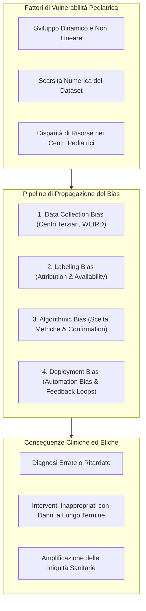

# Pediatric AI Bias and Developmental Vulnerabilities

**Summary**: Analisi dettagliata della genesi, propagazione e amplificazione del bias negli algoritmi di intelligenza artificiale per l'età pediatrica lungo le quattro fasi del ciclo di vita del modello (raccolta dati, annotazione clinica, sviluppo algoritmico e post-deployment con automazione), evidenziando le vulnerabilità biologiche e strutturali dei bambini.
**Sources**: Verhoeven, Bouisaghouane & Hulscher (2026) - `a-2702-1843.pdf`
**Last updated**: 2026-08-27
---

## Vulnerabilità Peculiari della Coorte Pediatrica

L'applicazione dell'intelligenza artificiale ai pazienti pediatrici incontra ostacoli intrinseci che differenziano radicalmente questo settore dalla medicina dell'adulto:

1. **Dinamismo dello Sviluppo Biologico**: I parametri fisiologici (frequenza cardiaca, pressione arteriosa, valori ematochimici, cinetica dei farmaci) cambiano continuamente dalla nascita all'adolescenza. Un modello addestrato su una specifica fascia d'età (es. neonati o lattanti) fallisce sistematicamente se applicato a bambini in età scolare o adolescenti.
2. **Dimensioni Ridotte dei Dataset e Rischio Overfitting**: Le patologie pediatriche chirurgiche sono statisticamente meno frequenti rispetto a quelle dell'adulto. Dataset limitati aumentano esponenzialmente il rischio di *overfitting*, memorizzando pattern contingenti anziché regole generali.
3. **Elevata Incidenza di Bias**: Revisioni sistematiche evidenziano che **fino al 77% dei modelli predittivi pediatrici presenta un alto rischio di bias metodologico e clinico**.

---

## Le Quattro Fasi di Propagazione del Bias

### 1. Fase di Raccolta Dati e Rappresentazione (*Data Collection Bias*)
- **Bias da Centro Terziario**: La maggioranza dei dati pediatrici di ricerca proviene da centri ospedalieri universitari di terzo livello. Ciò provoca una forte sovrastima dei casi rari o estremamente complessi a scapito delle manifestazioni cliniche standard di routine, inficiando l'affidabilità nei presidi territoriali o di primo soccorso.
- **Esclusione di Comorbidità e Casi Complessi**: Molti studi escludono a priori bambini con patologie croniche concomitanti (es. cardiopatie, prematurità estrema, malattie genetiche), producendo modelli non applicabili alla realtà clinica.
- **Bias Geografico ed Economico (Divario WEIRD / HIC)**: Oltre l'80% dei dataset di addestramento proviene da paesi occidentali ad alto reddito (*Western, Educated, Industrialized, Rich, Democratic*). Questo introduce un sistematico bias razziale, etnico ed economico, rendendo i modelli inefficaci o dannosi se applicati a popolazioni di paesi a basso e medio reddito (*LMICs*) o a minoranze demografiche.

### 2. Fase di Etichettatura e Annotazione (*Labeling Bias*)
L'apprendimento supervisionato dipende da annotazioni cliniche effettuate da medici, le quali sono vulnerabili a euristiche e distorsioni cognitive:
- **Attribution Bias**: Tendenza del clinico ad attribuire i sintomi a cause congruenti con le proprie assunzioni o la propria specializzazione, trascurando diagnosi alternative.
- **Availability Bias**: Influenza sproporzionata esercitata da casi recenti, drammatici o insoliti memorizzati dal medico, specialmente in contesti ospedalieri ad alto stress e con turni prolungati (es. pronto soccorso pediatrico, terapia intensiva).
- *Effetto a cascata*: Le etichette viziate diventano la *ground truth* su cui il modello impara, codificando in modo permanente il pregiudizio umano nei pesi algoritmici.

### 3. Fase di Sviluppo del Modello (*Model Development Bias*)
- **Scelta delle Metriche e Bilanciamento**: Metriche globali (es. accuratezza complessiva o AUC aggregata) possono mascherare tassi di errore inaccettabili in sottogruppi demografici vulnerabili (es. neonati prematuri o minoranze etniche).
- **Confirmation Bias degli Sviluppatori**: Tendenza involontaria dei ricercatori a selezionare architetture, feature e iperparametri che confermano le ipotesi iniziali, scartando configurazioni che metterebbero in discussione presupposti consolidati.

### 4. Fase di Deployment e Cicli di Retroazione (*Automation Bias & Feedback Loops*)
- **Automation Bias**: Tendenza psicologica dei medici e del personale infermieristico a fare eccessivo affidamento sulle raccomandazioni algoritmiche (*cognitive offloading*), sospendendo il giudizio critico anche in presenza di segnali clinici discordanti.
- **Feedback Loops Dannosi**: Quando le decisioni cliniche modellate da predizioni distorte determinano trattamenti, prescrizioni o ricoveri, tali esiti vengono registrati nella cartella clinica elettronica (EHR). Se questi dati storici vengono riutilizzati per il retraining periodico del modello, il bias originale viene amplificato e istituzionalizzato.

---

## Strategie di Mitigazione e Salvaguardie

Per contrastare il bias algoritmico in ambito pediatrico, Verhoeven et al. (2026) e le linee guida internazionali raccomandano un approccio integrato:

1. **Integrazione di Metriche di Equità (*Fairness Metrics*)**: Valutare le prestazioni del modello disaggregate per fascia d'età, sesso, etnia e livello socioeconomico (es. *equalized odds*, *demographic parity*).
2. **Audit di Trasparenza tramite XAI**: Utilizzare tecniche di spiegabilità (SHAP, Grad-CAM, alberi decisionali) per identificare tempestivamente se il modello basa le proprie predizioni su correlazioni spurie, stereotipi o artefatti di campionamento.
3. **Campionamento Rappresentativo e Multicentrico**: Costruire consorzi di dati aperti che includano ospedali territoriali e centri di paesi a medio-basso reddito, riducendo il divario WEIRD.
4. **Formazione Clinica Anti-Automation Bias**: Addestrare i pediatri a mantenere una postura critica di validazione attiva (*human-in-the-loop*), considerando l'output dell'IA come pura ipotesi probabilistica.

---

## Pagine Correlate

- [[verhoeven-et-al-2026]]: Articolo di revisione su Explainable AI, bias e benchmark in pediatria.
- [[xai-in-pediatric-surgery]]: Tecniche di spiegabilità per intercettare il bias nei dati e nei modelli chirurgici.
- [[accept-ai-and-pediatric-ethical-frameworks]]: Principi bioetici, giustizia algoritmica e framework ACCEPT-AI.
- [[pediatric-xai-benchmarking]]: Standard e dataset per la misurazione oggettiva di fedeltà e bias.
- [[algorithmic-bias-and-digital-inequalities]]: Disuguaglianze digitali e bias nei sistemi di intelligenza artificiale clinici.
- [[weird-bias-cultural-adaptability-ai]]: Il problema della sovrarappresentazione dei contesti occidentali nei modelli di IA.
- [[misurazione-bias-razziale-llm]]: Metodologie di quantificazione e audit del bias nei sistemi intelligenti.
