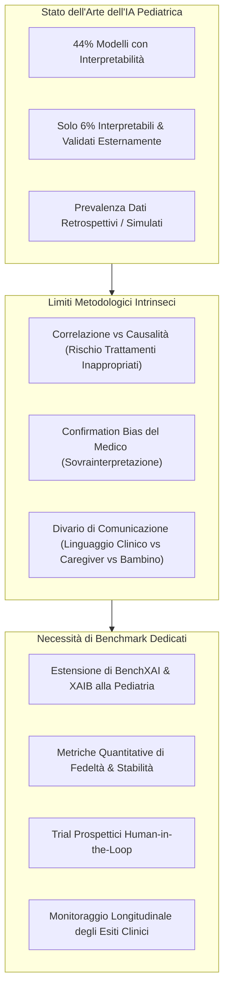
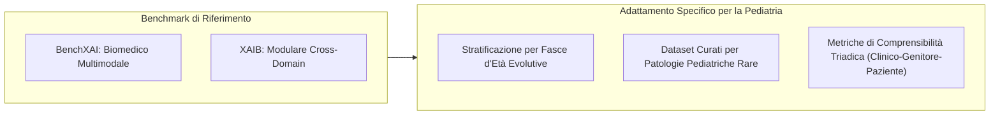

# Pediatric XAI Benchmarking and Clinical Validation

**Summary**: Analisi della necessità di benchmark standardizzati e protocolli di validazione prospettica per l'Explainable AI (XAI) in medicina e chirurgia pediatrica, valutazione dei framework attuali (BenchXAI, XAIB), limiti dell'inferenza correlazionale vs causale e requisiti per studi clinici human-in-the-loop.
**Sources**: Verhoeven, Bouisaghouane & Hulscher (2026) - `a-2702-1843.pdf`; Metsch & Hauschild (2025); Goncharenko et al. (2025)
**Last updated**: 2026-08-27
---

## Il Gap di Validazione nell'IA Pediatrica

Nonostante la rapida proliferazione di modelli di intelligenza artificiale applicati alla salute infantile, l'ambito clinico soffre di un marcato **gap di validazione e spiegabilità**:
- Solo il **44% dei modelli di IA in chirurgia pediatrica include metodologie di interpretabilità o XAI**.
- Solo il **6% dei modelli risulta contemporaneamente interpretabile ed esternamente validato** su coorti cliniche indipendenti (Elahmedi et al., 2024; Verhoeven et al., 2026).
- La maggior parte degli studi si basa su analisi retrospettive o dataset simulati, omettendo la valutazione prospettica dell'impatto reale sui processi decisionali dei chirurghi e sugli esiti perioperatori.

---

## Limiti Concettuali e Metodologici dell'XAI Attuale

### 1. Correlazione vs Causalità (*Correlation ≠ Causation*)
I metodi di spiegabilità post-hoc (come SHAP o LIME) quantificano il peso statistico con cui determinate feature contribuiscono alla predizione del modello, ma **non stabiliscono relazioni di causa-effetto**.
- *Rischio clinico*: Se un chirurgo interviene terapeuticamente per alterare una feature identificata come altamente rilevante dall'XAI ma legata solo da correlazione spuria all'esito, l'intervento può rivelarsi inefficace o dannoso.
- *Soluzione*: Integrazione di metodologie di **inferenza causale** (*causal inference*) e grafi causali all'interno delle pipeline di spiegabilità.

### 2. Confirmation Bias dell'Operatore Sanitario
I medici tendono a interpretare le spiegazioni algoritmiche (es. mappe Grad-CAM o elenchi di feature) come conferme delle proprie convinzioni diagnostiche pregresse. Se l'output dell'XAI è ambiguo, l'operatore può proiettare su di esso una coerenza fisiologica inesistente, non rilevando errori sistematici del modello.

### 3. Divario di Comprensibilità Multi-Audience
In pediatria, la spiegazione deve rispondere simultaneamente a esigenze differenti:
- Rigore e precisione quantitativa per il personale medico-chirurgico.
- Chiarezza, trasparenza e accessibilità per genitori e caregiver coinvolti nel consenso informato.
- Semplicità e assenza di termini allarmistici per i pazienti in età pediatrica/adolescenziale.

---

## I Benchmark Esistenti: BenchXAI e XAIB

Per valutare oggettivamente le tecniche XAI sono nati benchmark standardizzati, sebbene originariamente concepiti per l'adulto o la ricerca generica:

| Benchmark | Obiettivo & Ambito | Tipologia Dati Trattati | Metriche Valutate | Limiti per la Pediatria |
| :--- | :--- | :--- | :--- | :--- |
| **BenchXAI** (Metsch & Hauschild, 2025) | Valutazione comparativa completa di metodi XAI post-hoc in ambito biomedico | Multimodale (Imaging radiologico, genomica, cartelle cliniche elettroniche) | Fedeltà (*fidelity*), stabilità alle perturbazioni, consistenza, rilevanza biologica | Dati derivati quasi esclusivamente da popolazioni adulte; ignora le traiettorie di sviluppo |
| **XAIB** (Goncharenko et al., 2025) | Framework modulare, aperto ed estensibile per il benchmarking di spiegazioni post-hoc | Dati tabulari e immagini cross-domain | Continuità, compattezza, correttezza, robustezza algoritmica | Non include task clinici specifici o complessità del consenso proxy pediatrico |

---

## Requisiti per un Benchmark XAI Pediatrico Dedicato

Verhoeven et al. (2026) propongono la creazione di un benchmark aperto espressamente dedicato alla medicina e chirurgia pediatrica, strutturato su 4 requisiti:

1. **Dataset Curati e Stratificati per Fasi di Sviluppo**: Raccolta multicentrica di casi clinici reali (es. complicanze di chirurgia spinale, malformazioni congenite, enterocolite necrotizzante, sepsi neonatale) suddivisi per finestre neonatali, pediatriche e adolescenziali.
2. **Metriche Standardizzate di Fedeltà e Robustezza**:
   - *Fidelity*: Capacità della spiegazione di riflettere fedelmente la reale logica interna del modello.
   - *Robustness / Stability*: Invarianza della spiegazione rispetto a minime perturbazioni irrilevanti dei dati di input.
   - *Plausibilità Clinica*: Corrispondenza con linee guida mediche pediatriche validate.
3. **Studi Prospettici Human-in-the-Loop**: Sperimentazione clinica sul campo che misuri l'interazione tra chirurgo e interfaccia XAI, quantificando il tempo decisionale, l'accuratezza diagnostica aumentata e la riduzione di automation bias.
4. **Valutazione Longitudinale degli Esiti Clinici**: Misurazione dell'impatto reale a lungo termine sulla sopravvivenza, sulla riduzione delle complicanze e sulla qualità di vita del paziente pediatrico.

---

## Pagine Correlate

- [[verhoeven-et-al-2026]]: Articolo di revisione su Explainable AI, framework etici e benchmark in chirurgia pediatrica.
- [[xai-in-pediatric-surgery]]: Metodi e use cases di XAI nella chirurgia infantile.
- [[pediatric-ai-bias-and-vulnerabilities]]: Pipeline del bias e vulnerabilità evolutive nei modelli pediatrici.
- [[accept-ai-and-pediatric-ethical-frameworks]]: Standard ACCEPT-AI, conformità a EU AI Act e governance etica.
- [[counseling-benchmarks-evaluation]]: Metodologie di benchmarking ed evaluation nei sistemi clinici.
- [[mccv-and-statistical-validation-clinical-ml]]: Validazione statistica e cross-validazione nel machine learning clinico.
