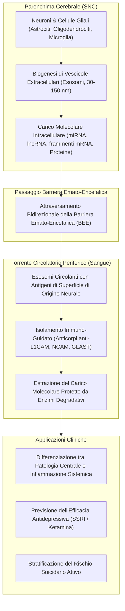

# Peripheral Blood Biomarkers and Brain-Derived Exosomes in MDD (Biomarcatori nel Sangue Periferico ed Esosomi Cerebrali nel Disturbo Depressivo Maggiore)

## Definizione Operativa
La **biopsia liquida neuropsichiatrica** consiste nell'impiego del sangue periferico (cellule mononucleate PBMCs, RNA totale, DNA genomico) e delle **vescicole extracellulari derivate dal sistema nervoso centrale (esosomi cerebrali circolanti)** per identificare firme molecolari oggettive, accessibili e non invasive del Disturbo Depressivo Maggiore (MDD) e del rischio suicidario. Questo approccio consente di monitorare longitudinalmente la progressione della malattia, predire la risposta ai trattamenti farmacologici e colmare la distanza anatomica tra la neuropatologia cerebrale e i tessuti periferici (Wang & Dwivedi, 2025).

---

## Architettura e Trasporto Trans-Barriera degli Esosomi

---

## Biomarcatori Ematici Validati nel Sangue Periferico

Il sangue periferico offre evidenti vantaggi pratici: prelievo rapido a basso costo, volumi abbondanti, possibilità di stabilizzazione immediata dell'RNA e campionamento seriale nel corso del trattamento.

### 1. Marcatori di Efficacia e Risposta Antidepressiva
- **Pannello di Ammissione (Remitter vs Non-Responder)**:
  - Livelli significativamente ridotti all'ammissione di `RORα` (retinoid-related orphan receptor α), `GCET2` e `CHI3L2` sono associati a una risposta terapeutica positiva agli antidepressivi (Hennings et al., 2015).
  - La proteina `LSP1` (*leukocyte-specific protein 1*) subisce una marcata riduzione dopo 5 settimane di trattamento farmacologico efficace.
- **Predittori di Mancata Risposta a Escitalopram**:
  - In pazienti non-responder dopo 8 settimane di escitalopram, l'analisi trascrittomica genome-wide ha rilevato un incremento marcato di `CHN2` (chimerina 2, regolatore della neurogenesi ippocampale) e `JAK2` (Janus chinasi 2, attivatore dei pathway immunologici e infiammatori) (Ju et al., 2019).
- **lncRNA FEDORA e Risposta Rapida a Ketamina**:
  - Livelli ematici elevati del lncRNA `FEDORA` correlano con la diagnosi di MDD nelle donne e mostrano una rapida normalizzazione in risposta all'infusione di ketamina, fungendo da biomarcatore dinamico di efficacia (Issler et al., 2022).

### 2. Biomarcatori Ematici di Ideazione e Comportamento Suicidario
- **19 Moduli Co-espressi**: Identificati nel sangue di pazienti con ideazione suicidaria, fortemente arricchiti in mediatori della cascata infiammatoria e della risposta immunitaria (Sun et al., 2024).
- **Metilazione del DNA (63 Siti CpG)**: Un classificatore Random Deep Forest su DNA ematico ha discriminato i tentatori di suicidio con il 92.6% di accuratezza basandosi su pattern di metilazione del DNA (Bhak et al., 2019).
- **circRNA Circolanti**: Marcatori ematici candidati includono `hsa_circRNA_103636`, `circFKBP8`, `circMBNL1` e `circDYM`, stabili nel siero grazie alla struttura ad anello chiuso (Cui et al., 2016; Shi et al., 2021).

---

## Esosomi Cerebrali Circolanti: La Finestra Molecolare sul Cervello

### Limiti del Sangue Totale e Ruolo degli Esosomi
Il principale limite dei campioni ematici non frazionati (whole blood o PBMCs) risiede nel rischio di confondere le alterazioni molecolari generate da patologie infiammatorie o metaboliche sistemiche con quelle originate nel sistema nervoso centrale.

L'isolamento di **vescicole extracellulari derivate dal cervello (*Brain-Derived Extracellular Vesicles / Exosomes*)** risolve questa criticità:
1. **Origine Cellula-Specifica**: Utilizzando anticorpi contro proteine di superficie specifiche (es. `L1CAM` per i neuroni, `GLAST/EAAT1` per gli astrociti, `MOG/MBP` per gli oligodendrociti), è possibile isolare selettivamente le vescicole rilasciate da specifiche popolazioni cellulari cerebrali.
2. **Protezione del Carico Genetico**: Il doppio strato lipidico dell'esosoma protegge RNA instabili (miRNA, lncRNA, piccoli frammenti di mRNA) e proteine dall'azione delle ribonucleasi e proteasi plasmatiche.
3. **Correlazione Diretta con la Neuropatologia**: Il profilo trascrittomico ed epigenetico contenuto negli esosomi cerebrali circolanti riflette in tempo reale lo stato metabolico, sinaptico e infiammatorio dei circuiti cortico-limbici del paziente in vita (Wang & Dwivedi, 2025).

---

## Prospettive Traslazionali e Percorso Verso la Clinica

| Fase di Sviluppo | Obiettivo Clinico | Metodologie Omiche & AI |
| :--- | :--- | :--- |
| **Screening Precoce** | Diagnosi oggettiva di MDD e forme sub-sindromiche (SSD) | Classificatori SVM su pannelli ematici di 10–48 RNA |
| **Triage di Emergenza** | Stratificazione del rischio di suicidio acuto/imminente | Modelli Random Deep Forest su siti di metilazione CpG ed esosomi |
| **Selezione Farmaco** | Scelta personalizzata tra SSRI, SNRI, Ketamina, IMAO | Biomarcatori di efficacia (*RORα, CHN2, JAK2, FEDORA, miR-1202*) |
| **Monitoraggio Continuo** | Valutazione dell'aderenza e prevenzione precoce delle ricadute | Prelievi ematici longitudinali e analisi di vescicole extracellulari |

---

## Relazioni nel Knowledge Base
- [[wang-dwivedi-2025]]: Sintesi sistematica della review di riferimento.
- [[multi-omics-depression-suicide]]: Integrazione di trascrittoma, metiloma e proteomica.
- [[non-coding-rna-biomarkers-psychiatry]]: Profili di miRNA, lncRNA e circRNA circolanti.
- [[single-cell-and-spatial-transcriptomics-in-mental-health]]: Mappatura cellula-specifica confrontata con la periferia.
- [[ai-multi-omics-psychiatric-biomarkers]]: Algoritmi predittivi applicati a dati ematici e biomarcatori.
- [[treatment-outcome-and-relapse-prediction]]: Predizione di risposta terapeutica e ricadute.
- [[rischio-suicidario-ai-limits]]: Limiti dell'approccio clinico soggettivo e necessità di biomarker oggettivi.
