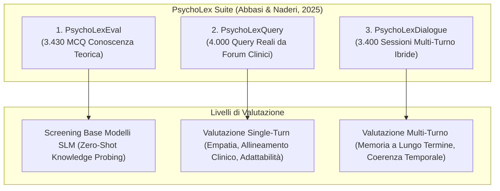
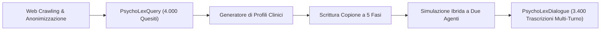

# Benchmark Psicoterapeutici per la Lingua Persiana (PsychoLex Suite)

**Summary**: Suite di tre dataset standardizzati e pionieristici (**PsychoLexEval**, **PsychoLexQuery**, **PsychoLexDialogue**) sviluppati per la valutazione sistematica delle competenze psicologiche, della risonanza empatica a singolo turno e della coerenza longitudinale multi-turno in sistemi di elaborazione del linguaggio naturale applicati alla salute mentale in lingua persiana.
**Sources**: `2510.03913v1.pdf` (Abbasi & Naderi, 2025: *PsychoLexTherapy: Simulating Reasoning in Psychotherapy with Small Language Models in Persian*)
**Last updated**: 2026-08-27
---

## Il Divario dei Dataset nell'IA per la Salute Mentale Non-Anglofona

La ricerca internazionale sull'IA in psicologia e psichiatria soffre di una forte asimmetria geografica e linguistica (*WEIRD bias*), concentrandosi quasi esclusivamente sull'inglese e, marginalmente, sul cinese (es. PsyQA, SMILECHAT). Per lingue sotto-rappresentate come il persiano (*Farsi*), la mancanza di risorse standardizzate ha storicamente impedito:
1. La misurazione rigorosa delle conoscenze teoriche nei modelli linguistici compatti.
2. La valutazione dell'adattamento socioculturale (es. convenzioni relazionali familiari, modelli collettivistici, forme di cortesia e idiomi di sofferenza psicologica).
3. Il testing controllato della memoria a lungo termine in conversazioni terapeutiche estese.

La **PsychoLex Suite** colma interamente questo vuoto introducendo una pipeline di benchmark a tre livelli.

---

## Struttura e Caratteristiche dei Tre Dataset

### 1. PsychoLexEval (Benchmarking della Conoscenza di Dominio)
- **Finalità**: Verificare l'accuratezza teorica e i concetti fondamentali di psicologia prima dell'impiego nei workflow clinici.
- **Dimensione**: **3.430 quesiti a scelta multipla** a 4 opzioni (1 sola corretta).
- **Fonti**: Esami nazionali di abilitazione e ammissione a lauree magistrali e dottorati di psicologia in Iran, test professionali certificati e generazioni sintetiche supervisionate da testi autorevoli di riferimento.
- **Domini coperti**: Psicologia clinica, psicologia dello sviluppo, neuropsicologia, psicologia cognitiva e dinamiche sociali.
- **Modalità di somministrazione**: Setting *zero-shot* puro (temperature=0.01, max_tokens=16) per misurare l'effettiva memoria parametrica del modello.

---

### 2. PsychoLexQuery (Quesiti Reali di Utenti Persiani)
- **Finalità**: Misurare la capacità del modello di rispondere a bisogni emotivi autentici e culturalmente radicati a singolo turno.
- **Dimensione**: Circa **4.000 domande reali** raccolte tramite web crawling da piattaforme aperte di consulenza psicologica (*EhyaCenter*, *Moshaverfa*, *Simiaroom*).
- **Protocollo di Anonimizzazione e Privacy Etica**:
  - Sostituzione dei nomi propri con identificatori neutri (*"Persona A"*, *"Utente B"*).
  - Generalizzazione dei toponimi geografici (*"città metropolitana"*, *"area rurale"*).
  - Rimozione completa di recapiti, indirizzi email, account social e ruoli aziendali specifici (*"CEO"* $\rightarrow$ *"dirigente"*).
- **Distribuzione Tematica dei Problemi**:

| Categoria Tematica | Frequenza Relativa (%) | Esempi di Vissuto Clinico |
| :--- | :---: | :--- |
| **Difficoltà Relazionali & Conflitti Familiari** | **53,7%** | Gestione dei confini familiari allargati, conflitti di coppia, pressioni genitoriali. |
| **Problemi Comportamentali Bambini/Adolescenti** | **9,6%** | Oppositività, rendimento scolastico, gestione dell'autonomia. |
| **Disturbi d'Ansia & Panico** | **7,7%** | Ansia da prestazione, somatizzazioni, evitamento sociale. |
| **Autostima & Insicurezza** | **6,7%** | Svalutazione personale, paura del giudizio, difficoltà di assertività. |
| **Depressione & Vissuti Depressivi** | **5,8%** | Disperazione, anedonia, ruminazione, stanchezza cronica. |
| **Abuso di Sostanze & Dipendenze** | **2,9%** | Ricadute, difficoltà di mantenimento dell'astinenza. |
| **Lutto, DCA, Stress Lavorativo & Altro** | **13,6%** | Burnout professionale, transizioni di vita, crisi esistenziali. |

---

### 3. PsychoLexDialogue (Sessioni Psicoterapeutiche Simulate Multi-Turno)
- **Finalità**: Valutare l'efficacia dei moduli di memoria a lungo termine ([[memory-augmented-therapeutic-dialogue]]) e la progressione dell'alleanza di lavoro.
- **Dimensione**: **3.400 dialoghi completi**, con un'estensione media di **10–14 turni per sessione** su 16 domini tematici.
- **Pipeline Generativa Ibrida**:
  1. *Generazione del Profilo Paziente*: Ogni query reale di PsychoLexQuery viene convertita in un profilo con temi emotivi prevalenti (frustrazione, tristezza, ansia, senso di colpa), pattern cognitivi disfunzionali e desiderata terapeutici.
  2. *Struttura Narrativa a 5 Stadi*: Basata sul modello rogersiano (Alleanza $\rightarrow$ Rispecchiamento emotivo $\rightarrow$ Esplorazione profonda $\rightarrow$ Ristrutturazione $\rightarrow$ Chiusura e pianificazione).
  3. *Co-Simulazione Terapeuta-Cliente*: Un'architettura ibrida in cui un agente-terapeuta (guidato da vincoli PCT) e un agente-cliente (guidato dal profilo e libero di esprimere esitazioni o difese) affinano ricorsivamente uno scheletro prestabilito.

---

## Metodologia di Valutazione della Suite

La suite adotta un duplice protocollo di validazione:
1. **LLM-as-a-Judge (GPT-5)**: Scoring automatizzato su rubriche standardizzate (da 1 a 10) su 9 dimensioni per il single-turn (empatia, aderenza clinica, accuratezza, coerenza, fluidità, ecc.) e 14 dimensioni per il multi-turn (inclusi coerenza emotiva, personalizzazione, continuità di tema, stile).
2. **Valutazione Umana Cieca da Esperti**: 3 laureati magistrali e specializzandi in psicologia clinica hanno classificato in *blind ranking* comparativo gli output senza conoscere il modello generatore.

---

## Concetti Correlati

- [[psycholextherapy-framework]]: Il framework testato sulla PsychoLex Suite.
- [[synthetic-clinical-dialogues]]: Approcci metodologici per la sintesi controllata di sedute cliniche.
- [[weird-bias-cultural-adaptability-ai]]: L'importanza dell'adattamento cross-culturale dei modelli psicologici.
- [[memory-augmented-therapeutic-dialogue]]: Architetture valutate tramite PsychoLexDialogue.
- [[clinical-fidelity-assessment]]: Metriche di fedeltà per sistemi clinici computazionali.
