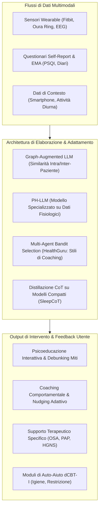

# Modelli Linguistici di Grandi Dimensioni nel Benessere e nella Salute del Sonno (Personal Sleep Wellness)

## Definizione Operativa
- Applicazione sistematica di Large Language Models ([[large-language-models|LLM]]) e intelligenza artificiale multimodale nel supporto quotidiano, ecologico e non clinico (*personal sleep wellness*) all'educazione, al monitoraggio e all'ottimizzazione dell'igiene del sonno (Mansoor, 2025).
- **Utilità CBT:** Potenzia il monitoraggio ecologico e continuo dei pattern di sonno tra le sedute cliniche ([[ai-supported-between-session-engagement]]), supportando l'igiene del sonno, la consapevolezza dei fattori perpetuanti (pensieri disfunzionali, ansia anticipatoria) e la correlazione tra comportamenti diurni (es. attività fisica, stress, assunzione di caffeina) e qualità del riposo notturno tramite feedback conversazionali personalizzati.

---

## Evidenze dalla Letteratura

- **Tassonomia Funzionale a 4 Pilastri:** La revisione sistematica di Mansoor (2025) struttura l'impiego dei modelli linguistici nella salute del sonno in: (1) educazione e risposta a quesiti sul sonno; (2) supporto specifico a patologie (OSA/PAP/HGNS); (3) raccomandazioni personalizzate e coaching comportamentale; (4) interventi digitali basati su CBT-I.
- **Accuratezza Educativa e Percezione del Paziente:** ChatGPT dimostra un'elevata concordanza con gli esperti nello sfatare i miti sul sonno ($ICC > 0.8$) (Bragazzi & Garbarino, 2024), e le sue risposte educative ai disturbi del sonno sono giudicate dagli utenti laici significativamente più chiare e supportanti sul piano emotivo rispetto a quelle degli specialisti (Kim et al., 2024).
- **Spiegazioni Cliniche e Supporto all'OSA:** Nei test testa-a-testa per l'educazione all'apnea ostruttiva del sonno, ChatGPT supera Google Bard per comprensibilità (90.8%) e azionabilità (73.04%) misurate tramite PEMAT (Cheong et al., 2024), garantendo spiegazioni sull'adattamento ai dispositivi PAP complete nell'88% dei casi (Pordzik et al., 2024).
- **Integrazione di Segnali Fisiologici Multimodali:** Modelli come *PhysioLLM* integrano le metriche dei sensori indossabili (efficienza del sonno, passi, frequenza cardiaca) per spiegare conversazionalmente le correlazioni tra comportamento diurno e qualità notturna, risultando superiori ad app commerciali per azionabilità e chiarezza (Fang et al., 2024).
- **Risoluzione della Scalabilità tramite Grafi e PH-LLM:** L'integrazione di grafi di similarità (*Graph-Augmented LLMs*) consente di contestualizzare le raccomandazioni del sonno pesando l'importanza delle feature biometriche senza riaddestrare il modello (Subramanian et al., 2024); parallelamente, *PH-LLM* addestrato su 857 casi multimodali complessi dimostra una capacità di formulazione di consigli clinici quasi sovrapponibile a quella di medici esperti (Cosentino et al., 2024).
- **Algoritmi Multi-Agente Guidati dalla Teoria Comportamentale:** L'architettura *HealthGuru* sfrutta algoritmi *multi-armed bandit* per selezionare dinamicamente lo stile comunicativo del modello (es. logico vs emotivo) adattandolo in tempo reale alle risposte dell'utente, incrementando l'aderenza agli obiettivi di sonno (Wang et al., 2025).
- **Discrepanza tra Sonno Percepito e Misurato:** Il confronto tra log conversazionali e rilevazioni biometriche (Fitbit) su oltre 500 soggetti rivela significative divergenze individuali tra durata percepita e oggettiva del sonno, evidenziando la necessità che i modelli LLM calibrino i loro consigli integrando entrambi i flussi di dati (Jang et al., 2023).
- **Limiti e Rischi di Bias:** La maggioranza delle evidenze attuali poggia su trial pilota a breve termine (1-2 settimane) o valutazioni di esperti su compiti circoscritti, con un rischio non trascurabile di allucinazioni su terapie chirurgiche o tecnologiche avanzate (es. HGNS) e assenza di validazioni su campioni ampi a lungo termine (Mansoor, 2025; Pordzik et al., 2024).

**Riferimenti Bibliografici:**
- Mansoor, H. (2025). A Scoping Review of Large Language Models in Personal Sleep Wellness. *Mayo Clinic Proceedings: Digital Health*, 3(4), 100301. https://doi.org/10.1016/j.mcpdig.2025.100301
- Bragazzi, N. L., & Garbarino, S. (2024). Assessing the accuracy of generative conversational artificial intelligence in debunking sleep health myths: mixed methods comparative study with expert analysis. *JMIR Formative Research*, 8(1), e55762. https://doi.org/10.2196/55762
- Cheong, R. C. T., Unadkat, S., Mcneillis, V., et al. (2024). Artificial intelligence chatbots as sources of patient education material for obstructive sleep apnoea: ChatGPT versus google bard. *European Archives of Oto-Rhino-Laryngology*, 281(2), 985–993. https://doi.org/10.1007/s00405-023-08319-9
- Cosentino, J., Belyaeva, A., Liu, X., et al. (2024). Towards a personal health large language model. *arXiv preprint arXiv:2406.06474*. https://doi.org/10.48550/arXiv.2406.06474
- Fang, C. M., Danry, V., Whitmore, N., et al. (2024). Physiollm: supporting personalized health insights with wearables and large language models. *arXiv preprint arXiv:2406.19283*. https://doi.org/10.48550/arXiv.2406.19283
- Jang, H., Lee, S., Son, Y., et al. (2023). Exploring variations in sleep perception: Comparative study of ChatBot sleep logs and Fitbit sleep data. *JMIR mHealth and uHealth*, 11(1), e49144. https://doi.org/10.2196/49144
- Kim, J., Lee, S. Y., Kim, J. H., et al. (2024). Chatgpt vs. sleep disorder specialist responses to common sleep queries: Ratings by experts and laypeople. *Sleep Health*, 10(6), 665–670. https://doi.org/10.1016/j.sleh.2024.08.011
- Pordzik, J., Bahr-Hamm, K., Huppertz, T., et al. (2024). Patient support in obstructive sleep apnoea by a large language model—ChatGPT4 on answering frequently asked questions on first line positive airway pressure and second line hypoglossal nerve stimulation therapy: a pilot study. *Nature and Science of Sleep*, 16, 2269–2277. https://doi.org/10.2147/NSS.S495654
- Subramanian, A., Yang, Z., Azimi, I., & Rahmani, A. M. (2024). Graph-augmented LLMs for personalized health insights: a case study in sleep analysis. In *Proceedings of the 2024 IEEE 20th International Conference on Body Sensor Networks (BSN)* (pp. 1–4). IEEE.
- Wang, X., Griffith, J., Adler, D. A., Castillo, J., Choudhury, T., & Wang, F. (2025). Exploring personalized health support through data-driven, theory-guided LLMs: a case study in sleep health. In *Proceedings of the 2025 CHI Conference on Human Factors in Computing Systems* (pp. 1–15). ACM.

## Relazioni
- Vedi anche: [[main]], [[digital-cbt-i-conversational-agents]], [[wearable-sensor-fusion-adherence]], [[cbt-dialogue-systems-and-tools]], [[conceptual-architecture-of-ai-guided-cbt]], [[ai-supported-between-session-engagement]], [[routine-coach-vs-on-demand-assistant]], [[large-language-models]], [[five-domain-chatbot-validation-framework]]
