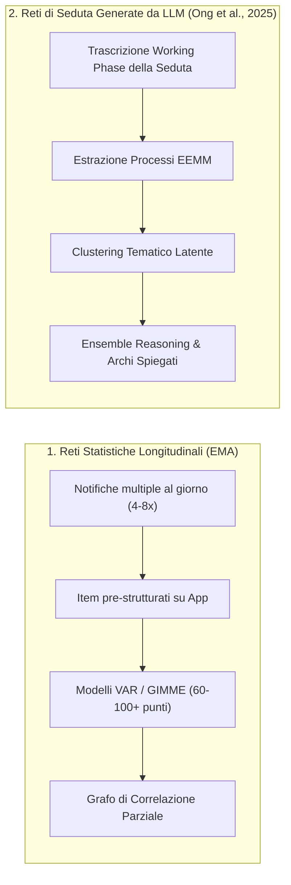

# Personalized Networks in Psychotherapy (Reti Personalizzate in Psicoterapia)

## Definizione Operativa
Una **rete personalizzata in psicoterapia** (*Personalized Psychological Network* o *Idiographic Network*) è una rappresentazione visiva e computazionale delle configurazioni psicologiche intra-individuali di un paziente. Essa organizza in forma di grafo orientato i sintomi, le dinamiche interpersonali, i fattori contestuali e i **processi di cambiamento**, specificando la natura e la direzione delle relazioni funzionali e causali che intercorrono tra di essi (Bringmann et al., 2022; Ong et al., 2025).

A differenza dei modelli nosografici categoriali classici (DSM-5/ICD-11), che assumono un'omogeneità latente all'interno della medesima etichetta diagnostica, l'approccio di rete modella la psicopatologia come un **sistema dinamico complesso**, in cui i disturbi mentali emergono e si auto-mantengono attraverso circuiti di retroazione (*feedback loops*) tra elementi cognitivi, emotivi, comportamentali e ambientali interconnessi.

---

## Modelli a Confronto: Reti Statistiche (EMA) vs. Reti Generate da LLM

Tradizionalmente, la costruzione di reti idiografiche richiedeva la raccolta intensiva di dati longitudinali tramite *Ecological Momentary Assessment* (EMA). L'introduzione di pipeline basate su Large Language Models (LLM; Ong et al., 2025) ha aperto la strada alla stima automatizzata di reti a livello di singola seduta (*session-level networks*).

| Dimensione di Confronto | Reti Statistiche Idiografiche (EMA) | Reti di Seduta Generate da LLM |
| :--- | :--- | :--- |
| **Sorgente Informativa** | Micro-valutazioni ripetute su smartphone fuori seduta | Dialogo clinico naturale e trascrizione della seduta |
| **Flessibilità dei Nodi** | Fissa: limitata al set di item pre-programmati | Dinamica: temi emergenti *bottom-up* dal discorso del paziente |
| **Carico (*Burden*)** | Molto elevato per il paziente (rischio abbandono/compliance) | Nullo (analisi retrospettiva della seduta) |
| **Trasparenza degli Archi** | Coefficiente numerico statistico ($\beta$) | Peso numerico + **Spiegazione qualitativa e tipo di interazione** |
| **Assunzioni Matematiche** | Richiede stazionarietà temporale e campionamento uniforme | Modellazione semantica e funzionale senza vincoli di stazionarietà |

---

## Anatomia di una Rete Personalizzata di Seduta

Nei modelli sviluppati secondo il framework della *Process-Based Therapy* (PBT; Hofmann & Hayes, 2019; Ong et al., 2025), la rete personalizzata è composta da:

1. **Nodi (Temi Clinici):**
   - Rappresentano costrutti funzionali sovraordinati ottenuti raggruppando enunciati e processi psicologici sottostanti.
   - Ogni nodo è caratterizzato da un peso ($w$, corrispondente al numero di processi/enunciati che lo compongono) e dai marcatori dimensionali prevalenti secondo il modello EEMM (es. *Cognizione*, *Senso del Sé*, *Affetto*).
2. **Archi Diretti (*Directed Edges*):**
   - **Tipo di Interazione:** 
     - *Eccitatorio (+):* il nodo $A$ innesca, amplifica o rinforza il nodo $B$ (es. *"La pressione a dover riuscire alimenta l'ansia per il futuro"*).
     - *Inibitorio (-):* il nodo $A$ sopprime, attenua o sovrascrive il nodo $B$ (es. *"Il senso del dovere verso la famiglia sopprime la paura della stagnazione professionale"*).
   - **Forza di Connessione:** Graduata qualitativamente (*Strong*, *Moderate*, *Weak*).
   - **Spiegazione Clinica Integrata:** Breve descrizione esplicativa generata dal modello che motiva la relazione causale/funzionale.

---

## Utilità Clinica e Applicazioni in CBT / PBT

- **Concettualizzazione del Caso Funzionale (*Case Formulation*):** Consente al clinico di superare l'approccio descrittivo basato unicamente sul sintomo primario più manifesto, identificando i nodi centrali (*bridge symptoms* o processi cardine) da cui dipendono i circoli viziosi di mantenimento (es. comprendere come il consumo di alcol sia secondario all'evitamento emotivo e alla perdita di speranza).
- **Selezione Mirata dei Moduli di Trattamento:** Guida la scelta delle tecniche psicoterapeutiche (es. defusione cognitiva, esposizione enterocettiva, attivazione comportamentale) in base ai nodi funzionalmente dominanti nella specifica seduta.
- **Riconoscimento di Dinamiche Latenti:** Identifica connessioni e conflitti sottostanti non pienamente verbalizzati o coscientizzati dal paziente (es. conflitto tra autonomia personale e obblighi di accudimento familiare).
- **Supervisione e Didattica Clinica:** Fornisce un feedback oggettivo e strutturato a psicologi in formazione per confrontare le proprie mappe cliniche con l'analisi sistematica del trascritto.

---

## Riferimenti Bibliografici
- Ong, C. W., Arnaout, H., Sheehan, K., Fox, E., Owtscharow, E., & Gurevych, I. (2025). Using Large Language Models to Create Personalized Networks From Therapy Sessions. *arXiv preprint arXiv:2512.05836v1*. https://doi.org/10.48550/arXiv.2512.05836
- Bringmann, L. F., Albers, C., Bockting, C., Borsboom, D., Ceulemans, E., Cramer, A., ... & Wichers, M. (2022). Psychopathological networks: Theory, methods and practice. *Behaviour Research and Therapy*, 149, 104011. https://doi.org/10.1016/j.brat.2021.104011
- Hofmann, S. G., & Hayes, S. C. (2019). The future of intervention science: Process-based therapy. *Clinical Psychological Science*, 7(1), 37–50. https://doi.org/10.1177/2167702618772296
- Levinson, C. A., Williams, B. M., Christian, C., Hunt, R. A., Keshishian, A. C., Brosof, L. C., ... & Bridges-Curry, Z. (2023). Personalizing eating disorder treatment using idiographic models: An open series trial. *Journal of Consulting and Clinical Psychology*, 91(1), 14.

---

## Pagine Correlate
- [[ong-et-al-2025]]
- [[extended-evolutionary-meta-model]]
- [[llm-case-conceptualization-pipeline]]
- [[process-based-therapy]]
- [[process-of-change]]
- [[ai-clinical-decision-support]]
- [[network-based-ai-mental-healthcare]]
