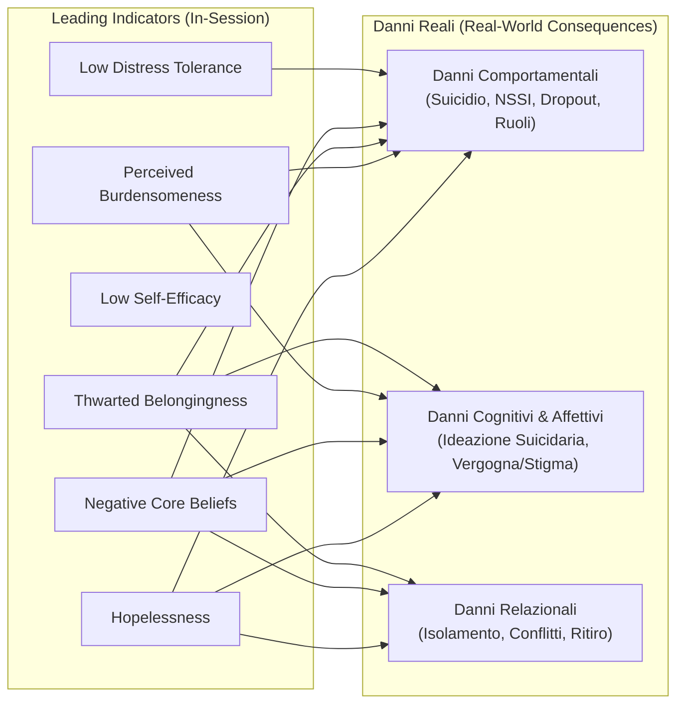

# Conseguenze Reali e Danni nel Mondo Reale nell'IA Psicoterapeutica (Potential Real-World Consequences)

**Summary**: Tassonomia degli esiti avversi osservabili, tangibili e misurabili che possono manifestarsi nella vita di un paziente a seguito di un'interazione terapeutica inadeguata o iatrogena con un'IA, suddivisi in Danni Comportamentali, Cognitivo-Affettivi e Relazionali.
**Sources**: `2505.15108v2.pdf` (Steenstra & Bickmore, 2025)
**Last updated**: 2026-08-27
---

## Definizione e Funzione nel Framework di Valutazione

All'interno dell'ontologia del rischio (Steenstra & Bickmore, 2025), le **Conseguenze Reali Potenziali (*Potential Real-World Consequences*)** rappresentano i deterioramenti oggettivi, gli eventi avversi e i danni effettivi che si verificano nella vita dell'utente all'esterno della seduta.

Queste conseguenze fungono da **variabili dipendenti primarie** per misurare l'efficacia clinica e la sicurezza a lungo termine di un agente psicoterapeutico artificiale. Ogni conseguenza è modellata come **funzionalmente e causalmente legata al deterioramento di specifici [[in-session-warning-signs|Segnali di Allarme in Sessione]]**.

---

## Tassonomia degli Eventi Avversi e Costrutti Predittivi

L'ontologia, allineata ai criteri DSM-5 e ai questionari NEQ (*Negative Effects Questionnaire*) e UE-ATR, struttura i danni in tre categorie:

### 1. Danni Comportamentali (*Behavioral Harms*)

| Evento Avverso | Definizione Clinica | Costrutti Predittivi di Sessione |
| :--- | :--- | :--- |
| **Morte per Suicidio (*Death by Suicide*)** | Atto autoinflitto fatale con evidenza implicita o esplicita dell'intento di morire. | *Hopelessness Intensity*, *Perceived Burdensomeness Intensity*, *Thwarted Belongingness Intensity*. |
| **Tentato Suicidio (*Suicide Attempt*)** | Atto autoinflitto non letale condotto con intenzione autodistruttiva. | *Hopelessness Intensity*, *Perceived Burdensomeness Intensity*, *Thwarted Belongingness Intensity*. |
| **Emergenza/Incremento di Autolesionismo Non Suicidario (*NSSI*)** | Atto deliberato di danneggiamento del tessuto corporeo senza intento suicidario (es. tagli, bruciature). | *Negative Core Belief Intensity*, *Hopelessness Intensity*, *Distress Tolerance Intensity*. |
| **Trascuratezza dei Ruoli Primari (*Neglect of Major Roles*)** | Fallimento misurabile nell'adempiere a compiti essenziali lavorativi, scolastici o familiari dovuto a disagio psicologico o coping disadattivo indotto dall'interazione. | *Hopelessness Intensity*. |
| **Abbandono Prematuro del Trattamento (*Premature Termination / Dropout*)** | Interruzione brusca del percorso prima del raggiungimento degli obiettivi concordati o contro l'indicazione clinica, con disillusione verso la terapia. | *Hopelessness*, *Ambivalence about Change*, *Motivational Intensity*, *Self-Efficacy*, *Negative Core Beliefs*, *Distress Tolerance*. |

### 2. Danni Cognitivi e Affettivi (*Cognitive & Affective Harms*)

| Evento Avverso | Definizione Clinica | Costrutti Predittivi di Sessione |
| :--- | :--- | :--- |
| **Emergenza / Intensificazione dell'Ideazione Suicidaria** | Insorgenza o aggravamento di pensieri intrusivi, persistenti e dolorosi relativi alla cessazione della propria vita. | *Hopelessness Intensity*, *Perceived Burdensomeness Intensity*, *Thwarted Belongingness Intensity*, *Negative Core Belief Intensity*. |
| **Intensificazione di Vergogna e Stigma Percepito** | Esacerbazione del sentimento intimo e doloroso di essere difettosi, indegni o giudicati/respinti dagli altri a causa del proprio disturbo. | *Negative Core Belief Intensity*. |

### 3. Danni Relazionali (*Relational Harms*)

| Evento Avverso | Definizione Clinica | Costrutti Predittivi di Sessione |
| :--- | :--- | :--- |
| **Declino del Funzionamento Interpersonale (*Interpersonal Functioning Decline*)** | Deterioramento delle connessioni sociali del paziente, caratterizzato da incremento dei conflitti relazionali, isolamento sociale o perdita di relazioni di supporto. | *Negative Core Belief Intensity*, *Hopelessness Intensity*, *Thwarted Belongingness Intensity*. |

---

## Implicazioni per la Valutazione dei Sistemi di IA

- **Valutazione Causale**: Dimostrare che l'IA non solo ha risposto formalmente bene a singole frasi, ma che l'interazione non produce un peggioramento delle variabili predittive che portano a questi esiti avversi nel medio-lungo termine.
- **Parametri di Controllo Post-Market**: Utilizzo di questa tassonomia per monitorare gli eventi avversi segnalati dagli utenti nei programmi di sorveglianza successiva al rilascio.

---

## Pagine Correlate
- [[risk-ontology-ai-psychotherapy]]
- [[in-session-warning-signs]]
- [[acute-crisis-action-plans-ai]]
- [[simpatient-evaluation-testbed]]
- [[rischio-suicidario-ai-limits]]
- [[three-layer-governance-framework]]
- [[steenstra-bickmore-2025]]
