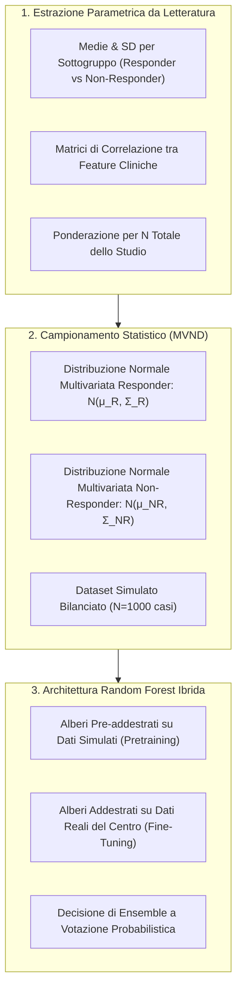

# Pretraining con Dati Simulati da Letteratura nel Machine Learning Clinico

## Definizione Operativa

Il **pretraining con dati simulati da letteratura** è una metodologia di pre-addestramento algoritmico basata sulla generazione di dati sintetici a partire da statistiche descrittive aggregate pubblicate nella letteratura scientifica (medie, deviazioni standard, matrici di correlazione disaggregate per gruppi di outcome terapeutico). La finalità principale è mitigare l'overfitting e compensare la scarsità di dataset clinici aperti prima della fase di fine-tuning su campioni reali.

Il razionale teorico si basa su tre pilastri:
1. **Smorzamento del Rumore Locale (*Noise Averaging*)**: Integrare statistiche provenienti da studi internazionali eterogenei per mediare il rumore idiosincratico di singoli dataset clinici locali.
2. **Riduzione del Bias di Campionamento (*Sampling Bias Mitigation*)**: L'aggregazione di parametri di diverse popolazioni riduce il rischio di fissazione su caratteristiche contingenti di una specifica coorte.
3. **Inizializzazione Informata degli Alberi Decisionali**: Nei modelli Random Forest, l'ensemble viene pre-popolato con alberi decisionali addestrati su distribuzioni note di *responder* e *non-responder*, combinandosi con alberi calibrati sulle associazioni del dataset reale.

## Evidenze dalla Letteratura

Le evidenze empiriche suggeriscono che l'efficacia del metodo è condizionata dalla qualità del segnale nel dataset reale:

| Studio / Setting | Risultato con Pretraining | Modello Standard (Solo Reale) | Esito Statistico e Interpretazione |
| :--- | :--- | :--- | :--- |
| **Studio 1 (Risposta OCD - CBT)** | Balanced Acc: $0.549 \pm 0.052$ | Balanced Acc: $0.526 \pm 0.035$ | $p = 0.19$ (n.s.). Miglioramento descrittivo. |
| **Studio 1 (Sbilanciato)** | Balanced Acc: $0.571 \pm 0.050$ | Balanced Acc: $0.516 \pm 0.020$ | $p = 0.02$ (Sig.). Utile surrogato bilanciamento. |
| **Studio 2 (Remissione OCD - CBT)** | Balanced Acc: $0.517 \pm 0.027$ | Balanced Acc: $\mathbf{0.650 \pm 0.036}$ | Pretraining deleterio; degradazione segnale. |

**Principali Criticità e Soluzioni:**
- **Assunzione Gaussiana**: Spesso irrealistica in psicometria; si propongono evoluzioni tramite Kernel Density Estimation (KDE) o copule non parametriche.
- **Disponibilità dati**: Necessità di standard come Consort-AI per la condivisione di tabelle disaggregate.
- **Performance**: Il metodo degrada se il modello reale possiede già un segnale forte.

**Riferimenti Bibliografici:**
- Jacobs et al. (2026) - *Pretraining con Dati Simulati da Letteratura nel Machine Learning Clinico* (`2601.06159v1.pdf`).

## Relazioni

- [[jacobs-et-al-2026]]: Sintesi completa dello studio empirico originale.
- [[open-data-scarcity-clinical-psychology]]: Quadro etico e metodologico della carenza di dati condivisi in ambito clinico.
- [[mccv-and-statistical-validation-clinical-ml]]: Protocolli di validazione MCCV e inferenza statistica corretta.
- [[treatment-outcome-and-relapse-prediction]]: Modelli predittivi dell'efficacia psicoterapeutica.
- [[ai-clinical-decision-support]]: Sistemi di supporto alle decisioni cliniche.
