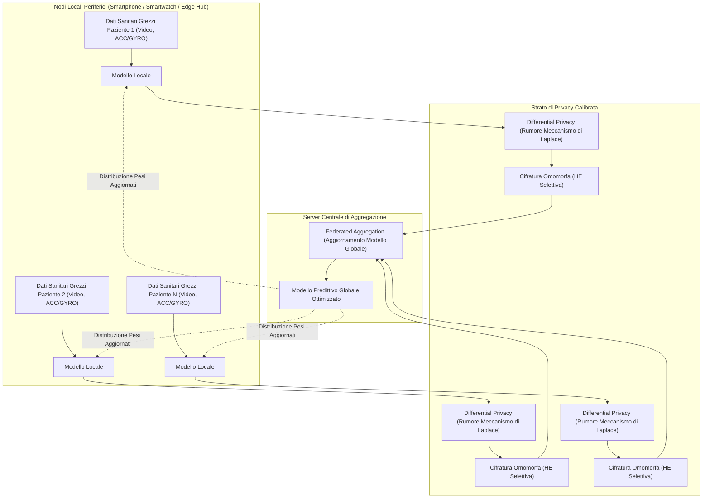
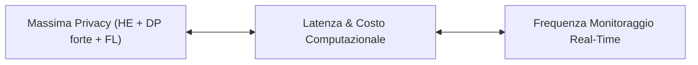

# Privacy-Preserving Machine Learning in Telemedicine and Remote Patient Monitoring

## Definizione Operativa
Un insieme di architetture crittografiche e paradigmi di machine learning decentralizzato (Federated Learning, Differential Privacy e Homomorphic Encryption) progettati per addestrare modelli predittivi ed eseguire inferenze cliniche in tempo reale su flussi di dati biometrici, video e sensoriali generati da dispositivi di telemedicina e Remote Patient Monitoring (RPM), garantendo che i dati sanitari grezzi (*raw personal data*) non abbandonino mai il dispositivo periferico locale del paziente e rimangano conformi alle normative GDPR e HIPAA (Joshua & Peterson, 2025; Li et al., 2021).

- **Utilità Clinica e di Governance:** Protezione assoluta della riservatezza dei dati ad altissima sensibilità (es. registrazioni video dell'ingestione, dati biometrici continui), neutralizzazione dei rischi di *data breach* centralizzati e prevenzione degli attacchi di inferenza di appartenenza (*membership inference attacks*).

---

## Architettura e Meccanismi di Protezione

### 1. Federated Learning (FL)
- I dati biometrici e le abitudini posologiche restano archiviati esclusivamente sul dispositivo locale del paziente.
- Ciascun nodo allena localmente la rete (es. Bi-LSTM o CNN) e trasmette al server centrale unicamente i gradienti o i pesi del modello. Il server centrale aggrega gli aggiornamenti tramite algoritmi come *Federated Averaging* (FedAvg).

### 2. Differential Privacy (DP) e Meccanismo di Laplace
- Per impedire la ricostruzione delle caratteristiche del singolo paziente attraverso l'analisi dei pesi condivisi, viene introdotto rumore statistico calibrato.
- L'iniezione di rumore avviene tramite il **Meccanismo di Laplace**:
  $$L(x) = f(x) + \text{Lap}\left(\frac{\Delta f}{\epsilon}\right)$$
  - $\Delta f$: *Sensibilità globale* della funzione di query (misura la massima variazione possibile dell'output al variare di un singolo record).
  - $\epsilon$: *Privacy budget* (parametro che quantifica il trade-off tra livello di riservatezza e accuratezza analitica del modello; valori minori di $\epsilon$ offrono maggiore anonimato a fronte di maggior rumore introdotto).

### 3. Selective Homomorphic Encryption (HE)
- Permette di eseguire operazioni algebriche (somma e moltiplicazione dei pesi) direttamente sui vettori crittografati senza richiedere la preventiva decifrazione sul server cloud.
- Applicata selettivamente alle componenti e ai parametri computazionali ad alto rischio per limitare il dispendio computazionale.

---

## Trade-off Computazionale, Latenza e Sfide di Implementazione

1. **Latenza di Calcolo e Monitoraggio Real-Time**: L'impiego della cifratura omomorfa e dei cicli di aggregazione federata può introdurre ritardi nell'ordine di millisecondi o secondi. Nel monitoraggio di urgenze fisiologiche o rilevamento ad alta frequenza, è richiesta un'architettura ibrida edge-cloud a bassa latenza (sfruttando il 5G URLLC).
2. **Degrado dell'Accuratezza con Elevato Rumore DP**: Se il budget $\epsilon$ è impostato su livelli troppo restrittivi, il rumore laplaciano può degradare la sensibilità del classificatore di aderenza, aumentando i falsi negativi.
3. **Efficienza Energetica su Dispositivi Mobili**: L'addestramento locale su wearable e smartphone a batteria limitata impone l'adozione di modelli compressi (quantizzazione, pruning) per evitare il surriscaldamento e l'esaurimento della carica.

---

## Riferimenti Bibliografici
- Joshua, C., & Peterson, W. (2025). AI-Powered Real-Time Adherence Monitoring for Remote Patient Care in Telemedicine. *Research Article*, June 2025.
- Li, X., et al. (2021). Multi-Site fMRI Analysis Using Privacy-Preserving Federated Learning. *Medical Image Analysis*, 65, 101765.
- Gundaboina, A. (2024). DevSecOps in Healthcare: Building Secure Patient Engagement Applications. *JAIMLD*, 2(4), 3052-3059.

---

## Relazioni
- [[joshua-peterson-2025]]
- [[video-observed-therapy-ai]]
- [[wearable-sensor-fusion-adherence]]
- [[etica-privacy-bias-ia-clinica]]
- [[on-device-slm-mental-health]]
