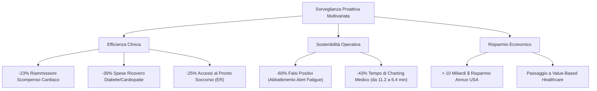

# Proactive Clinical Surveillance and Alert Fatigue Mitigation in Telemedicine

## Definizione Operativa
La transizione dai sistemi di telemonitoraggio reattivi basati su soglie univariata isolate (che inviano notifiche solo a seguito di un evento anomalo manifesto, es. "dose mancata") a un modello di **sorveglianza clinica proattiva** guidato da algoritmi di intelligenza artificiale multivariata. Questo modello analizza congiuntamente deviazioni nei parametri vitali, tendenze comportamentali e fattori contestuali per intercettare il deterioramento clinico subclinico prima dell'insorgenza della crisi acuta, abbattendo drasticamente l'affaticamento da allarme (*alert fatigue*) dei sanitari (Joshua & Peterson, 2025; Chen & Decary, 2020).

- **Utilità Clinica e Organizzativa:** Sostenibilità dei flussi di lavoro clinici, gestione di ampi pannelli di pazienti per singolo team medico, prevenzione attiva delle ospedalizzazioni e transizione da un modello di cura fondato sul volume (*volume-based*) a uno fondato sul valore (*value-based healthcare*).

---

## Il Cambio di Paradigma: Reattivo vs Proattivo

```mermaid
flowchart TD
    subgraph ReactiveModel ["Telemonitoraggio Tradizionale (Reattivo)"]
        R1["Soglia Univariata Rigida (es. Singola Dose Saltata)"] --> R2["Allarme Immediato e Indiscriminato"]
        R2 --> R3["Falsi Positivi Elevati & Fluttuazioni Benigne"]
        R3 --> R4["Alert Fatigue nel Personale Sanitario (Allarmi Ignorati)"]
        R4 --> R5["Intervento Tardivo a Crisi Acuta Iniziata"]
    end

    subgraph ProactiveModel ["Sorveglianza Proattiva AI-Enhanced"]
        P1["Flussi Dati Multivariati (Aderenza + Attività Motoria + Segni Vitali)"] --> P2["Multivariate Pattern Recognition & Baseline Individuale"]
        P2 --> P3["Filtro Fluttuazioni Benigne (-60% Allarmi Inutili)"]
        P3 --> P4["Riconoscimento Deterioramento Pre-Crisi (es. Ipomobilità + Salto Diuretico nello Scompenso)"]
        P4 --> P5["Intervento Preventivo Precoce & Rettifica Terapeutica"]
    end
```

### Esempio Clinico Comparativo nello Scompenso Cardiaco (Heart Failure)
- **Approccio Tradizionale**: Il paziente dimentica una dose di diuretico; il sistema genera un allarme istantaneo aspecifico. Se il paziente compensa spontaneamente, l'allarme risulta un falso positivo che satura l'attenzione del clinico.
- **Approccio Proattivo AI**: Il sistema correla il mancato gesto di assunzione del diuretico con una graduale flessione dell'attività motoria giornaliera registrata dallo smartwatch (biomarcatore precoce di astenia e ritenzione idrica). L'IA identifica un pattern di deterioramento clinicamente significativo ed emette una notifica ad alta priorità, consentendo l'intervento terapeutico prima dello scompenso acuto.

---

## Impatto Clinico, Economico e sui Flussi di Lavoro

1. **Abbattimento dell'Alert Fatigue (-60%)**: Il filtraggio del rumore fisiologico e delle oscillazioni transitorie innocue riduce del 60% le notifiche ingiustificate, preservando l'attenzione e la responsività del personale medico per le emergenze reali.
2. **Efficienza della Documentazione (-43%)**: L'integrazione di reportistica automatizzata e strutturazione dei dati riduce il tempo speso dai medici nella redazione delle note da 11.2 minuti a 6.4 minuti per visita virtuale, senza alterare la completezza clinica.
3. **Riduzione dei Ricoveri e Costi Sanitari**: 
   - Riduzione del 23% delle riammissioni per insufficienza cardiaca (>10 miliardi di dollari annui di risparmio negli USA; Steinhubl et al., 2022).
   - Riduzione del 30% dei costi di degenza per pazienti con diabete e patologie cardiovascolari (Joshua & Peterson, 2025).

---

## Il Ruolo Chiave dell'Explainable AI (XAI)

Affinché la sorveglianza proattiva sia accolta nella pratica medica quotidiana, è essenziale superare l'opacità dei modelli di deep learning ("black box").
- I medici richiedono l'esplicitazione dei pesi che hanno generato l'allarme (es. matrici di correlazione tra calo dell'attività motoria, variazioni del peso corporeo ed omissione posologica).
- L'adozione di tecniche di interpretabilità (SHAP, LIME, mappe di attenzione) consente al personale di comprendere la razionale clinica sottostante alla notifica predittiva.

---

## Riferimenti Bibliografici
- Joshua, C., & Peterson, W. (2025). AI-Powered Real-Time Adherence Monitoring for Remote Patient Care in Telemedicine. *Research Article*, June 2025.
- Steinhubl, S. R., et al. (2022). Economic Impact of AI-Driven Heart Failure Monitoring. *Health Affairs*, 41(5), 259-273.
- Chen, M., & Decary, M. (2020). Artificial Intelligence in Healthcare: A Guide for Leaders. *Healthcare Management Forum*, 33(1), 10-18.

---

## Relazioni
- [[joshua-peterson-2025]]
- [[video-observed-therapy-ai]]
- [[wearable-sensor-fusion-adherence]]
- [[privacy-preserving-rpm-frameworks]]
- [[chronic-disease-monitoring-adherence]]
- [[ai-clinical-decision-support]]
