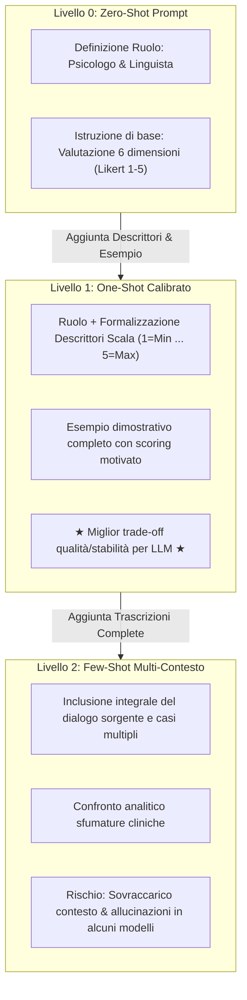

# Prompting Euristico Progressivo nella Sintesi Clinica

## Definizione Operativa

Il **Progressive Prompting** (prompting euristico progressivo) è una tecnica di ingegneria dei prompt strutturata che guida i Large Language Models attraverso un'escalation sistematica di vincoli di ruolo, criteri di ancoraggio teorico ed esempi dimostrativi (da *Zero-Shot* a *One-Shot* fino a *Few-Shot* multi-contesto), al fine di ottimizzare la fedeltà contestuale e contenere la deriva semantica nei compiti di sintesi e codifica psicoterapeutica (Kumar, Rajawat, & Ntoutsi, 2025).

---

## Architettura dei Prompt e Meccanismi di Guida

Nello studio di Kumar et al. (2025), la progettazione dei prompt per la sintesi e la valutazione del Colloquio Motivazionale è stata raffinata iterativamente con il contributo di esperti clinici:

### 1. Zero-Shot Prompt
- **Struttura**: Assegna al modello la personalità di *Psicologo e Linguista* esperto e richiede di valutare la sintesi sulle dimensioni bersaglio.
- **Criticità**: Senza definizioni operative dei singoli punti della scala, il modello applica euristiche generiche, producendo valutazioni soggette a forte varianza e polarizzazione.

### 2. One-Shot Prompt (Regime Ottimale)
- **Struttura**:
  - Definizione formale del ruolo e del dominio clinico.
  - Esplicitazione tassativa dei 5 livelli della scala Likert (1 = *Extremely Low*, 2 = *Low*, 3 = *Moderate*, 4 = *High*, 5 = *Extremely High*).
  - Presentazione di una seduta tipo con la relativa sintesi e i punteggi giustificati per ciascuna delle 6 dimensioni MITI.
- **Vantaggi Clinici**: Massimizza l'allineamento con la ground truth umana, riducendo le misclassificazioni a un intervallo compatto ($\pm 1$), senza saturare la finestra di attenzione del modello.

### 3. Few-Shot Prompt con Dialoghi Integrati
- **Struttura**: Fornisce molteplici coppie dialogo-sintesi complete, richiedendo un confronto incrociato analitico tra testo originale e riassunto.
- **Trade-off e Limiti**:
  - *Nei modelli a elevata capacità contestuale (es. ChatGPT-4.0)*: Garantisce elevata ricchezza semantica.
  - *Nei modelli vulnerabili alla distrazione contestuale (es. DeepSeek-V3, Gemini)*: L'eccessiva lunghezza del prompt innesca perdita di coerenza (*context loss*), allucinazioni e oscillazioni estreme nei punteggi.

---

## Confronto Sperimentale dell'Impatto del Prompting

| Modello | Regime Zero-Shot | Regime One-Shot | Regime Few-Shot |
| :--- | :--- | :--- | :--- |
| **ChatGPT-4.0** | Tendenza a sintesi generiche, punteggi mediamente allineati. | **Prestazione ottimale**: deviazione minima dalla ground truth ($\Delta \in [-1, +1]$), eccellente preservazione dell'empatia. | Ottima qualità narrativa, ma lievi ridondanze descrittive. |
| **DeepSeek-V3** | Sintesi accettabili, forte variabilità nello scoring. | Buona aderenza descrittiva, moderata polarizzazione Likert. | **Instabilità**: perdita di contesto e tendenza ad allucinare dettagli terapeutici. |
| **Gemini 2.0 Flash** | Sintesi eccessivamente brevi, trascuratezza dell'empatia. | Sintesi stringate, forte deviazione dai punteggi degli esperti. | Persistenza di approccio estremo e scarsa profondità emotiva. |

---

## Linee Guida Operative per la Progettazione di Prompt Clinici

1. **Specificazione Multidisciplinare del Ruolo**: Combinare competenze cliniche e linguistiche nel system prompt (*"Agisci come Psicologo Clinico e Linguista Computazionale esperto in MITI"*).
2. **Definizione Tassativa delle Scale di Misurazione**: Non limitarsi a richiedere un punteggio 1–5, ma associare ciascun valore a indicatori comportamentali univoci.
3. **Controllo della Lunghezza del Prompt**: Evitare l'inclusione indiscriminata di multiple trascrizioni integrali se il modello target manifesta fenomeni di *lost-in-the-middle* o instabilità contestuale; preferire un singolo shot esaustivo e ben annotato.

---

## Relazioni
- [[semantic-drift-in-therapy-llms]]: Il fenomeno primario contrastato dal prompting progressivo.
- [[miti-framework-llm-evaluation]]: Lo schema teorico inserito come vincolo strutturale nel prompt.
- [[annosum-mi-dataset]]: Il corpus impiegato per calibrare e validare i prompt.
- [[machine-heuristics-in-therapy]]: Euristiche algoritmiche di interpretazione del testo clinico.
- [[human-in-the-reasoning]]: Ruolo dell'esperto umano nell'iterazione e validazione dei prompt.
- [[kumar-et-al-2025]]: Studio sperimentale sul progressive prompting applicato al Colloquio Motivazionale.
