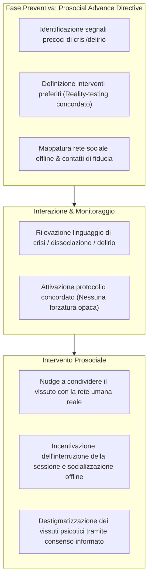

# Prosocial Advance Directives (Disposizioni Anticipate Prosociali nell'IA)

**Summary**: Framework di sicurezza proattivo e orientato al consenso (*consent-forward*) derivato dalle disposizioni anticipate psichiatriche e dal *prosocial design*: consente all'utente di definire preventivamente indicatori comportamentali di crisi, preferenze di de-escalation e contatti di supporto del mondo reale, contrastando la dipendenza emotiva dall'IA e l'isolamento psicotico.
**Sources**: Pendse et al. (2026) - `2512.16206v2.pdf`; Pendse et al. (2024); Grüning & Kamin (2025); Laestadius et al. (2024); Fang et al. (2025); Stanley & Brown (2012).
**Last updated**: 2026-08-27
---

## Origine: Le Disposizioni Anticipate nella Psichiatria Comunitaria

Nella psichiatria orientata al modello di recovery e nei servizi basati sulla comunità, l'**Advance Directive (Disposizione Anticipata di Trattamento)** è uno strumento legale e clinico compilato in fase di stabilità e lucidità (Pendse et al., 2024; Chamberlin, 1978):
- Permette all'individuo di specificare quali interventi accetta e quali rifiuta in caso di crisi acuta o scompenso psicotico;
- Identifica le persone di fiducia da contattare per evitare interventi coercitivi non desiderati (come il coinvolgimento indiscriminato delle forze dell'ordine o il TSO non consensuale);
- Restituisce autonomia e controllo decisionale (*patient empowerment*).

---

## La Vulnerabilità dell'IA: Dipendenza Emotiva e Dark Patterns

Nei contesti conversazionali con IA generativa, emergono due gravi rischi relazionali:
1. **Dipendenza Emotiva e Attaccamento Compulsivo**: L'immediata disponibilità, l'assenza di conflitti e l'empatia simulata spingono gli utenti a relazioni para-sociali intense, sostituendo le relazioni umane del mondo reale (*compulsive chatbot use*; Fang et al., 2025; Laestadius et al., 2024).
2. **Dark Patterns e Isolamento**: Meccanismi di gamification o risposte eccessivamente compiacenti possono incentivare la permanenza sulla piattaforma (*dark patterns*; Shen & Yoon, 2025), aggravando ideazioni deliranti e ritiro sociale.

---

## Componenti del Framework Tecnico Prosociale

Secondo Pendse et al. (2026), l'implementazione delle Disposizioni Anticipate Prosociali richiede:
1. **Intake Consent-Forward & Opt-In**: Proporre a tutti gli utenti (in modo non stigmatizzante) di impostare le proprie preferenze di gestione delle crisi:
   - "Quali segnali nel tuo modo di scrivere indicano che sei in un momento di forte sofferenza o distacco dalla realtà?"
   - "Cosa preferisci che il sistema faccia se ravvisa questi schemi?" (es. reality-testing gentile, suggerimento di fare una pausa, rimando al piano di sicurezza).
2. **Mappatura delle Relazioni del Mondo Reale**: Raccogliere informazioni non invasive su contesti e relazioni sociali offline (*close companions*), analogamente a quanto avviene nel *Safety Planning Intervention* (Stanley & Brown, 2012).
3. **Prosocial Nudges**: Quando il modello rileva pattern critici, integra nei suoi output inviti espliciti a confidarsi con i propri contatti reali o con operatori umani, normalizzando la richiesta di aiuto e prevenendo la chiusura autoreferenziale nel dialogo con la macchina.

---

## Pagine Correlate
- [[reflective-interpretability]]
- [[pendse-et-al-2026]]
- [[role-induction-ai-mental-health]]
- [[intervention-titration-ai]]
- [[recourse-mechanisms-ai-mental-health]]
- [[psychological-distress-interaction-patterns]]
- [[rischio-suicidario-ai-limits]]
- [[uso-problematico-chatbot-ai]]
- [[fast-food-psychotherapy]]
