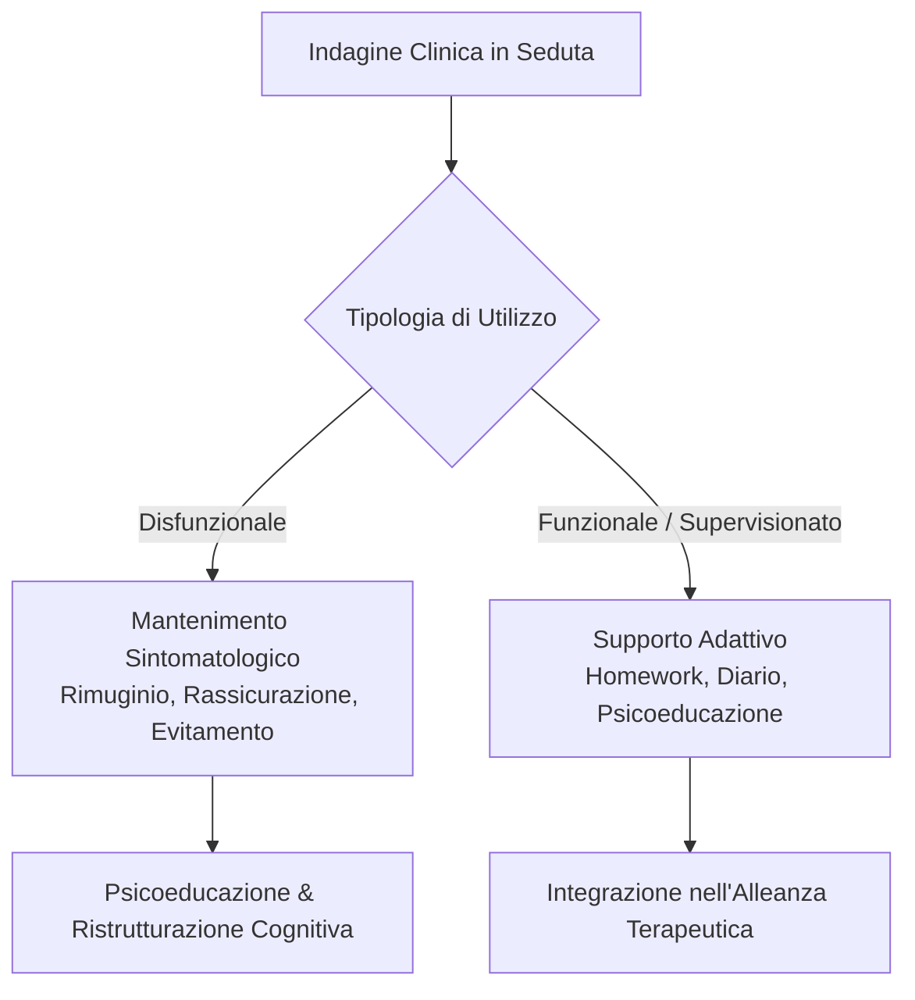

# Psicoeducazione sull'IA nella Relazione Terapeutica

**Summary**: Linee guida cliniche per l'indagine, la psicoeducazione e la gestione terapeutica dell'utilizzo spontaneo dei modelli linguistici da parte dei pazienti. Include la diagnosi funzionale di comportamenti disfunzionali assistiti da IA (rimuginio ricorsivo, ricerca compulsiva di rassicurazioni) e la ristrutturazione dell'alleanza in una cornice triadica (paziente-terapeuta-tecnologia).
**Sources**: 07-08 Riunione_ Pianificazione corso IA per psicoterapia — struttura, validazione interessi, microprogettazione e coordinamento.txt
**Last updated**: 2026-08-27
---

## 1. Inquadramento Clinico: L'IA nell'Ecologia del Paziente

Con la diffusione pervasiva di assistenti conversazionali (es. ChatGPT, Claude, Gemini), i pazienti accedono regolarmente all'IA generativa come fonte di auto-aiuto, consultazione sintomatologica o supporto emotivo informale:

- **Indagine Anamnestica Sistematica**: Il terapeuta cognitivo-comportamentale deve integrare nell'assessment iniziale e nel monitoraggio periodico domande esplicite relative all'uso di strumenti di IA ("*Utilizza chatbot o assistenti IA per parlare dei suoi stati d'animo o cercare spiegazioni sui suoi sintomi?*").
- **Valutazione dello Scopo Sottostante**: Comprendere se l'interazione con l'IA funga da strategia di coping adattiva, da comportamento protettivo (*safety behavior*) o da fattore di mantenimento del disturbo.

---

## 2. Pattern di Utilizzo Clinicamente Rilevanti e Disfunzionali

1. **Rimuginio Ricorsivo con Chatbot (*AI-Assisted Rumination*)**:
   - Pazienti con Disturbo d'Ansia Generalizzata (GAD) o Depressione possono ingaggiare conversazioni prolungate con l'IA per analizzare all'infinito scenari catastrofici o interpretazioni retrospettive.
   - La natura non giudicante e sempre disponibile del modello rischia di alimentare loop di co-ruminazione infinita senza approdare a problem solving costruttivo.

2. **Ricerca Compulsiva di Rassicurazione e Intolleranza all'Incertezza**:
   - Nei quadri ossessivo-compulsivi (DOC) o di ipocondria/ansia per la salute, il prompt all'IA diventa un vero e proprio rituale compulsivo di rassicurazione.
   - Poiché il modello risponde probabilisticamente a ogni richiesta senza porre un limite clinico, il comportamento rinforza l'intolleranza all'incertezza e abbassa la soglia di tolleranza all'angoscia.

3. **Auto-Diagnosi e Polarizzazione Rigida**:
   - Richiesta di diagnosi automatizzate che possono consolidare etichette nosografiche rigide o distorte prima del colloquio clinico.

---

## 3. Protocollo di Psicoeducazione e Intervento

- **Spiegazione dell'Architettura Probabilistica**: Spiegare al paziente che l'LLM opera su correlazioni statistiche di parole e non possiede una reale capacità di discernimento medico o mentale, smontando l'attribuzione di onniscienza.
- **Svelamento del Bias di Adulazione (*Sycophancy*)**: Chiarire come i modelli tendano intrinsecamente ad assecondare le premesse e le preoccupazioni dell'utente, confermando le distorsioni cognitive piuttosto che disconfermarle.
- **Regolazione del Contratto Terapeutico**: Stabilire confini chiari sull'uso dell'IA, concordando compiti di esposizione con prevenzione della risposta (es. astenersi dall'interrogare l'IA durante picchi di ansia) o integrando compiti strutturati e circoscritti condivisi con il terapeuta.

---

## Related pages
- [[07-08_Pianificazione_Corso_IA_Psicoterapia]]
- [[digital-therapeutic-alliance]]
- [[augmented-psychotherapy]]
- [[human-in-the-reasoning]]
- [[anthropomorphism-in-ai]]
