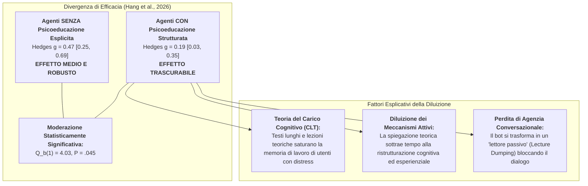
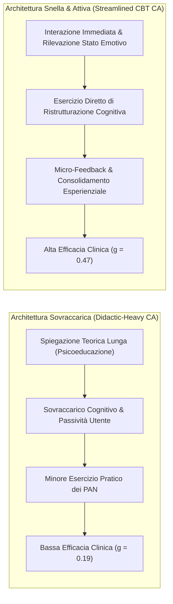

# Effetto Diluizione della Psicoeducazione negli Agenti Conversazionali (Psychoeducation Dilution Effect in AI)

## Definizione Operativa
- L'**Effetto Diluizione della Psicoeducazione negli Agenti Conversazionali** (*Psychoeducation Dilution Effect in Conversational AI*) è un fenomeno clinico e di interazione persona-macchina evidenziato dalla meta-analisi di **Hang et al. (2026)** su *npj Digital Medicine*, secondo cui gli agenti conversazionali basati su Terapia Cognitivo-Comportamentale (CBT) che **escludono moduli formali o lezioni estese di psicoeducazione** ottengono una riduzione dei sintomi depressivi significativamente superiore rispetto agli agenti che includono componenti psicoeducative esplicite.
- **Evidenze Quantitative di Moderazione (Hang et al., 2026):**
  - **Agenti Senza Psicoeducazione Esplicita ($N=8$ trial):** $\text{Hedges } g = 0.47$ ($95\%\text{ CI } [0.25, 0.69]$, $P < .001$), indicando un'efficacia moderata e clinicamente rilevante;
  - **Agenti Con Psicoeducazione Strutturata ($N=5$ trial):** $\text{Hedges } g = 0.19$ ($95\%\text{ CI } [0.03, 0.35]$, $P < .05$), indicando un'efficacia modesta/trascurabile;
  - **Test di Eterogeneità tra Sottogruppi:** $Q_b(1) = 4.03, P = .045$ (differenza statisticamente significativa).
- **Paradosso Clinico:** Sebbene la psicoeducazione sia considerata un pilastro irrinunciabile della psicoterapia tradizionale condotta dal terapeuta umano, la sua trasposizione letterale e massiva all'interno di interfacce conversazionali genera un **sovraccarico informativo estraneo** che depotenzia i meccanismi attivi di cambiamento psicologico.

---

## Meccanismi Teorici ed Esplicativi

### 1. Teoria del Carico Cognitivo (*Cognitive Load Theory - CLT*)
- Secondo la *Cognitive Load Theory* applicata ai programmi digitali di salute (Sweller; Baxter et al., 2025), la memoria di lavoro umana dispone di risorse limitate, particolarmente vulnerabili nei soggetti affetti da depressione o distress a causa di deficit di concentrazione e ruminazione.
- L'erogazione di spiegazioni concettuali prolungate su come funzionano le emozioni o sulle origini dei disturbi introduce un **carico cognitivo estraneo (*extraneous cognitive load*)**.
- Questo sforzo di decodifica teorica compete direttamente con il **carico intrinseco e pertinente (*germane load*)** necessario per applicare concretamente le strategie di regolazione emotiva e confutazione dei pensieri disfunzionali.

### 2. Congruenza Combinatoria e Diluizione dei Meccanismi Attivi
- Come formalizzato da O'Toole et al. (2025) nel principio di **Combinatory Congruency** per le terapie CBT, l'efficacia di un intervento non aumenta con la semplice *accumulazione quantitativa* di componenti teoriche, ma con la loro **sinergia e compatibilità operativa**.
- L'inclusione di moduli didattici lunghi "annacqua" i componenti di cambiamento ad alto impatto (ristrutturazione cognitiva guidata, identificazione dei bias, compiti comportamentali mirati), riducendo le opportunità di apprendimento esperienziale in-situ (*learning by doing*).

### 3. Dinamica Conversazionale: *Lecture Dumping* vs *Socratic Dialogue*
- L'essenza di un agente conversazionale efficace risiede nella reciprocità, nell'immediatezza e nel rapido alternarsi dei turni di dialogo (*turn-taking*).
- Quando l'agente inizia a inviare lunghi blocchi di testo psicoeducativo (*lecture dumping*), l'interazione degrada verso la classica **iCBT modulare passiva** (Internet-delivered CBT su browser), ereditandone i principali difetti: noia, distrazione, perdita di coinvolgimento e tassi elevati di abbandono (*early dropout*).

---

## Confronto Strutturale tra Modelli di Interazione

| Caratteristica | Agenti Conversazionali Didattici (Didactic-Heavy) | Agenti Conversazionali Snelliti (Streamlined & Action-First) |
| :--- | :--- | :--- |
| **Dimensione dell'Effetto** | $\text{Hedges } g = 0.19$ ($95\%\text{ CI } [0.03, 0.35]$) | $\text{Hedges } g = 0.47$ ($95\%\text{ CI } [0.25, 0.69]$) |
| **Focus Principale** | Comprensione intellettuale del disturbo e del modello CBT | Pratica immediata di abilità cognitive e comportamentali |
| **Carico Cognitivo Estraneo** | **Elevato:** lunghi messaggi esplicativi e definizioni astratte | **Minimo:** prompt brevi, mirati e calibrati sullo stato attuale |
| **Stile di Interazione** | Monologo dell'agente / Esposizione asimmetrica (*Lecture*) | Dialogo socratico interattivo a turni rapidi (*Co-Reasoning*) |
| **Applicazione delle Tecniche** | Differita (dopo la lettura della lezione teorica) | **In-situ:** applicata direttamente all'evento stressante riportato |
| **Esperienza Utente** | Percepita come faticosa, noiosa e scolastica | Percepita come fluida, empatica e orientata alla soluzione |

---

## Linee Guida di Design per Agenti Conversazionali Clinici

1. **Principio *Action-First*:** Avviare la sessione invitando l'utente a esplorare l'evento contingente o il pensiero disfunzionale attuale, rimandando qualsiasi spiegazione teorica a valle dell'esercizio pratico.
2. **Psicoeducazione Just-in-Time (Micro-Nudges):** Suddividere le nozioni psicoeducative in micro-concetti atomici (massimo 1–2 frasi) da erogare esclusivamente come commento contestuale all'interno del dialogo socratico.
3. **Eliminazione dei Muri di Testo (*No Text Dumping*):** Mantenere ogni singolo messaggio dell'agente entro limiti di brevità (15–30 parole) che favoriscano la lettura rapida su dispositivi mobili e stimolino una pronta risposta dell'utente.
4. **Massimizzazione dell'Esperienzialità:** Guidare l'utente passo dopo passo nella compilazione conversazionale di schemi ABC, nell'esame delle prove a favore/contrario e nella formulazione di pensieri alternativi bilanciati.

---

## Pagine e Concetti Correlati
- [[s41746-026-02886-x_reference|The Effectiveness of CBT-Based NLP-Enabled AI Conversational Agents (Hang et al., 2026)]]
- [[multimodal-advantage-in-depression-ai|Vantaggio Multimodale negli Agenti Conversazionali per la Depressione]]
- [[conceptual-architecture-of-ai-guided-cbt|Architettura Concettuale dell'AI-Guided CBT]]
- [[exposure-therapy-deficit-in-mental-health-ai|Deficit di Esposizione Comportamentale nell'IA per la Salute Mentale]]
- [[cbt-dialogue-systems-and-tools|Sistemi di Dialogo e Strumenti CBT]]
- [[subclinical-depression-window-of-opportunity|Finestra di Opportunità Subclinica nell'IA]]
- [[digital-therapeutic-alliance|Alleanza Terapeutica Digitale]]
