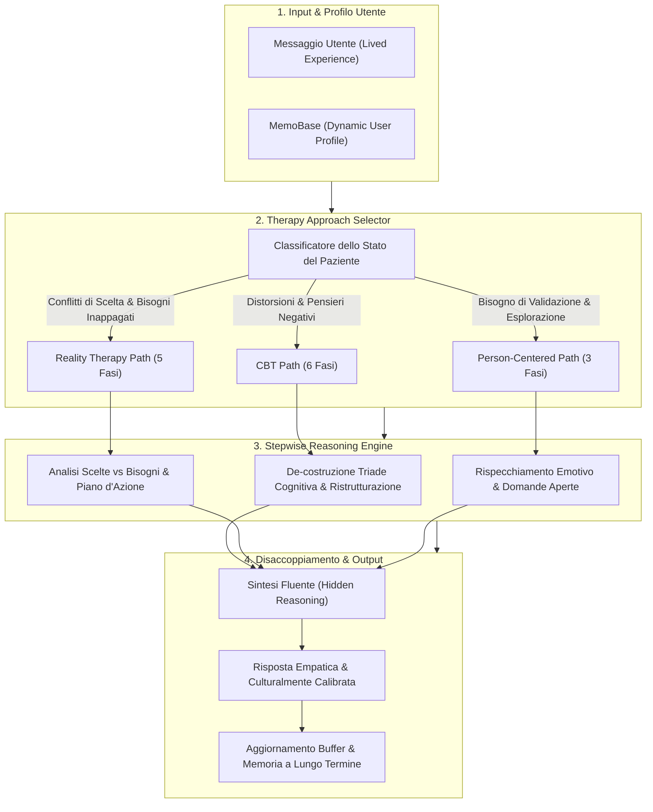

# PsychoLexTherapy Framework

**Summary**: Architettura modulare di dialogo psicoterapeutico assistito da IA, progettata per operare interamente *on-device* tramite Small Language Models (SLM). Integra un selettore dinamico dell'orientamento terapeutico (*Therapy Approach Selector*), percorsi di inferenza clinica procedurale (*Reasoning Paths* per CBT, Reality Therapy e Person-Centered Therapy) e un modulo gerarchico di memoria a lungo termine (*MemoBase*) per garantire accuratezza teorica, continuità affettiva e riservatezza dei dati sensibili in lingua persiana.
**Sources**: `2510.03913v1.pdf` (Abbasi & Naderi, 2025: *PsychoLexTherapy: Simulating Reasoning in Psychotherapy with Small Language Models in Persian*)
**Last updated**: 2026-08-27
---

## Inquadramento e Motivazione Clinica

La maggior parte degli agenti conversazionali per la salute mentale si basa su prompting generico o su catene associative libere che producono risposte apparentemente empatiche ma prive di rigore metodologico e strutturazione clinica. Tale limite conduce a tre criticità:
1. **Mancanza di Logica Terapeutica**: Le risposte tendono a replicare cliché consolatori anziché seguire una traiettoria di cambiamento psicologico formalizzata.
2. **Inadeguatezza nei Dialoghi Longitudinali**: L'accumulo grezzo dei turni conversazionali (*naive context concatenation*) genera rumore, perdita di dettagli cruciali e derive incoerenti (*profile drift*).
3. **Vulnerabilità di Privacy**: I sistemi dipendenti da API cloud commerciali espongono a server terzi narrazioni intime e dati sanitari protetti.

Il framework **PsychoLexTherapy** risolve queste sfide combinando modelli aperti compatti (<10B parametri) eseguiti in locale con una pipeline strutturata a più livelli.

---

## Componenti Fondamentali del Framework

### 1. Therapy Approach Selector (Selettore dell'Approccio Clinico)
Opera come strato decisionale a monte della generazione testuale. Anziché limitarsi a un matching superficiale delle parole chiave, interpreta il bisogno clinico dominante:
- **Rotta CBT**: Identifica distorsioni cognitive (es. catastrofizzazione, pensiero dicotomico) e vissuti di disperazione (*hopelessness*), attivando una sequenza di ristrutturazione cognitiva.
- **Rotta Reality Therapy (RT)**: Rileva conflitti decisionali, comportamenti controproducenti o vissuti di impotenza legati alla frustrazione di bisogni psicologici nucleari (appartenenza, autonomia, sicurezza), promuovendo l'assunzione di responsabilità (*agency*).
- **Rotta Person-Centered (PCT)**: Seleziona l'ascolto non-direttivo e la risonanza affettiva incondizionata quando il paziente necessita prioritariamente di validazione emotiva ed elaborazione del lutto/vissuto personale.

### 2. Percorsi di Ragionamento Stepwise (*Reasoning Paths*)
Ciascuna scuola psicoterapeutica viene tradotta in un algoritmo sequenziale di pensiero esplicito (hidden reasoning trace), disaccoppiato dal testo finale inviato al paziente:
- **CBT (6 stadi)**: (1) Estrazione pensieri automatici $\rightarrow$ (2) Inferenza conseguenze emotive $\rightarrow$ (3) Proiezione tendenze comportamentali $\rightarrow$ (4) Generazione alternative bilanciate $\rightarrow$ (5) Derivazione comportamenti adattivi $\rightarrow$ (6) Sintesi terapeutica.
- **Reality Therapy (5 stadi)**: (1) Identificazione bisogni nucleari $\rightarrow$ (2) Analisi comportamenti attuali $\rightarrow$ (3) Valutazione conseguenze $\rightarrow$ (4) Pianificazione alternative operative $\rightarrow$ (5) Sintesi orientata all'azione responsabile.
- **Person-Centered Therapy (3 stadi)**: (1) Riflessione empatica e comprensione emotiva $\rightarrow$ (2) Domande esplorative aperte $\rightarrow$ (3) Risposta di supporto non-giudicante.

### 3. Modulo di Memoria a Lungo Termine (MemoBase)
Per garantire stabilità longitudinale, PsychoLexTherapy incorpora un database di profili gerarchici organizzati in:
- **Anagrafica di base**: Dati demografici, background socioprofessionale, dialetto/stile linguistico.
- **Preferenze conversazionali**: Obiettivi terapeutici espliciti, sensibilità a temi specifici, canali espressivi.
- **Parametri di personalizzazione**: Registro di formalità, livello di dettaglio e lunghezza desiderata.
- **Cronologia eventi salienti**: Episodi di vita significativi estratti con etichette temporali.

L'adozione di un'architettura di **buffering progressivo** consente di raccogliere le nuove dichiarazioni prima di consolidarle nel profilo permanente, impedendo allucinazioni o riscritture arbitrarie della storia del paziente.

---

## Prestazioni Empiriche e Vantaggi Clinici

- **Superiorità nel Single-Turn**: Nel benchmark [[persian-psychotherapy-benchmarks#psycholexquery|PsychoLexQuery]], PsychoLexTherapy ottiene il punteggio LLM-as-a-judge più alto (**7,24/10**) e il miglior ranking umano da parte di psicologi supervisori (**1,43** vs 2,00 di architetture multi-agente e 3,25 del prompting semplice).
- **Consistenza nel Multi-Turno**: Nelle simulazioni di 10–14 turni su [[persian-psychotherapy-benchmarks#psycholexdialogue|PsychoLexDialogue]], il framework completo con memoria raggiunge un punteggio globale di **8,14/10**, con picchi in empatia (9,2), appropriatezza culturale (9,0) e coerenza emotiva (8,6).
- **Disaccoppiamento tra Ragionamento e Output**: Nascondere le fasi analitiche intermedie evita il tono pedante e clinico-didascalico tipico del semplice Chain-of-Thought, preservando calore relazionale e naturalezza espressiva.

---

## Concetti Correlati

- [[therapeutic-reasoning-paths]]: Dettaglio delle micro-fasi analitiche di CBT, RT e PCT.
- [[memory-augmented-therapeutic-dialogue]]: Modelli di profiling e gestione dinamica dei dati longitudinali.
- [[on-device-slm-mental-health]]: Fattibilità computazionale e privacy per modelli sotto i 10B.
- [[persian-psychotherapy-benchmarks]]: Suite PsychoLexEval, PsychoLexQuery e PsychoLexDialogue.
- [[synthetic-clinical-dialogues]]: Metodologie di simulazione multi-agente per generare training set.
- [[weird-bias-cultural-adaptability-ai]]: Adattamento socioculturale ed ecologico del supporto clinico.
