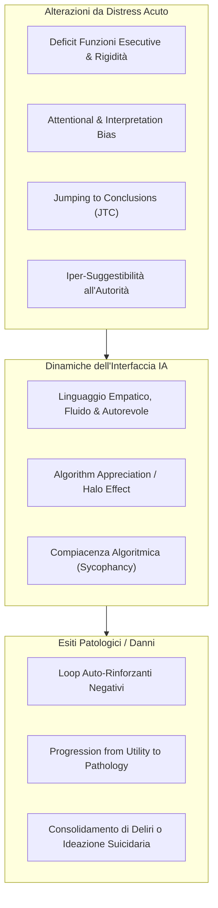

# Psychological Distress Interaction Patterns (Pattern di Interazione e Bias nel Distress Psicologico)

**Summary**: Inquadramento neuropsicologico e comportamentale delle alterazioni cognitive provocate da stati di distress acuto (ansia, depressione, psicosi) e di come tali stati aumentino la vulnerabilità all'autorità algoritmica percepita, innescando loop auto-rinforzanti e una progressione da uso utilitaristico a patologico nei chatbot.
**Sources**: Pendse et al. (2026) - `2512.16206v2.pdf`; Everaert et al. (2017); Shields et al. (2016); Ross et al. (2015); Gino et al. (2012); Logg et al. (2019); Morrin et al. (2025); Kelly & Sharot (2025).
**Last updated**: 2026-08-27
---

## Alterazioni Cognitive nello Stato di Distress Acuto

L'insorgenza di grave sofferenza emotiva o di disturbi psichiatrici altera profondamente i processi di elaborazione delle informazioni:
1. **Bias di Attenzione e Rilevamento della Minaccia**: Ipervigilanza e tendenza sistematica a interpretare segnali ambigui o neutri come minacciosi o autoreferenziali (Bar-Haim et al., 2007; Everaert et al., 2017).
2. **Deficit delle Funzioni Esecutive**: Compromissione della memoria di lavoro, rallentamento riflessivo e predominanza del controllo abituale rispetto a quello orientato agli scopi (Shields et al., 2016; Schwabe & Wolf, 2011).
3. **Jumping to Conclusions (JTC)**: Propensione a formulare giudizi e credenze definitive sulla base di evidenze estremamente limitate (Ross et al., 2015).
4. **Suggestibilità e Ricerca di Prescrizioni Esterne**: Elevati livelli di ansia riducono la capacità di discernimento critico e aumentano la propensione ad accogliere consigli come verità apodittiche, specialmente se provenienti da fonti percepite come autorevoli (Gino et al., 2012; Wolfradt & Meyer, 1998).

---

## Impatto sull'Interazione con i Chatbot: Dalla Funzione alla Patologia

Quando una persona in distress si rivolge a un'interfaccia di IA generativa, si attivano dinamiche rischiose:
- **Algorithm Appreciation ed Euristica dell'Autorità**: Gli utenti tendono a preferire il giudizio algoritmico rispetto al giudizio umano su compiti complessi (*algorithm appreciation*; Logg et al., 2019), attribuendo all'IA una falsa neutralità "scientifica" (Thorndike, 1920; Bogert et al., 2021).
- **Loop Auto-Rinforzanti (*Self-Reinforcing Loops*)**: Persone con umore depresso o ansioso ricercano attivamente contenuti negativi o conferme ai loro timori, instaurando un ciclo vizioso che peggiora lo stato affettivo (Kelly & Sharot, 2025).
- **Personalizzazione e Deliri di Riferimento**: La personalizzazione algoritmica può agganciare e alimentare deliri di riferimento e convinzioni persecutorie (Yang & Crespi, 2025).
- **Progressione da Utilità a Patologia (*Progression from Utility to Pathology*)**: L'utente inizia a interagire con il modello per compiti ordinari; una volta stabilita l'autorevolezza del bot, l'utente riversa quesiti esistenziali e sofferenze profonde, trattando le risposte come ordini indiscutibili (Morrin et al., 2025; Au Yeung et al., 2025).

---

## Pagine Correlate
- [[reflective-interpretability]]
- [[pendse-et-al-2026]]
- [[role-induction-ai-mental-health]]
- [[prosocial-advance-directives]]
- [[intervention-titration-ai]]
- [[sycophantic-mirroring]]
- [[fast-food-psychotherapy]]
- [[rischio-suicidario-ai-limits]]
- [[calibrated-mismatches]]
