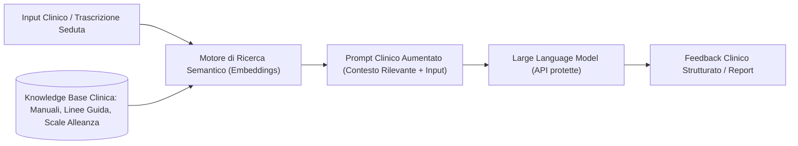

# Retrieval-Augmented Generation (RAG) in Psicoterapia

**Summary**: Architettura informatica che integra modelli linguistici di grandi dimensioni (LLM) con database documentali clinici esterni per fornire risposte contestualizzate, minimizzare le allucinazioni e preservare la privacy e la deontologia professionale.
**Sources**: `06-10 Lezione_ RAG, LLM in Psicoterapia e Governance Etica.txt`
**Last updated**: 2026-08-27
---

## Definizione e Funzionamento
Il **RAG (Retrieval-Augmented Generation)** è un paradigma architetturale in cui l'LLM non genera risposte attingendo unicamente ai pesi statistici appresi durante il pre-addestramento generale, ma interroga preliminarmente un archivio documentale controllato (*retrieval*) e utilizza i frammenti informativi pertinenti recuperati come contesto vincolante per la generazione (*generation*).

## Applicazioni Cliniche e Formative
1. **Analisi e Supervisione Post-Seduta**:
   - Inserimento del trascritto anonimizzato della seduta affiancato da repository teorici (es. modelli di rottura e riparazione dell'alleanza di Safran & Muran, scale WAI).
   - Generazione di report oggettivi sui turni di parola, marker di rottura dell'alleanza da ritiro o confronto e suggerimenti per le sedute successive.
2. **Simulazione Didattica di Pazienti Virtuali**:
   - Alimentazione del sistema con schede cliniche e profilazioni psicologiche strutturate (es. teoria dei valori di Schwartz, tratti di personalità Big Five), consentendo agli specializzandi di simulare colloqui con pazienti caratterizzati da profili cognitivi ed emotivi specifici.
3. **Piattaforme di Studio e Ricerca Clinica**:
   - Caricamento di manuali specialistici in formato PDF nativo per interrogazioni bibliografiche precise, sintesi concettuali e protocolli di manipolazione sperimentale.

## Requisiti di Sicurezza, Privacy e Governance
- **Accesso tramite API vs Interfacce Web Consumer**: l'impiego clinico richiede l'uso di API dedicate con clausole esplicite di *zero-data retention* (i dati non vengono memorizzati né impiegati per l'addestramento dei modelli commerciali).
- **Server Confinati e Normativa Europea**: i dati devono risiedere su infrastrutture conformi al GDPR e all'AI Act europeo, previo consenso informato del paziente.
- **De-identificazione Preventiva**: rimozione rigorosa di ogni identificatore anagrafico o dato sensibile prima dell'elaborazione algoritmica.

---

## Pagine Correlate
- [[modello-centauro-clinico]]
- [[feedback-informed-practice-ai]]
- [[augmented-psychotherapy]]
- [[large-language-models]]
