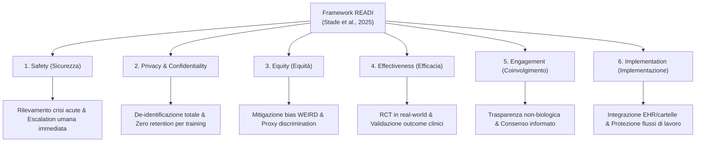

# Framework READI (Readiness Evaluation for AI-Mental Health Deployment and Implementation)

**Summary**: Framework di valutazione metodologica e operativa strutturato in sei dimensioni (Safety, Privacy, Equity, Effectiveness, Engagement, Implementation), proposto da Stade et al. (2025) per colmare il divario tra la sperimentazione algoritmica di laboratorio e l'integrazione sicura dell'Intelligenza Artificiale Generativa nei contesti clinici e assistenziali della salute mentale.
**Sources**: `AI Generativa in Psicoterapia.docx`, Stade, Eichstaedt, Kim, & Stirman (2025) (*Technology, Mind, and Behavior*)
**Last updated**: 2026-08-27
---

## Origine e Necessità Clinica

L'adozione clinica di sistemi basati su Large Language Models ([[large-language-models]]) in psicoterapia e psichiatria soffre storicamente di un grave deficit di validazione: la maggior parte dei modelli viene distribuita basandosi unicamente su metriche di gradimento utente (*User Experience - UX*) o su test informatici isolati, trascurando la sicurezza clinica a lungo termine, l'impatto etico e l'integrazione nei workflow reali.

Il framework **READI** (*Readiness Evaluation for Artificial Intelligence-Mental Health Deployment and Implementation*), formulato da **Stade et al. (2025)**, definisce una matrice di valutazione standardizzata pre-deployment, vincolando l'adozione dell'IA in salute mentale al rispetto di sei pilastri interconnessi.

---

## Le Sei Dimensioni Operative del Framework READI

| Dimensione | Obiettivo Primario | Requisiti Operativi e Criteri di Esclusione |
| :--- | :--- | :--- |
| **1. Safety (Sicurezza)** | Prevenzione del danno iatrogeno diretto e gestione delle crisi. | - Integrazione obbligatoria di protocolli di *proactive risk detection* per ideazione suicidaria e psicosi. - Inibizione della generazione autonoma ed escalation automatica al clinico umano. - Mitigazione attiva dei pattern di accondiscendenza dannosa ([[sycophantic-mirroring]]). |
| **2. Privacy e Confidenzialità** | Protezione rigorosa dei dati sensibili e della segretezza professionale. | - Obbligo di anonimizzazione e de-identificazione prima dell'invio ad API o cloud. - Divieto categorico di utilizzo dei dati dei pazienti per il retraining dei modelli. - Piena conformità con standard regolatori (HIPAA, GDPR, AI Act). |
| **3. Equity (Equità)** | Giustizia distributiva e assenza di discriminazioni algoritmiche. | - Audit sistematico per l'identificazione di bias culturali ed etnici (mitigazione del bias [[weird-bias-cultural-adaptability-ai]]). - Verifica dell'accuratezza diagnostica e relazionale su popolazioni minoritarie per prevenire la *proxy discrimination*. |
| **4. Effectiveness (Efficacia)** | Dimostrazione scientifica del beneficio terapeutico. | - Superamento della validazione basata su metriche UX a favore di Trial Clinici Randomizzati (RCT). - Misurazione degli esiti mediante scale validate (es. PHQ-9, GAD-7, CTRS) in contesti ecologici reali. |
| **5. Engagement (Coinvolgimento)** | Alleanza di lavoro e consapevolezza del limite tecnologico. | - Massima trasparenza sull'interfaccia: esplicitazione chiara della natura artificiale del sistema. - Prevenzione di legami di dipendenza patologica e proiezioni antropomorfiche non realistiche. |
| **6. Implementation (Implementazione)** | Sostenibilità e coerenza con i carichi di lavoro professionali. | - Integrazione fluida con i sistemi informativi sanitari (EHR) e le cartelle cliniche elettroniche. - Prevenzione dell'interruzione procedurale e del sovraccarico cognitivo del personale curante. |

---

## Integrazione con i Protocolli Human-in-the-Loop

Il framework READI stabilisce che nessuna delle sei dimensioni può considerarsi soddisfatta in assenza di un solido presidio **[[human-in-the-reasoning]]**:
- **Non-Sostituibilità della Relazione Umana**: L'IA non può operare in modalità *standalone* (conforme alle linee guida APA 2025).
- **Audit e Monitoraggio Continuo**: La valutazione READI non si esaurisce al momento del rilascio, ma impone audit longitudinali per intercettare fenomeni di *concept drift*, *semantic drift* o *deskilling* del personale clinico.

---

## Related Pages
- [[ai-generativa-in-psicoterapia]]
- [[mind-safe-framework]]
- [[hybrid-neuro-symbolic-cdss]]
- [[automation-bias-clinical-reasoning]]
- [[human-in-the-reasoning]]
- [[rischio-suicidario-ai-limits]]
- [[weird-bias-cultural-adaptability-ai]]
- [[etica-privacy-bias-ia-clinica]]
