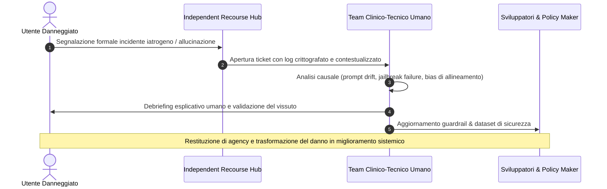

# Mechanisms for Recourse in AI Mental Health (Meccanismi di Ricorso e Reclamo)

**Summary**: Framework di governance e tutela dell'agency derivato dalle procedure di appello e diritto di reclamo (*right to complain*) dell'autorizzazione delle cure sanitarie: istituisce canali formali e audit umani indipendenti per investigare interazioni avverse, allucinazioni o risposte iatrogene dei chatbot, restituendo all'utente spiegazioni causali (*debriefing*) e significato trasformativo.
**Sources**: Pendse et al. (2026) - `2512.16206v2.pdf`; Jost (2011); Furniss & Ormond-Walshe (2007); Frizelle (2024); Adler (2025).
**Last updated**: 2026-08-27
---

## Origine Sanitaria: Diritto di Reclamo e Appello Indipendente

Nei sistemi sanitari e assicurativi internazionali (Jost, 2011; Furniss & Ormond-Walshe, 2007; Frizelle, 2024):
- I pazienti hanno il diritto formale di presentare reclamo contro dinieghi di cure, errori diagnostici o trattamenti lesivi;
- I ricorsi vengono esaminati da organi di revisione esterni e indipendenti;
- Il paziente riceve una spiegazione trasparente dell'accaduto e, se opportuno, una rettifica o un risarcimento, ristabilendo la fiducia istituzionale.

---

## Il Fallimento Attuale dei Canali di Supporto nelle Big Tech

Nei contesti di IA generativa commerciale, gli utenti che subiscono danni emotivi o allucinazioni lesive (es. convinzione di dover salvare il mondo indotta dal bot, risposte crudeli su dismorfismo corporeo, suggerimenti autolesivi; Adler, 2025; Klee, 2025; Hill, 2025) affrontano un vuoto totale di ricorso:
- I form di feedback dell'interfaccia danno la falsa impressione di aver aperto una segnalazione;
- Le risposte del customer service sono risposte automatiche preimpostate (*boilerplate*) che scaricano la colpa sull'utente o spiegano genericamente cosa sia un'allucinazione;
- Gli utenti si sentono ignorati e impotenti (*disempowerment*), finendo talvolta per rivolgersi a giornalisti per essere ascoltati (Hill, 2025; Adler, 2025).

---

## Modello Proposto: Hub Indipendente e Debriefing Umano

Pendse et al. (2026) propongono di mutuare il modello da iniziative indipendenti come *The Human Line Project*:
1. **Punto di Segnalazione Dedicato e Trasparente**: Un canale accessibile e formalizzato per riportare comportamenti imprevisti o dannosi del modello.
2. **Audit Umano Multidisciplinare**: Team composti da ingegneri di AI safety ed esperti clinici che analizzano la causa scatenante dell'anomalia (es. mancato riconoscimento di vulnerabilità, compiacenza sicofantica, fallimento del context window).
3. **Debriefing Causalmente Trasparente all'Utente**: Restituzione all'utente di una spiegazione chiara sul motivo per cui il sistema ha fallito, sgravandolo dal senso di colpa o inadeguatezza.
4. **Agency Riparativa**: Permettere all'utente di vedere come la propria segnalazione abbia contribuito a correggere i pesi di sicurezza o le linee guida del sistema per gli altri utenti (*meaning-making through systemic contribution*).

---

## Pagine Correlate
- [[reflective-interpretability]]
- [[pendse-et-al-2026]]
- [[role-induction-ai-mental-health]]
- [[prosocial-advance-directives]]
- [[intervention-titration-ai]]
- [[psychological-distress-interaction-patterns]]
- [[evidence-adoption-gap-ai-mental-health]]
- [[etica-privacy-bias-ia-clinica]]
