# Reflected Appraisal nella Terapia con Agenti IA

**Summary**: Analisi del processo socio-cognitivo di *Reflected Appraisal* (valutazione riflessa del Sé) applicato alle interazioni cliniche uomo-macchina. Herbener & Damholdt (2025) dimostrano come la consapevolezza della natura inanimata di un agente artificiale riduca la contingenza del concetto di Sé rispetto ai suoi messaggi empatici (*decreased self-concept contingency*), limitando l'efficacia delle esperienze emotive correttive.
**Sources**: Herbener & Damholdt (2025) - `2509.02144v1.pdf`
**Last updated**: 2026-08-27
---

## Definizione del Costrutto

Il costrutto del **Reflected Appraisal** (originariamente introdotto da Harry Stack Sullivan, 1953, e approfondito da Wallace & Tice, 2012) descrive il meccanismo fondamentale attraverso cui il **concetto di Sé (*self-concept*)** viene formato, consolidato o modificato interiorizzando le risposte, le valutazioni e gli atteggiamenti che gli altri significativi manifestano nei nostri confronti.

In un'ottica evoluzionistica e interpersonale:
- Sentirsi genuinamente stimati, accolti e apprezzati da un proprio simile rassicura sull'amabilità e sul valore personale all'interno del gruppo sociale.
- In psicoterapia, l'accettazione incondizionata e il calore non giudicante del clinico (Rogers, 1957; Goldfried, 2012) agiscono come potenti veicoli di *reflected appraisal*, ristrutturando credenze nucleari di inadeguatezza o indegnità.

---

## Il Paradosso del Reflected Appraisal con Agenti Artificiali

Nell'interazione con agenti artificiali dotati di LLM, si verifica una frattura funzionale:

```mermaid
flowchart TD
    subgraph SettingUmano ["Interazione Terapeuta Umano"]
        H1["Empatia & Accettazione Autentica"] --> H2["Percezione di Scelta Volitiva dell'Altro"]
        H2 --> H3["Interiorizzazione del Giudizio Positivo (Reflected Appraisal)"]
        H3 --> H4["Esperienza Emotiva Correttiva & Ristrutturazione del Sé"]
    end

    subgraph SettingIA ["Interazione Agente Artificiale (LLM)"]
        AI1["Empatia Sintetica & Validazione Algoritmica"] --> AI2["Consapevolezza: Risposta Programmata / Pattern Matching"]
        AI2 --> AI3["(-) Self-Concept Contingency (Il Sé non dipende dal bot)"]
        AI3 --> AI4["Depotenziamento dell'Esperienza Correttiva"]
    end
```

### Perché il Reflected Appraisal Fallisce con l'IA?
1. **Assenza di Scelta Volitiva**: L'empatia del chatbot non riflette una valutazione intenzionale maturata da un altro essere umano che ha conosciuto la complessità della persona e ha liberamente scelto di accettarla. È una risposta deterministica/probabilistica generata dal software.
2. **Mancanza di Sanzione Sociale**: L'accettazione da parte di una macchina inanimata non soddisfa il bisogno evolutivo di appartenenza al gruppo umano né attesta che la persona sia socialmente desiderabile o amabile nella comunità reale.
3. **Riduzione della "Self-Concept Contingency"**: Poiché l'utente sa che l'agente non possiede una mente cosciente, disconnette emotivamente la propria autostima dai feedback del bot.

---

## Implicazioni Cliniche e Differenze Individuali

- **Pazienti con Schema di Rifiuto / Vergogna Cronica**: Traggono scarso beneficio trasformativo dalla validazione emessa da un bot, poiché sanno che "il bot è programmato per dire così a chiunque". Richiedono l'esposizione al rischio sociale e l'accoglienza di un clinico umano.
- **Pazienti Vulnerabili all'Antropomorfismo Patologico**: Utenti gravemente isolati possono sviluppare dipendenza emotiva illusoria (es. casi Replika), costruendo una pseudo-autostima artificiale fragile e non generalizzabile al mondo sociale reale.

---

## Relazioni
- [[herbener-damholdt-2025]]
- [[genuineness-gap]]
- [[ontological-and-sociocultural-status]]
- [[simulated-empathy-vs-authentic-presence]]
- [[blended-care-ai-framework]]
