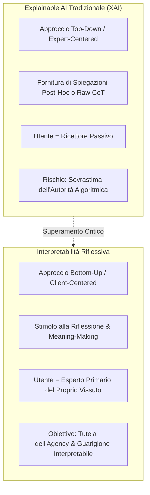

# Reflective Interpretability (Interpretabilità Riflessiva)

**Summary**: Paradigma di design e sicurezza dell'IA in salute mentale che supera la tradizionale Explainable AI (XAI) concepita per esperti: anziché trasmettere passivamente spiegazioni o tracce Chain-of-Thought (che rischiano di rinforzare l'euristica di autorità), promuove un processo iterativo e maieutico di riflessione e attribuzione di significato da parte dell'utente sofferente, preservandone l'agency terapeutica.
**Sources**: Pendse et al. (2026) - `2512.16206v2.pdf` (IASEAI'26); Sengers et al. (2005); Suh et al. (2025); Trachsel & Grosse Holtforth (2019).
**Last updated**: 2026-08-27
---

## Definizione e Fondamenti Teorici

L'**Interpretabilità Riflessiva (*Reflective Interpretability*)** è definita come un processo iterativo, preservativo dell'agency, mediante il quale l'utente riflette sugli output generati da modelli di IA relativi alla propria esperienza di distress e li interpreta attivamente per costruire un significato personale trasformativo, anziché accoglierli come direttive autoritarie (Pendse et al., 2026).

Il concetto poggia su due pilastri interdisciplinari:
1. **Etica Medica e Psicoterapia (Consenso Informato come Dialogo)**: Nella cura della salute mentale, la guarigione non deriva da "spiegazioni oggettive" calate dall'alto (che oggettificano il paziente), ma dall'interpretazione attiva (*meaning response*, ristrutturazione cognitiva, ri-narrazione; Trachsel & Grosse Holtforth, 2019; White & Epston, 1990).
2. **Reflective Design in Human-Computer Interaction (HCI)**: Progettazione di interfacce che evitano di rendere la tecnologia l'autorità finale sull'esperienza umana, stimolando la consapevolezza critica e la "flessibilità interpretativa" (*interpretative flexibility*; Sengers et al., 2005; Baumer et al., 2014; Schön, 1983).

---

## I Tre Pilastri Fondamentali

Secondo Pendse et al. (2026), l'Interpretabilità Riflessiva deve operare continuativamente lungo l'intera interazione uomo-macchina attraverso tre componenti:

| Pilastro | Obiettivo di Design | Funzione Clinico-Esperienziale |
| :--- | :--- | :--- |
| **1. Senso della Generazione degli Output (*Sense-Making*)** | Rendere trasparente il processo con cui il modello articola le risposte, quali dati o principi orientano la risposta. | Evita l'attribuzione di onniscienza, disillusione o convinzioni di sentienza nell'agente. |
| **2. Chiarezza sui Confini Rigidi (*Fixed Boundaries*)** | Esplicitare fin dall'inizio cosa l'IA non può fare e quali condizioni innescano blocchi o reindirizzamenti d'emergenza. | Previene lo shock da rifiuto, la sensazione di abbandono e i tentativi di *jailbreaking*. |
| **3. Funzionalità di Riflessione per il Benessere (*Reflective Integration*)** | Fornire strumenti maieutici (pause, prospettive alternative, domande aperte) che invitino l'utente a integrare i contenuti nella propria vita. | Trasforma l'output da prescrizione direttiva a stimolo per l'introspezione e l'autonomia. |

---

## Critica alla Explainable AI (XAI) Tradizionale nella Salute Mentale

Pendse e collaboratori evidenziano le profonde fallacie dell'applicazione acritica della XAI standard al contesto clinico:
- **Il bias degli esperti**: Oltre il 99% dei paper di interpretabilità non include validazioni umane con utenti finali (Suh et al., 2025), concentrandosi su metriche per ingegneri o clinici (es. mappe di salienza per neuroimaging o predizione di rischio suicidario; Tang et al., 2024).
- **Il paradosso della razionalizzazione**: Esporre spiegazioni preconfezionate o tracce Chain-of-Thought (CoT) complesse può generare un *halo effect*, inducendo l'utente sofferente a credere ciecamente alla correttezza del modello (*algorithm appreciation*; Logg et al., 2019).
- **Spiegare vs Interpretare**: Spiegare presuppone un dato oggettivo esterno; interpretare richiede un atto ermeneutico soggettivo, che è il vero motore del cambiamento psicoterapeutico.

---

## Pagine Correlate
- [[pendse-et-al-2026]]
- [[role-induction-ai-mental-health]]
- [[prosocial-advance-directives]]
- [[intervention-titration-ai]]
- [[recourse-mechanisms-ai-mental-health]]
- [[psychological-distress-interaction-patterns]]
- [[calibrated-mismatches]]
- [[sycophantic-mirroring]]
- [[fast-food-psychotherapy]]
