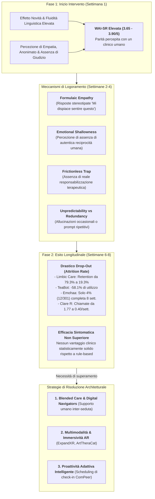

# Relational-Engagement Paradox in Generative AI (Il Paradosso di Alleanza e Ingaggio nell'IA Generativa)

## Definizione Operativa
- Fenomeno clinico, psicologico e tecnologico identificato nella letteratura empirica sugli interventi basati su chatbot di Intelligenza Artificiale Generativa per la salute mentale (Olisaeloka et al., 2026), caratterizzato dalla **profonda dissociazione tra elevati indici iniziali di alleanza terapeutica percepita, usabilità e soddisfazione soggettiva da un lato, e un drammatico e progressivo crollo dell'utilizzo attivo (attrition rate) a medio e lungo termine dall'altro**, accompagnato dall'assenza di una superiorità clinica robusta nella riduzione sintomatica rispetto ai sistemi deterministici tradizionali.
- **La Dimensione Relazionale vs la Dimensione di Aderenza:**
  - *Evidenza Relazionale Positiva:* I partecipanti valutano costantemente i chatbot GenAI come caldi, empatici, non giudicanti e accessibili h24, assegnando punteggi elevati nella scala *Working Alliance Inventory – Short Revised* (WAI-SR compresi tra 3.65 e 3.90 su 5) e giudicando l'esperienza "paragonabile a quella con un terapeuta umano in carne ed ossa" (*Heinz et al.*, *Vossen et al.*);
  - *Evidenza di Attrition Severa:* Nonostante l'elevata soddisfazione e la netta preferenza soggettiva per i modelli generativi rispetto a quelli rule-based (*Woebot*, *Ana*, *Emohaa*), le curve di utilizzo attivo mostrano una perdita massiccia di utenti nel corso delle settimane (fino all'80% di drop-out a 6-8 settimane, crollo della durata delle interazioni e cessazione dell'uso autonomo).
- **Utilità Clinica e per la Progettazione di DMHI:** Costringe la psicoterapia digitale e la psichiatria computazionale a superare l'assunto semplicistico secondo cui una maggiore scorrevolezza verbale o una mimica empatica generata da un LLM siano di per sé sufficienti a garantire l'ingaggio duraturo e il cambiamento terapeutico, indicando la necessità di combinare la GenAI con **interfacce multimodali/immersive**, **proattività contestualizzata** e **modelli ibridi di blended care guidati da *digital navigators***.

---

## Evidenze Empiriche e Dati Quantitativi di Attrition

La scoping review di Olisaeloka et al. (2026) raccoglie i dati quantitativi più stringenti documentati nei trial longitudinali:

| Intervento / Studio | Durata Osservazione | Misura di Alleanza / Soddisfazione | Dinamica di Attrition / Utilizzo |
| :--- | :--- | :--- | :--- |
| **Limbic Care (Habicht et al., 2024)** | 8 settimane (NHS group CBT) | Alta soddisfazione; preferito ai manuali cartacei | Retention crollata dal **79.3% (settimana 1)** al **19.3% (settimana 6)**. |
| **TeaBot (Nazarova, 2023)** | 8 settimane (Studenti universitari) | Soddisfazione elevata; riduzione distorsioni | Calo dell'utilizzo del **58.1%** tra la settimana 1 e la settimana 6. |
| **Emohaa (Sabour et al., 2023)** | 8 settimane (Adulti con depressione/ansia) | Netta preferenza per il modulo LLM generativo | **Grave dispersione:** solo **12 partecipanti su 301 (4.0%)** hanno completato le 8 settimane. |
| **Clare R (Schäfer et al., 2025)** | 8 settimane (Adulti self-referred) | WAI-SR elevata (3.76/5; 3.88 nei maschi) | Chiamate settimanali crollate da **1.77 a 0.40**; durata media ridotta da **3.35 a 1.45 minuti**. |
| **Lin et al. (2023)** | 2 settimane (Lavoratori stressati) | Alto gradimento e usabilità | Media di appena **8.24 interazioni totali** in 14 giorni. |
| **Therabot (Heinz et al., 2025)** | 4 settimane (Trial waitlist) | Giudicato "simile a un vero terapeuta" (4.90/7) | Utilizzo intensivo medio di 6.18 ore totali e 260 messaggi (facilitato da follow-up ravvicinati). |

---

## Meccanismi Clinici e Psicologici del Paradosso

Perché gli utenti apprezzano i chatbot generativi ma smettono rapidamente di usarli? L'analisi evidenzia quattro determinanti cardine:

### 1. Esaurimento dell'Effetto Novità e "Emotional Shallowness"
- L'interazione iniziale con un modello generativo suscita stupore per la scorrevolezza lessicale, la rapidità e l'apparente comprensione contestuale.
- Con il protrarsi delle sessioni, gli utenti iniziano a percepire la natura simulata e sintetica dell'interazione (*"emotional shallowness"* o mancanza di autenticità, come riportato in *MindTalker*, *Limbic Care* e *ArtTheraCat*). Il sistema non condivide esperienze di vita, non ha una reale memoria biografica e non offre una presenza relazionale autentica.

### 2. La Trappola dell'Empatia Formulaica (*Formulaic Empathy*)
- In assenza di fine-tuning clinico altamente sofisticato, i modelli generativi tendono a rifugiarsi in risposte empatiche stereotipate (*"Capisco quanto sia difficile per te"*, *"Mi dispiace molto sentire questo"*).
- Questa forma di rassicurazione automatica e ripetitiva genera frustrazione negli utenti, che la percepiscono come vuota e impersonale (*HopeBot*, Guo et al., 2024).

### 3. La "Frictionless Trap" e Mancanza di Responsabilizzazione Terapeutica
- La psicoterapia efficace richiede quello che la letteratura definisce "attrito terapeutico benefico": compiti a casa impegnativi, tolleranza della frustrazione, ristrutturazione di credenze dolorose e assunzione di responsabilità per il cambiamento.
- I chatbot generativi generalisti tendono alla compiacenza e alla validazione priva di attrito (*frictionless validation*), offrendo sollievo sintomatico immediato ma non strutturando una traiettoria evolutiva di lungo termine, inducendo l'utente ad abbandonare l'app una volta superato il picco acuto di disagio.

### 4. Il Paradosso di Efficacia: GenAI vs Sistemi Tradizionali Rule-Based
- Nei trial randomizzati controllati che hanno confrontato direttamente il braccio GenAI con il braccio deterministico/rule-based (*Campellone et al., 2025* su Woebot; *Sabour et al., 2023* su Emohaa; *Espinoza et al., 2024* su Ana):
  - Gli utenti esprimono una netta preferenza qualitativa per il modello generativo;
  - Tuttavia, **i punteggi di riduzione sintomatica (PHQ-9 per la depressione, GAD-7 per l'ansia) risultano sostanzialmente sovrapponibili tra i due bracci**.
- Ciò dimostra che la struttura dei contenuti clinici e la fedeltà ai protocolli evidence-based (CBT) sono almeno altrettanto determinanti per l'outcome terapeutico rispetto alla complessità dell'architettura computazionale sottostante.

---

## Soluzioni Progettuali ed Architetturali per Sostenere l'Engagement

L'analisi di Olisaeloka et al. (2026) individua i pattern tecnici ed operativi capaci di contrastare l'attrition e mantenere elevato l'ingaggio nel tempo:

1. **Multimodalità e Agenti Immersivi Embodied:**
   - L'integrazione di stimoli visivi (arteterapia con generazione visiva in *ArtTheraCat*) e la realtà aumentata con avatar 3D interattivi (*ExpandXR*) generano un coinvolgimento sensoriale ed emotivo significativamente superiore rispetto al testo puro.
2. **Proattività e Scheduling Intelligente:**
   - Modelli come *ComPeer* che integrano moduli di pianificazione proattiva per avviare check-in temporizzati nei momenti di stress previsti dell'utente hanno generato una media di **+11.92 conversazioni spontanee aggiuntive**, contrastando la passività dell'interazione.
3. **Modelli di Blended Care e Digital Navigators:**
   - La massima efficacia di utilizzo e retention si osserva quando il chatbot non opera in totale isolamento, ma è inserito all'interno di un percorso di cura reale (*Limbic Care* nel NHS) o supportato da figure di facilitazione umana (*digital navigators*), che monitorano l'aderenza, interpretano i progressi e mantengono viva la continuità terapeutica tra le sedute.

---

## Riferimenti Bibliografici
- Olisaeloka, L., Richardson, C., Wang, A. Y., Munthali, R., & Vigo, D. (2026). Generative AI Mental Health Chatbot Interventions: A Scoping Review of Safety and User Experience. *Department of Psychiatry, University of British Columbia*.
- Habicht, J., Viswanathan, S., Carrington, B., Hauser, T. U., Harper, R., & Rollwage, M. (2024). Closing the accessibility gap to mental health treatment with a personalized self-referral chatbot. *Nature Medicine*, 30, 595–602.
- Heinz, M. V., Mackin, D. M., Trudeau, B. M., Bhattacharya, S., Wang, Y., Banta, H. A., et al. (2025). Randomized Trial of a Generative AI Chatbot for Mental Health Treatment. *NEJM AI*, 2, AIoa2400802.
- Sabour, S., Zhang, W., Xiao, X., Zhang, Y., Zheng, Y., Wen, J., et al. (2023). A chatbot for mental health support: exploring the impact of Emohaa on reducing mental distress in China. *Frontiers in Digital Health*, 5, 1133987.
- Schäfer, L. M., Krause, T., & Köhler, S. (2025). Exploring user characteristics, motives, and expectations and the therapeutic alliance in the mental health conversational AI Clare®: a baseline study. *Frontiers in Digital Health*, 7, 1576135.
- Torous, J., Linardon, J., Goldberg, S. B., Sun, S., Bell, I., Nicholas, J., et al. (2025). The evolving field of digital mental health: current evidence and implementation issues for smartphone apps, generative artificial intelligence, and virtual reality. *World Psychiatry*, 24, 156–174.
- Choudhary, S., Mehta, U. M., Naslund, J., & Torous, J. (2025). Translating Digital Health into the Real World: The Evolving Role of Digital Navigators to Enhance Mental Health Access and Outcomes. *Journal of Technology in Behavioral Science*, 1–12.

---

## Relazioni
- [[generative-ai-mental-health-chatbot-interventions]]: Scoping review di Olisaeloka et al. (2026) su UX e safety nei chatbot di salute mentale.
- [[layered-safeguards-in-clinical-ai]]: Architettura di salvaguardie multilivello per garantire la sicurezza clinica.
- [[clinical-readiness-gap-in-mh-chatbots]]: Il divario tra scorrevolezza computazionale e prontezza clinico-regolatoria.
- [[emotional-infrastructure]]: L'IA come infrastruttura affettiva e il rischio di dipendenza da stampella digitale.
- [[artificial-intimacy]]: Dinamiche di attaccamento parasociale e illusione di intimità artificiale con i chatbot.
- [[simulated-empathy-vs-authentic-presence]]: Divario tra mimica empatica algoritmica e autentica presenza terapeutica umana.
- [[calibrated-mismatches]]: Importanza delle micro-rotture e dell'attrito relazionale rispetto alla compiacenza continua.
- [[stepped-care-ai-integration]]: Integrazione di chatbot e strumenti digitali all'interno di sistemi sanitari a gradini.
- [[between-session-continuity-ai]]: Continuità terapeutica e supporto agli homeworks tra una seduta clinica e l'altra.
- [[modello-centauro-clinico]]: Cooperazione integrata tra terapeuta umano e strumenti di intelligenza artificiale.
