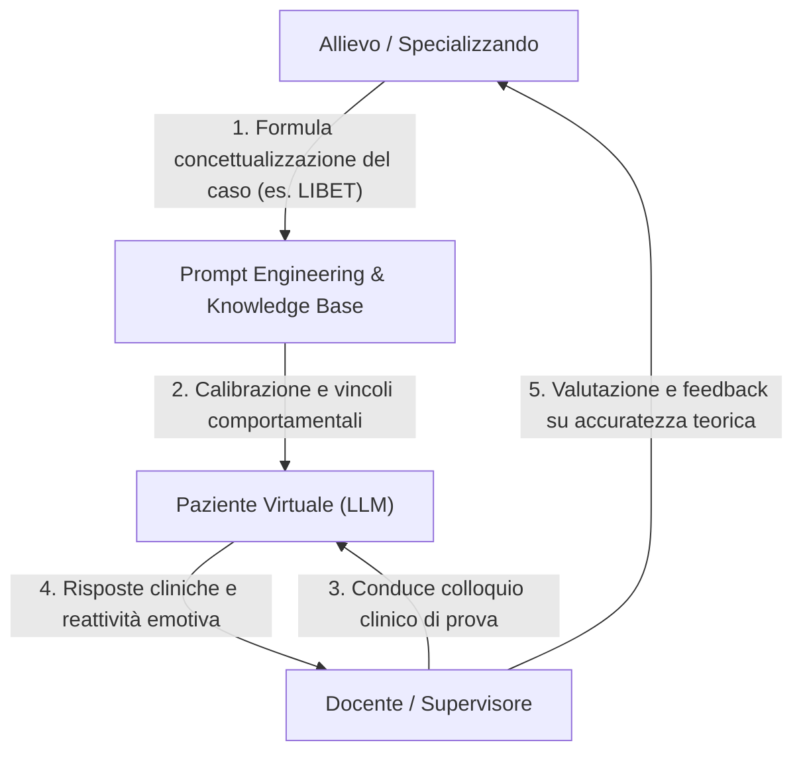

# Reverse Training e Didattica Induttiva con Pazienti Virtuali

## Definizione Operativa
Il **Reverse Training con Pazienti Virtuali** è una metodologia pedagogica avanzata per la formazione clinica e la psicoterapia in cui lo specializzando modella e addestra un paziente virtuale basato su LLM per dimostrare la padronanza di un quadro diagnostico-funzionale (principio del *learning by teaching*), sottoponendo l'agente simulato alla valutazione del docente o supervisore.

Il processo rovescia l'approccio didattico convenzionale:
*   **Dalla fruizione passiva alla creazione attiva**: Lo studente assume il ruolo di sviluppatore clinico, configurando credenze di base, cicli interpersonali disfunzionali, bias cognitivi e pattern verbali specifici.
*   **Dimostrazione di comprensione**: La capacità di calibrare un modello affinché riproduca coerentemente una psicopatologia senza deviare in risposte stereotipate o allucinazioni funge da validatore della comprensione concettuale del caso clinico.

### Workflow Operativo

1.  **Modellizzazione e Prompting**: Traduzione della concettualizzazione del caso (es. piano semi-adattivo, credenze nucleari) in istruzioni e *guardrails* per l'LLM.
2.  **Colloquio del Supervisore**: Il docente testa l'agente simulato per verificarne la coerenza psicopatologica e la resistenza alla ristrutturazione.
3.  **Valutazione e Debugging**: Eventuali incongruenze nel paziente virtuale indicano lacune nella concettualizzazione teorica dell'allievo, guidando la supervisione.

## Evidenze dalla Letteratura
L'approccio si fonda sull'integrazione di:
*   **Prompting Socratico**: Utilizzo di agenti "maieutici" (es. *Libet Prime*) che guidano l'allievo tramite domande aperte, evitando soluzioni preconfezionate e stimolando la riflessione differenziale.
*   **Prevenzione della Deriva Ricorsiva**: Necessità di definire regole e *guardrails* per impedire cicli dialogici autoreferenziali, garantendo l'efficacia didattica.

**Riferimenti Bibliografici:**
*   06-05 Riunione: Impiego dell'IA in ambito clinico, bias e formazione.
*   05-08 Riunione: Sviluppo Knowledge Base AI, Etica e Applicazioni Cliniche.

## Relazioni
- [[simulazione-pazienti-ai]]
- [[clinical-ai-simulation]]
- [[human-in-the-reasoning]]
- [[prompting-in-psychology]]
- [[06-05_Riunione_Impiego_IA_Clinica_Bias_Formazione]]
- [[machine-psychology]]
