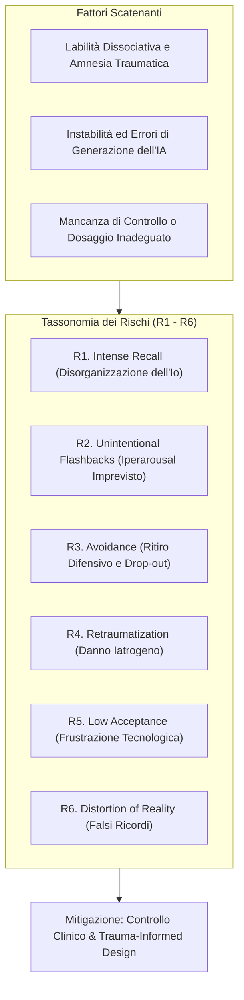

# Rischi Clinici nell'Esposizione Mediata da IA per CPTSD

**Summary**: Tassonomia e analisi dei sei rischi clinici specifici del paziente (R1 Intense recall, R2 Unintentional trauma flashbacks, R3 Avoidance, R4 Retraumatization, R5 Low acceptance/dropout, R6 Distortion of reality) derivanti dall'interazione tra la complessità dissociativa del CPTSD e l'imprevedibilità dei modelli di intelligenza artificiale generativa.
**Sources**: Degenhard et al. (2025) - `2505.20796v1.pdf`
**Last updated**: 2026-08-27
---

## Vulnerabilità Clinica del CPTSD e Interazione con l'IA

Il Disturbo da Stress Post-Traumatico Complesso (CPTSD) è caratterizzato da grave compromissione nella regolazione affettiva, credenze persistenti di fallimento o svalutazione e significative difficoltà relazionali, spesso originate da traumi prolungati o ripetuti durante l'infanzia. L'introduzione di strumenti di visualizzazione basati su Intelligenza Artificiale Generativa (GAI) in questo contesto presenta vulnerabilità cliniche peculiari.

Degenhard et al. (2025) identificano **6 categorie di rischio primario (R1–R6)** sul versante del paziente:

---

## Analisi Dettagliata delle Dimensioni di Rischio

### R1. Intense Recall (Rievocazione Intensa e Angosciosa)
- **Manifestazione**: Il ripristino dell'accesso a memorie traumatiche a lungo evitate scatena emozioni estreme, angoscia acuta, disorganizzazione dell'Io, panico e impulsi autolesivi.
- **Dinamica con l'IA**: L'alto livello di realismo immersivo o la velocità con cui l'immagine viene generata possono provocare una perdita improvvisa di controllo a causa dell'assorbimento cognitivo ed emotivo nella scena virtuale (*absorption*).

### R2. Unintentional Trauma Flashbacks (Flashback Traumatici Involontari)
- **Manifestazione**: I pazienti con CPTSD sono esposti a un rischio elevatissimo di innesco (*triggering*) imprevisto, sia per tempistica che per intensità dello stimolo.
- **Dinamica con l'IA**: Un'allucinazione visiva dell'IA o la generazione non richiesta di un particolare saliente traumatico può provocare un grave stato di iperarousal fisiologico incontrollato.

### R3. Avoidance (Evitamento e Disimpegno Terapeutico)
- **Manifestazione**: La tendenza naturale a fuggire dal dolore traumatico porta alla chiusura comunicativa, alla riduzione dell'autosvelamento (*self-disclosure*) e infine all'interruzione del trattamento (*drop-out*).
- **Dinamica con l'IA**: Se il sistema pone richieste cognitive o descrittive eccessive quando la memoria è ancora confusa, il paziente tende a ritirarsi dall'esplorazione.

### R4. Retraumatization (Retraumatizzazione)
- **Manifestazione**: L'esposizione, anziché favorire l'integrazione e l'estinzione dell'ansia, riattiva il trauma in modo soverchiante, privo di risorse di elaborazione.
- **Dinamica con l'IA**: L'impossibilità di modulare tempestivamente la scena o un'attivazione troppo repentina trasforma l'esposizione in un danno iatrogeno.

### R5. Low Acceptance (Bassa Accettazione e Sfiducia Tecnologica)
- **Manifestazione**: Scetticismo, frustrazione o rigetto dello strumento tecnologico impiegato nella terapia.
- **Dinamica con l'IA**: La mancanza di coerenza temporale (es. modifiche al prompt che distruggono il lavoro precedente) e la natura di "black box" dell'IA minano l'alleanza di lavoro e l'accettazione del percorso.

### R6. Distortion of Reality (Distorsione della Realtà e Falsi Ricordi)
- **Manifestazione**: Creazione della falsa convinzione di ricordare un evento o un dettaglio mai accaduto.
- **Dinamica con l'IA**: Suggerimenti linguistici del sistema o elementi visivi generati arbitrariamente dall'IA possono agire come suggestioni su memorie frammentarie e malleabili, impiantando ricordi fittizi non storici.

---

## Strategie di Mitigazione Clinica

1. **Pre-Screening del Terapeuta**: Nessuna immagine o elemento 3D deve essere esposto al paziente prima che il clinico ne abbia validato l'adeguatezza e il dosaggio emotivo.
2. **Gradualità e Titration del Dettaglio**: Iniziare con rappresentazioni a basso dettaglio/stilizzate, aumentando il realismo solo su esplicito consenso del paziente e in presenza di stabilità emotiva.
3. **Monitoraggio Fisiologico e Clinico Costante**: Riconoscere tempestivamente segnali di dissociazione o ipereccitazione per arrestare o riconfigurare l'esposizione.

---

## Related pages
- [[degenhard-et-al-2025]]
- [[generative-ai-exposure-therapy]]
- [[interazione-triadica-terapeuta-paziente-ia]]
- [[distorsione-memoria-imagery-rescripting-ia]]
- [[human-in-the-reasoning]]
- [[rischio-suicidario-ai-limits]]
