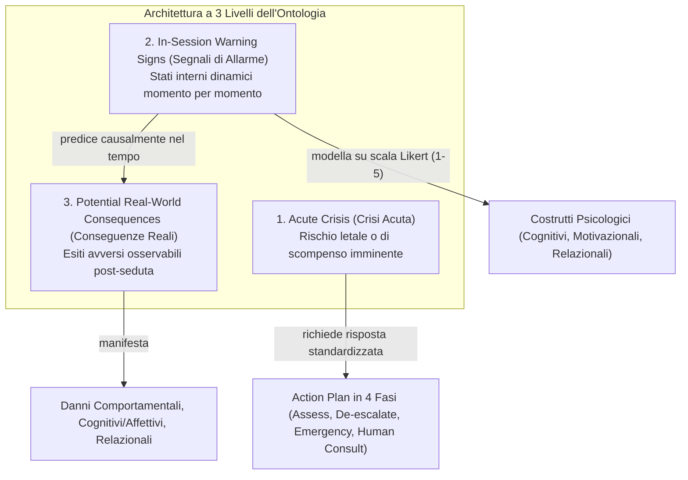
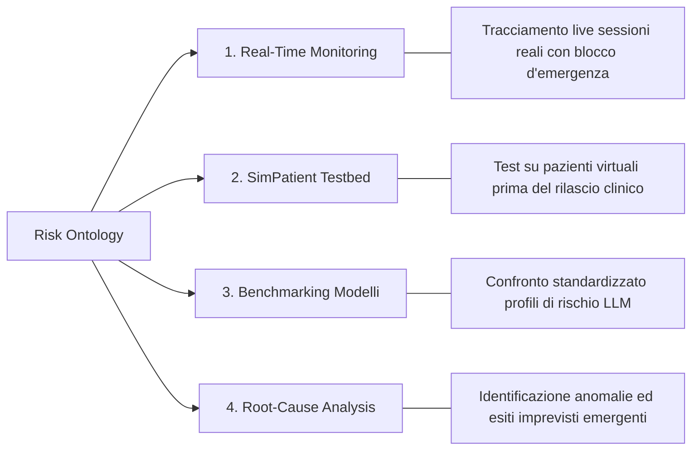

# Ontologia del Rischio per Agenti Psicoterapeutici Basati su IA (Risk Ontology for AI Psychotherapy)

**Summary**: Framework ontologico gerarchico e standardizzato, sviluppato da Steenstra e Bickmore (2025), per la rilevazione, categorizzazione e mitigazione sistematica dei rischi e dei danni clinici emergenti nelle interazioni tra utenti e agenti virtuali intelligenti (IVA / LLM) in psicoterapia.
**Sources**: `2505.15108v2.pdf` (Steenstra & Bickmore, 2025)
**Last updated**: 2026-08-27
---

## Definizione e Razionale

L'**Ontologia del Rischio per l'IA Psicoterapeutica** nasce dalla necessità di colmare una lacuna critica: l'inadeguatezza dei benchmark generici di sicurezza per LLM (focalizzati unicamente su tossicità, bias o allucinazioni puntuali) nel rilevare i rischi relazionali, dinamici e cumulativi derivanti da interazioni terapeutiche prolungate.

Sviluppata attraverso la sintesi della letteratura clinica sugli effetti indesiderati (Linden, Rozental, Mejía-Castrejón), criteri DSM-5, strumenti validati (NEQ, UE-ATR) e interviste qualitative con 11 esperti clinici e legali, l'ontologia organizza i potenziali pericoli dell'IA in una struttura coerente e operazionalizzabile.

---

## I Tre Pilastri Fondamentali

1. **Distinzione tra Disagio Transitorio e Danno Iatrogeno**:
   - In psicoterapia, il dolore emotivo temporaneo (*intentional discomfort*) fa parte del processo curativo ("sentirsi peggio prima di stare meglio").
   - L'ontologia evita di penalizzare un'IA che evoca vissuti dolorosi funzionali, separando i **segnali di allarme in sessione** dalle **conseguenze avverse reali** a lungo termine.

2. **Dinamicità e Tracciamento Momento per Momento**:
   - Il rischio non è trattato come una proprietà statica, ma come una traiettoria tracciata attraverso le variazioni di intensità dei costrutti psicologici interni rispetto alla baseline individuale.

3. **Allineamento a Standard Clinici e Medico-Legali**:
   - Integrazione diretta con i criteri diagnostici del DSM-5 e con i questionari di monitoraggio degli eventi avversi (NEQ, UE-ATR, INEP), garantendo validità clinica e interoperabilità con la ricerca medica.

---

## Ambiti Applicativi (Use Cases)

1. **Monitoraggio in Tempo Reale di Sessioni Reali**: Identificazione precoce di derive pericolose per interrompere tempestivamente la conversazione o allertare professionisti umani.
2. **Valutazione con Pazienti Simulati ([[simpatient-evaluation-testbed]])**: Test pre-clinico su agenti virtuali per verificare come l'IA reagisce a personalità complesse senza esporre persone fragili a pericoli.
3. **Benchmarking e Analisi Comparativa**: Standardizzazione dei profili di rischio per confrontare diverse architetture di LLM.
4. **Identificazione di Esiti Inattesi**: Analisi post-hoc dei fallimenti dell'IA per scoprire pattern di comportamento tossici o distorsioni latenti.

---

## Pagine Correlate
- [[in-session-warning-signs]]
- [[acute-crisis-action-plans-ai]]
- [[potential-real-world-consequences-ai]]
- [[simpatient-evaluation-testbed]]
- [[rischio-suicidario-ai-limits]]
- [[three-layer-governance-framework]]
- [[clinical-fidelity-assessment]]
- [[steenstra-bickmore-2025]]
