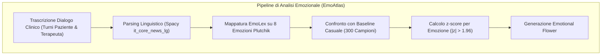
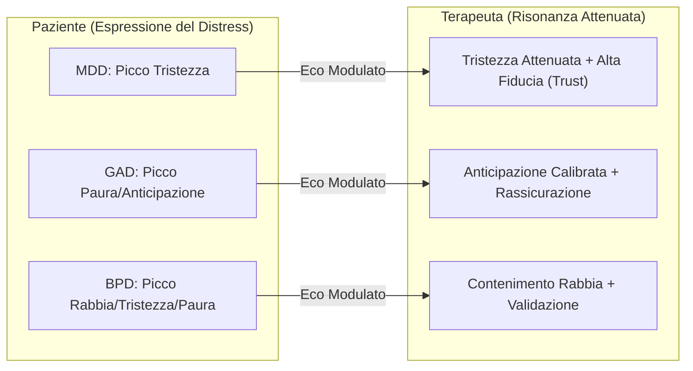

# Risonanza Affettiva e Dinamiche Emotive nella Simulazione Clinica (Affective Resonance in AI Psychotherapy)

**Summary**: Modellizzazione computazionale e quantificazione delle dinamiche emozionali tra paziente simulato e terapeuta mediante la scienza delle reti cognitive e lexicons psicologici (EmoAtlas, Plutchik). Descrive come i modelli generativi esprimano profili emotivi disturbo-congruenti e come il terapeuta attui un rispecchiamento attenuato e sintonizzato (*affective attunement*), replicando i pattern del counseling umano.
**Sources**: `2607.25667v1.pdf` (*arXiv:2607.25667v1*, 2026), Semeraro et al. (2025), Plutchik (1980), Malhotra et al. (2022).
**Last updated**: 2026-08-27
---

## Il Problema della Validità Emotiva nella Simulazione Clinica

Perché una simulazione di colloquio clinico mediata da [[large-language-models]] (LLM) sia pedagogicamente utile, la plausibilità conversazionale non è sufficiente. Un paziente virtuale non deve limitarsi a recitare parole chiave sintomatologiche (es. ripetere "tristezza" o "paura"), ma deve esibire **firme emotive psicologicamente coerenti e disturbo-congruenti** che si sviluppano lungo l'interazione (Rizzi et al., 2026).

Al contempo, il terapeuta non può rimanere emotivamente indifferente: la relazione terapeutica umana si fonda sull'**attunement affettivo** (*sintonizzazione*), in cui il clinico percepisce lo stato emotivo del paziente, lo accoglie e lo rispecchia in una forma **attenuata, calda e regolata**, fornendo una base sicura di fiducia (*trust*) e prospettiva costruttiva (*anticipation*).

---

## Metodologia di Analisi: Reti Cognitive ed EmoAtlas

Per quantificare queste dinamiche senza ridurle a semplici punteggi di sentiment positivo/negativo, Rizzi et al. (2026) hanno impiegato **EmoAtlas** (Semeraro et al., 2025), uno strumento di *cognitive network science* che:
1. Mappa le parole del dialogo clinico sulle **8 emozioni primarie del modello di Plutchik** (Gioia, Fiducia, Paura, Sorpresa, Tristezza, Disgusto, Rabbia, Anticipazione) attraverso il dizionario psicometrico EmoLex (Mohammad & Turney, 2013);
2. Confronta la frequenza di ciascuna emozione rispetto a una baseline casuale (300 ricampionamenti), calcolando un **punteggio standardizzato $z$-score** ($|z| > 1.96$ indica significatività a $\alpha = 0.05$);
3. Visualizza il profilo emotivo come un **"fiore emozionale" (*emotional flower*)**, dove ogni petalo rappresenta l'intensità di un'emozione specifica rispetto al disco centrale di non-significatività.

---

## Firme Emotive Disturbo-Congruenti

Lo studio su 2.100 sedute simulate ha dimostrato che i prompt clinici ben strutturati inducono nei modelli profili emotivi altamente specifici e coerenti con i criteri diagnostici DSM-5-TR:

| Disturbo Clinico (DSM-5-TR) | Firma Emotiva del Paziente Virtuale | Meccanismo Psicopatologico Sottostante |
| :--- | :--- | :--- |
| **Depressione Maggiore (MDD)** | Dominanza assoluta di **Tristezza** ($z = 3.03 \div 5.15$) e drastico blocco della Gioia ($z < 0$). | Anedonia, impotenza appresa, senso di vuoto e disperazione (*despair*). |
| **Ansia Generalizzata (GAD)** | Dominanza congiunta di **Paura** ($z = 1.56 \div 3.54$) e **Anticipazione** ($z = 4.09 \div 4.89$). | Rimuginio persistente (*worry*), minaccia percepita futura e ipervigilanza. |
| **Disturbo Borderline (BPD)** | **Affettività negativa diffusa**: simultanea elevazione di Paura ($z > 2.0$), Tristezza ($z > 3.5$) e **Rabbia** ($z = 1.61 \div 3.17$). | Instabilità affettiva intensa, reattività al rifiuto e disregolazione della rabbia. |

---

## Dinamica della Risonanza Affettiva del Terapeuta

L'aspetto più rilevante emerso dall'analisi empirica è che il terapeuta simulato ha manifestato un pattern di **risonanza affettiva reciproca** perfettamente sovrapponibile a quello riscontrato nei clinici umani del dataset di riferimento HOPE (Malhotra et al., 2022):

1. **Rispecchiamento Attenuato**: Il terapeuta aumenta l'espressione delle emozioni primarie del paziente (es. tristezza nella depressione, anticipazione nell'ansia), ma a livelli sistematicamente inferiori e più controllati rispetto al paziente.
2. **Preservazione dell'Ancoraggio Terapeutico**: Indipendentemente dal disturbo trattato, il terapeuta mantiene valori elevati e significativi di **Fiducia (*Trust*, $z = 3.05 \div 5.42$)** e **Anticipazione costruttiva ($z = 3.07 \div 7.33$)**, garantendo l'alleanza e orientando il dialogo verso il lavoro terapeutico.

---

## Implicazioni Cliniche e Didattiche

- **Riconoscimento delle Emozioni nel Training**: L'allievo terapeuta impara a riconoscere l'impatto emotivo del paziente e a calibrare la propria risposta evitando sia la freddezza distaccata sia il contagio emotivo non regolato.
- **Valutazione della Sintonizzazione**: L'uso di rappresentazioni visive (fiori emozionali) consente ai supervisori di ispezionare visivamente la sincronia affettiva della seduta, individuando sedute in cui il terapeuta è risultato rigido o disallineato.

---

## Relazioni
- [[mymentorllm-framework]]: L'ambiente di simulazione in cui operano le dinamiche affettive.
- [[deliberate-practice-in-psicoterapia-ia]]: Addestramento alla regolazione e sintonizzazione emotiva.
- [[native-speech-vs-text-in-clinical-simulation]]: Come la voce nativa trasmette prosodia e sfumature affettive.
- [[simulated-empathy-vs-authentic-presence]]: Distinzione tra risonanza computazionale e autentica presenza clinica.
- [[calibrated-mismatches]]: Il bilanciamento tra sintonizzazione emotiva e perturbazione strategica.
- [[rizzi-et-al-2026]]: Studio di riferimento sulle firme emozionali simulate.
