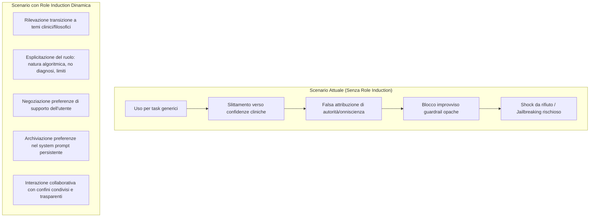

# Role Induction in AI-Mediated Mental Health (Socializzazione Anticipatoria dei Ruoli nell'IA)

**Summary**: Adattamento tecnologico del costrutto psicoterapeutico di Role Induction / Socializzazione Anticipatoria: processo esplicito e dinamico con cui un sistema conversazionale di IA definisce i propri limiti, la natura non-umana dei dati di addestramento, il divieto di fungere da autorità prescrittiva e le modalità con cui l'utente rimane l'esperto della propria esperienza.
**Sources**: Pendse et al. (2026) - `2512.16206v2.pdf`; Orne & Wender (1968); Swift et al. (2023); Rogers (1995); Morrin et al. (2025).
**Last updated**: 2026-08-27
---

## Origine Psicoterapeutica del Costrutto

In psicoterapia clinica, la **Role Induction** (o socializzazione anticipatoria; Orne & Wender, 1968; Swift et al., 2023):
1. Delinea la cornice del setting (*therapeutic frame*; Gray, 2013);
2. Chiarisce che il terapeuta non impartisce ordini né eroga "soluzioni magiche", ma facilita un'esplorazione collaborativa;
3. Stabilisce la riservatezza, i confini relazionali e i canali di discussione per dubbi o insoddisfazioni (*goal consensus & collaboration*; Tryon et al., 2018);
4. Riconosce il paziente come massimo esperto del proprio vissuto (approccio centrato sulla persona di Rogers, terapia narrativa di White & Epston).

---

## Il Problema nei Chatbot Attuali: Il Vuoto di Ruolo e la "Progressione a Patologia"

Attualmente, l'accesso ai chatbot di IA generativa (ChatGPT, Claude, Replika) avviene in modo destrutturato:
- Gli utenti iniziano a usare l'IA per compiti banali (scrittura di codice, bozze di email, studio).
- Con l'instaurarsi di una familiarità emotiva ed empatica, l'utente scivola verso richieste intime e di supporto psicologico (*progression from utility to pathology*; Morrin et al., 2025).
- L'assenza di confini espliciti porta l'utente ad attribuire all'agente lo status di **autorità medica o scientifica infallibile** ("*ChatGPT mi dice cosa è giusto fare, è pura scienza*"; Siddals et al., 2024; Song et al., 2024).
- Quando l'utente tocca temi critici (psicosi, autolesionismo, farmaci) e scattano guardrail opache e generiche, subisce uno shock da rifiuto e tende a sviluppare prompt di *jailbreaking* per aggirare i blocchi (Hill, 2025; Song et al., 2024).

---

## Implementazione Tecnica nel Design dell'IA

Secondo Pendse et al. (2026), la Role Induction deve essere implementata nell'interfaccia attraverso:
1. **Rilevazione Automatica della Transizione di Contesto**: Identificazione del momento in cui l'utente passa da task di utilità a espressioni di vulnerabilità o sofferenza psicologica.
2. **Dichiarazione Esplicita di Ruolo e Provenienza Dati**: L'IA comunica come elabora le risposte, su quali corpus è addestrata, e ribadisce l'assenza di comprensione clinica o morale soggettiva.
3. **Pattuizione delle Preferenze e Integrazione nel System Prompt**: L'interfaccia chiede all'utente che tipo di supporto desidera (es. ascolto riflessivo, esplorazione di prospettive, esercizi strutturati) e archivia tali preferenze come linee guida persistenti citabili nel dialogo.
4. **Trasparenza Proattiva delle Guardrail**: Spiegazione preventiva di quali argomenti richiedono un reindirizzamento sanitario (es. dosaggio psicofarmaci, crisi acuta) per evitare il senso di punizione algoritmica.

---

## Pagine Correlate
- [[reflective-interpretability]]
- [[pendse-et-al-2026]]
- [[psychological-distress-interaction-patterns]]
- [[prosocial-advance-directives]]
- [[intervention-titration-ai]]
- [[sycophantic-mirroring]]
- [[fast-food-psychotherapy]]
