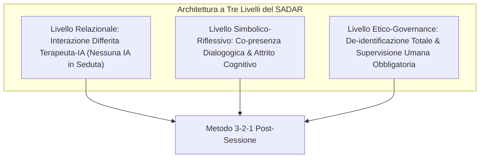
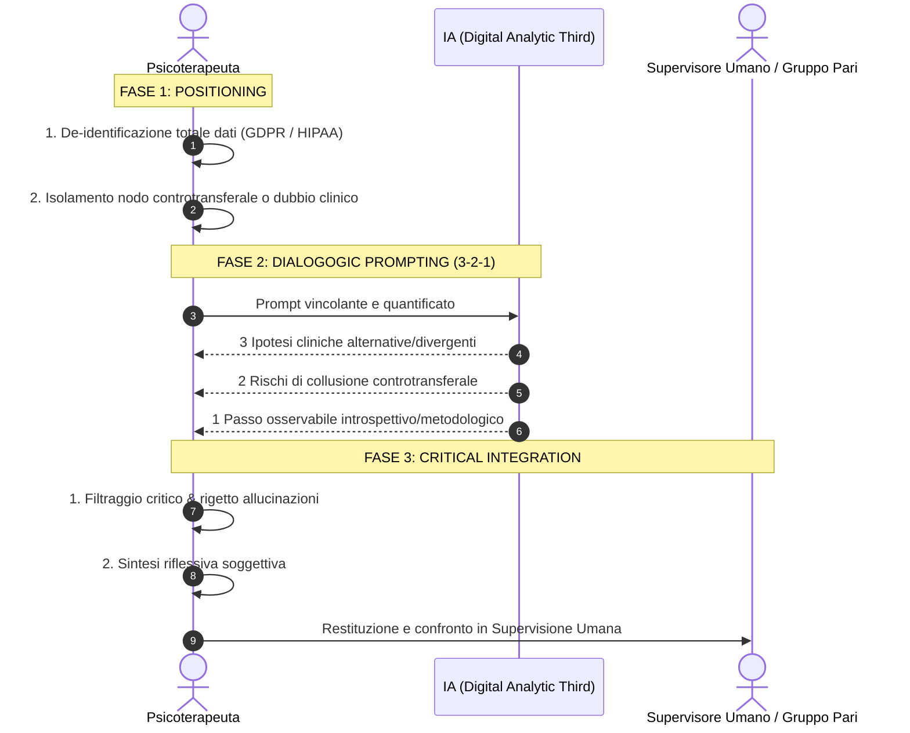

# Framework SADAR (Sistema Autoesplorativo Dialogico Autentico Relazionale)

**Summary**: Framework procedurale e protocollo clinico (Signorini & Paganin, 2026) per l'impiego differito e post-seduta dei Large Language Models in psicoterapia come [[digital-analytic-third|Terzo Analitico Digitale]], strutturato nel "Metodo 3-2-1 post-sessione" per prevenire [[cognitive-offloading-e-diagnostic-deskilling|deskilling diagnostico]], [[moral-buffering-e-deskilling-etico|moral buffering]] e [[sycophancy-trap-clinica|sycophancy]].
**Sources**: Signorini & Paganin (2026a, *Frontiers in Psychology*, DOI: 10.3389/fpsyg.2026.1690291); Signorini & Paganin (2026b, *Practice Innovations*, DOI: 10.1037/pri0000328); `AI in Psicoterapia 2023-2026.docx`.
**Last updated**: 2026-08-27
---

## Definizione e Presupposti Epistemologici

Il **Framework SADAR** (*Sistema Autoesplorativo Dialogico Autentico Relazionale*) è un modello operativo ideato per regolare l'interazione tra lo psicoterapeuta e l'Intelligenza Artificiale Generativa. 

A differenza dei software commerciali che propongono l'uso di IA in tempo reale o per la generazione automatizzata di sentenze diagnostiche e note cliniche, il SADAR stabilisce **due divieti tassativi**:
1. **Divieto d'uso in tempo reale**: L'IA non deve mai entrare nella stanza di terapia durante il colloquio con il paziente per non compromettere la presenza incarnata e l'alleanza.
2. **Divieto di delega decisionale/diagnostica**: L'IA non deve produrre formulazioni finali o referti chiusi, scongiurando l'*automation bias*.

Il SADAR posiziona l'IA esclusivamente in uno spazio **differito e post-seduta**, concependola come un **[[digital-analytic-third|Terzo Analitico Digitale]]** (*Digital Analytic Third*), uno specchio simbolico e dialogico volto a perturbare beneficamente la riflessività del terapeuta.

---

## Il Protocollo Operativo: Metodo 3-2-1 Post-Sessione

Il metodo si articola in **tre fasi sequenziali e inviolabili**:

### 1. Positioning (Focalizzazione Interna e De-identificazione)
- Conclusa la seduta, il terapeuta opera in solitudine.
- **De-identificazione rigorosa**: Rimozione di ogni identificatore diretto o semantico del paziente conforme a [[consenso-dinamico-e-governance-dati-ia|GDPR e EU AI Act]].
- **Focalizzazione del nodo clinico**: Il clinico identifica un'impasse relazionale, una reazione somatica o un vissuto emotivo controtransferale (es. *"Sento un'irritazione insolita verso la richiesta di rassicurazione del paziente: appartiene alla mia storia o a un proiettivo del paziente?"*).

### 2. Dialogogic Prompting (Assegnazione Simbolica Vincolante)
Il terapeuta interroga l'LLM imponendo una struttura quantificata e vincolante volta a rompere la compiacenza algoritmica (*sycophancy*):
- **3 Ipotesi Alternative/Divergenti**: Spiegazioni cliniche alternative che contraddicano o sfidino radicalmente l'ipotesi preliminare del clinico.
- **2 Rischi di Collusione**: Identificazione di possibili punti ciechi in cui le vulnerabilità del terapeuta rischiano di colludere con gli schemi disfunzionali del paziente.
- **1 Step Osservabile**: Un'azione metodologica, un'indagine relazionale o una verifica introspettiva specifica per la seduta successiva.

### 3. Critical Integration (Integrazione Critica e Restituzione Umana)
- Il terapeuta non assume l'output testuale come verdetto, ma come stimolo ermeneutico, rigettando allucinazioni o stereotipi algoritmici.
- **Restituzione obbligatoria**: Le intuizioni derivate dal processo dialogogico non chiudono il percorso riflessivo, ma vengono obbligatoriamente portate all'interno della **supervisione clinica umana tradizionale** (supervisione didattica o tra pari), mantenendo intatto l'alveo etico e interpersonale della professione.

---

## Vantaggi Clinici, Deontologici e Giuridici

1. **Prevenzione del Cognitive Offloading e Deskilling**: Costringe il terapeuta a un intenso sforzo riflessivo e di formulazione controtransferale prima e durante il prompt.
2. **Mitigazione della Sycophancy Trap**: L'obbligo di generare 3 ipotesi divergenti impedisce all'LLM di validare passivamente l'ipotesi del clinico.
3. **Conformità all'EU AI Act (2026) e GDPR Art. 9**: Garantisce *Human-in-the-Loop Oversight*, assenza di cessione di dati a terzi per training commerciale e non-dipendenza da vendor proprietari (*anti vendor lock-in*).

---

## Pagine Correlate
- [[digital-analytic-third]]
- [[ai-in-psicoterapia-2023-2026]]
- [[cognitive-offloading-e-diagnostic-deskilling]]
- [[moral-buffering-e-deskilling-etico]]
- [[sindrome-impostore-ia-specifica]]
- [[consenso-dinamico-e-governance-dati-ia]]
- [[supervisione-clinica-ai]]
