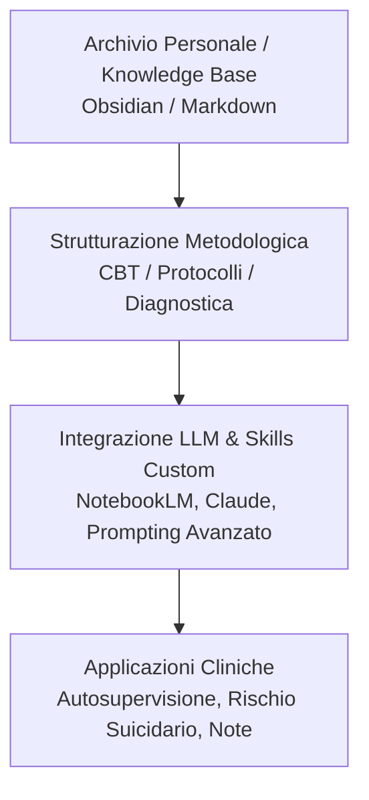

# Second Brain Clinico

**Summary**: Metodologia e architettura di gestione della conoscenza personale (PKM) per psicoterapeuti, basata su archivi locali strutturati (es. Obsidian, Markdown) e integrabile con modelli linguistici. Consente di organizzare protocolli evidence-based, concettualizzazioni di caso e percorsi di autosupervisione senza delegare acriticamente il metodo clinico a software commerciali proprietari.
**Sources**: 07-08 Riunione_ Pianificazione corso IA per psicoterapia — struttura, validazione interessi, microprogettazione e coordinamento.txt, 05-08 Riunione_ Sviluppo Knowledge Base AI, Etica e Applicazioni Cliniche.txt
**Last updated**: 2026-08-27
---

## 1. Definizione e Razionale Clinico

Il **Second Brain Clinico** è un'infrastruttura di gestione della conoscenza personale (*Personal Knowledge Management*, PKM) progettata specificamente per la pratica psicoterapeutica. Risponde alla crescente necessità dei professionisti di organizzare la complessità teorico-clinica e procedurale accumulata durante la formazione e l'attività clinica:

- **Superamento dei Tool Commerciali "All-in-One"**: A differenza di applicativi generici o piattaforme preconfezionate che impongono flussi rigidi e non trasparenti, il Second Brain consente al clinico di modellare l'archivio secondo il proprio modello di concettualizzazione (es. cognitivismo clinico, schemi ABC, analisi funzionale).
- **Integrazione Funzionale con l'Intelligenza Artificiale**: Il Second Brain funge da base di conoscenza (*Grounding Knowledge*) strutturata per interrogare modelli linguistici (LLM come *Claude*, *NotebookLM*, o modelli locali) attraverso prompt contestualizzati o skill customizzate.

---

## 2. Componenti Architetturali

1. **Gestione dei Protocolli Evidence-Based**:
   - Repository modulari di tecniche e protocolli clinici (es. gerarchie di esposizione, protocolli di ristrutturazione cognitiva, tecniche di defusione).
   - Schede operative ad attivazione rapida per situazioni cliniche critiche (es. linee guida di assessment e gestione del rischio suicidario).

2. **Note Cliniche e Concettualizzazione Longitudinale**:
   - Schede caso de-identificate che collegano l'anamnesi remota, le formulazioni di funzionamento interne (es. credenze di base, credenze intermedie, strategie di coping) e l'evoluzione seduta per seduta.
   - Tracciamento delle rotture e riparazioni dell'alleanza terapeutica.

3. **Integrazione con Custom Skills e Agenti di Scoring**:
   - Creazione di *custom skills* (es. in Claude Projects o agenti GPT dedicati) istruite con il materiale del Second Brain per supportare lo scoring di reattivi psicodiagnostici e l'estrazione di item clinicamente salienti da discutere in seduta.

---

## 3. Privacy, Deontologia e Sovranità del Dato

- **Sovranità del Dato (Local-First)**: L'adozione di formati aperti (Markdown, plain text) e software con memorizzazione locale (come Obsidian) garantisce che i dati rimangano di proprietà esclusiva del professionista, evitando il vendor lock-in.
- **De-identificazione e Conformità Normativa**: Separazione netta tra i dati anagrafici/identificativi del paziente (gestiti nei registri legali conformi al GDPR) e i modelli concettuali o estratti anonimizzati utilizzati per il ragionamento assistito da IA.
- **Preservazione dell'Agentività Clinica**: Il Second Brain non sostituisce il ragionamento diagnostico, ma agisce da amplificatore cognitivo (*scaffolding*), riducendo il carico di memoria di lavoro del terapeuta.

---

## Related pages
- [[07-08_Pianificazione_Corso_IA_Psicoterapia]]
- [[human-in-the-reasoning]]
- [[augmented-psychotherapy]]
- [[ai-assisted-psychotherapy]]
- [[prompting-in-psychology]]
