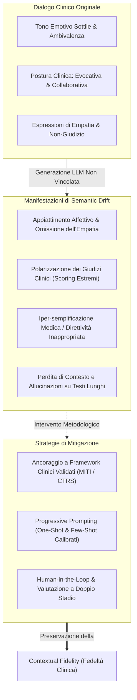

# Semantic Drift e Contextual Fidelity nei Modelli Linguistici per la Psicoterapia

## Definizione Operativa

Il **Semantic Drift** (deriva semantica) nei Large Language Models (LLM) applicati alla psicoterapia e al counseling descrive la graduale divergenza del testo generato (in compiti di sintesi, riscrittura, trascrizione o dialogo) rispetto al significato originario, all'intento clinico, al tono emotivo o alle dinamiche relazionali della seduta sorgente (Kumar, Rajawat, & Ntoutsi, 2025).

In contrapposizione, la **Contextual Fidelity** (fedeltà contestuale) rappresenta la capacità del modello di preservare intatti il clima terapeutico, la postura interpersonale del clinico (es. non giudicante, collaborativa, empatica) e le motivazioni intrinseche del paziente, senza introdurre distorsioni, appiattimenti affettivi o allucinazioni concettuali.

---

## Meccanismi di Deriva Semantica nei Dialoghi Terapeutici

Nel dominio della salute mentale, la deriva semantica non si limita a errori fattuali (allucinazioni di date o dosaggi), ma altera la **struttura relazionale profonda** del colloquio:

### 1. Riduzionismo Medico-Prescrittivo
Quando un LLM privo di vincoli specialistici riassume una seduta di colloquio motivazionale, tende spontaneamente a privilegiare i sintomi biologici o le soluzioni pratiche (es. prescrizione di riposo o farmaci) a scapito dei vissuti psicologici, trasformando una relazione maieutica in una consultazione prescrittiva direttiva.

### 2. Polarizzazione ed Estremizzazione Valutativa
Modelli con minore sintonizzazione clinica (come osservato per Gemini 2.0 Flash e DeepSeek-V3 in Kumar et al., 2025) tendono a interpretare i costrutti psicologici in modo dicotomico o estremo (valori 1 o 5 su scale Likert), mancando le sfumature intermedie (livelli 2, 3, 4) che caratterizzano l'alleanza terapeutica reale.

### 3. Affaticamento da Contesto (*Context Loss*) e Allucinazione
Nei prompt estesi contenenti lunghe trascrizioni di sedute (*few-shot prompting* massivo), i modelli generativi possono perdere il tracciamento dei turni di parola, attribuendo al paziente frasi del terapeuta o inventando tentativi di rassicurazione non presenti nel testo originale.

### 4. Appiattimento dell'Empatia e Inconsistenza Emozionale
L'incapacità dei modelli generativi generici di quantificare l'intensità emotiva implicita porta all'omissione di interventi empatici sottili ma decisivi, riducendo l'efficacia delle sintesi per la supervisione clinica.

---

## Evidenze Empiriche da Kumar et al. (2025)

Nello studio di Kumar et al. (2025), la deriva semantica è stata quantificata misurando la deviazione ($\Delta = \text{Score}_{\text{predetto}} - \text{Score}_{\text{ground\_truth}}$) tra i punteggi assegnati dai modelli linguistici e la ground truth annotata da esperti clinici lungo le dimensioni del framework MITI:

| Dimensione MITI | Livello di Drift Rilevato | Causa Principale del Drift |
| :--- | :--- | :--- |
| **Evocation** | Moderato-Alto | Tendenza dell'LLM a scambiare il chiarimento di istruzioni per vera evocazione motivazionale. |
| **Collaboration** | Medio | Riconoscimento della reciprocità, ma rischio di sovrastimare la cooperazione formale. |
| **Autonomy** | Elevato | Difficoltà nel distinguere tra reale supporto all'autonomia e disimpegno o abbandono del paziente. |
| **Direction** | Medio-Basso | Dimensione più lineare e meglio quantificata dagli LLM grazie alla presenza di obiettivi espliciti. |
| **Empathy** | Elevato | Frequente appiattimento affettivo nei modelli con sintesi stringate (es. Gemini). |
| **Non-Judgmental Attitude** | Medio-Alto | Rischio di introdurre toni paternalistici impliciti nelle sintesi non controllate. |

---

## Strategie di Prevenzione e Mitigazione

1. **Integrazione di Schemi di Coding Formalizzati**: L'imposizione di schemi standardizzati (MITI, CTRS, MISC) nel prompt forza il modello a strutturare la sintesi attorno alle dimensioni qualitative della terapia anziché su un mero riassunto tematico.
2. **One-Shot Calibrato**: La fornitura di una singola guida esemplare corredata da definizioni operative dei costrutti e della scala di misurazione riduce la varianza dell'output senza sovraccaricare la finestra di contesto.
3. **Verifica a Doppio Stadio (*Two-Stage Verification*)**: Valutazione indipendente della fedeltà delle sintesi generate rispetto al testo sorgente prima del loro impiego nella cartella clinica o nella formazione.

---

## Relazioni
- [[miti-framework-llm-evaluation]]: Schema di codifica clinica per quantificare e limitare la deriva semantica nel Colloquio Motivazionale.
- [[progressive-prompting-clinical-summarization]]: Tecniche di ingegneria dei prompt per guidare la fedeltà contestuale.
- [[annosum-mi-dataset]]: Benchmark empirico per la misurazione della deviazione da ground truth esperta.
- [[clinical-fidelity-assessment]]: Principi metodologici per la misurazione della fedeltà terapeutica.
- [[sycophantic-mirroring]]: Rischio di compiacimento e deriva relazionale nei sistemi conversazionali.
- [[human-in-the-reasoning]]: Ruolo del clinico come supervisore per l'identificazione precoce del drift.
- [[kumar-et-al-2025]]: Studio sperimentale primario di riferimento.
