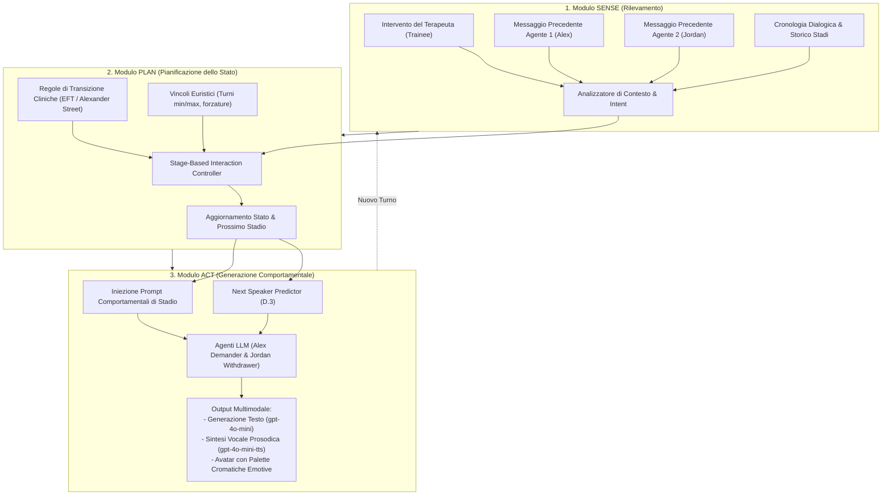

# Architettura Sense-Plan-Act per la Simulazione Terapeutica

## Definizione Operativa
- Framework architetturale derivato dalla robotica e dal *dialogue management* adattato alla simulazione psicoterapeutica multi-agente, in cui l'interazione viene modellata come un sistema dinamico controllato a ciclo chiuso (*closed-loop dynamical system*).
- **Utilità Clinico-Formativa:** Supera la generazione non vincolata basata su prompt statici (*prompt-only*), dividendo il funzionamento della simulazione in tre moduli ciclici:
  1. **SENSE (Rilevamento):** Monitora in tempo reale gli interventi del terapeuta tirocinante, le risposte pregresse dei pazienti virtuali e la cronologia degli scambi.
  2. **PLAN (Pianificazione):** Un controller di stadio esplicito (*stage-based interaction controller*) aggiorna lo stato dell'interazione applicando regole cliniche formalizzate e vincoli euristici (es. prevenzione di escalation premature o forzatura di de-escalation).
  3. **ACT (Esecuzione):** Attiva prompt comportamentali, prosodici ed emotivi differenziati per ciascun agente virtuale in base allo stadio attivo, gestendo il turn-taking e l'output multimodale (testo, sintesi vocale TTS con sfumature emotive, avatar grafici).

## Evidenze dalla Letteratura
- **Controllo delle Traiettorie Cliniche a Lungo Termine:** Nei modelli conversazionali aperti, i vincoli inseriti in un singolo system prompt tendono a degradare rapidamente (*alignment drift* e perdita del ruolo). L'architettura Sense-Plan-Act mantiene la coerenza longitudinale delegando il controllo dello stato a un componente separato che guida i prompt di generazione (Wang, Chen et al., 2026; Li et al., 2025).
- **Accordo e Fedeltà di Transizione:** Nello studio empirico su 42 sessioni, l'architettura ha dimostrato un accordo sostanziale tra le transizioni determinate dal controller automatico e la codifica di psicoterapeuti umani esperti ($\kappa = 0.77$, accuratezza 82.93%, F1 pesato 0.84), garantendo una progressione fluida e clinicamente verosimile (Wang, Chen et al., 2026).
- **Aderenza Comportamentale (*Stage Fidelity*):** L'attivazione di istruzioni specifiche per ciascuno stadio ha prodotto un tasso di aderenza al comportamento clinico atteso dell'83.8% nel sistema sperimentale rispetto al 63.8% della baseline priva di controller ($\chi^2 = 43.75, p < 0.001$) (Wang, Chen et al., 2026).

**Riferimenti Bibliografici:**
- Wang, C., Chen, A., Bao, C., Jin, S., Swartz, H., Wu, T., Kraut, R. E., & Zhu, H. (2026). Simulating Couple Conflict: Designing A Multi-Agent System for Therapy Training and Practice. *arXiv preprint arXiv:2601.10970v2*. https://arxiv.org/abs/2601.10970
- Li, Z., Peng, J., Wang, Y., et al. (2025). ChatSOP: An SOP-Guided MCTS Planning Framework for Controllable LLM Dialogue Agents. *Proceedings of ACL 2025*, 17637–17659.
- Young, S., Gasic, M., Thomson, B., & Williams, J. D. (2013). POMDP-based Statistical Spoken Dialogue Systems: A Review. *Proceedings of the IEEE*, 101(5), 1160–1179.

## Relazioni
- Vedi anche: [[wang-chen-et-al-2026]], [[stage-structured-dialogue-control]], [[multi-party-interaction-simulation]], [[demand-withdraw-multi-agent-dynamics]], [[clinical-fidelity-assessment]], [[simulazione-pazienti-ai]]
