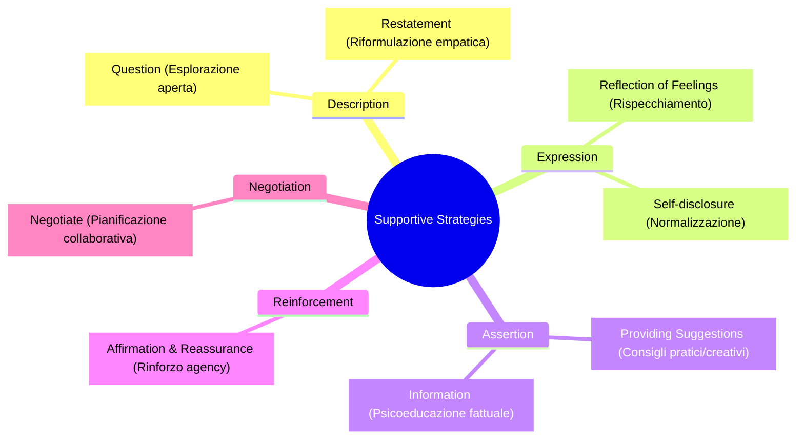

# Sentence-Level Supportive Strategies

## Definizione Operativa
- Metodologia di controllo e condizionamento fine della generazione linguistica negli agenti psicoterapeutici basati su LLM, in cui ogni singolo enunciato/frase emesso dal sistema è formalmente vincolato e annotato con una specifica strategia di supporto psicologico tratta da teorie cliniche validate.
- **Utilità CBT:** Supera la vaghezza delle indicazioni a livello di intero turno (*utterance-level*), garantendo che la sfida cognitiva insita nella ristrutturazione non generi drop-out o rigetto, ma sia costantemente bilanciata da interventi di validazione, rispecchiamento emotivo, self-disclosure controllata e negoziazione collaborativa.

## Evidenze dalla Letteratura
- **Fondamenti Teorici di Riferimento:** Lo schema integra i costrutti della *Helping Skills Theory* di Clara Hill (2009) e le strategie di validazione e modulazione emotiva della *Dialectical Behavior Therapy (DBT)* di Marsha Linehan (2014), suddividendole in **5 macro-categorie e 8 sotto-strategie** operative (Zhou et al., 2025):
  1. **Description:**
     - *Question:* Chiarire ed esplorare il problema tramite domande aperte non inquisitorie.
     - *Restatement:* Riformulare le parole del paziente per restituire senso di ascolto e validazione.
  2. **Expression:**
     - *Reflection of Feelings:* Identificare ed etichettare con accuratezza lo stato emotivo provato.
     - *Self-disclosure:* Condivisione sobria ed etica di esperienze/prospettive per normalizzare la sofferenza.
  3. **Assertion:**
     - *Providing Suggestions:* Fornire consigli specifici, concreti e azionabili (es. attività creative, hobby mirati, pratiche somatiche).
     - *Information:* Condividere spiegazioni psicoeducative chiare senza gergo accademico asettico.
  4. **Reinforcement:**
     - *Affirmation and Reassurance:* Rinforzo esplicito dei punti di forza, progressi e capacità di resilienza.
  5. **Negotiation:**
     - *Negotiate:* Ricerca di compromessi e co-definizione flessibile degli obiettivi con il paziente.
- **Impatto sul Modello Computazionale:** Nel dataset CRISP e nei modelli CRISPERS-14B, le risposte del terapeuta integrano in media 2.23 strategie per turno con un'accuratezza annotativa del 97.6% ($\kappa = 0.712$). Gli studi di ablazione (*w/o SSCG*) dimostrano che eliminare il controllo sentence-level causa un decadimento drastico della qualità globale, del supporto percepito e della fiducia relazionale (Zhou et al., 2025).

**Riferimenti Bibliografici:**
- Hill, C. E. (2009). *Helping skills: Facilitating exploration, insight, and action*. American Psychological Association.
- Linehan, M. (2014). *DBT Skills Training Manual*. Guilford Publications.
- Zhou, J., Chen, Y., Yin, J., Huang, Y., Shi, Y., Zhang, X., Peng, L., Zhang, R., Lv, T., Hu, Z., Wang, H., & Huang, M. (2025). CRISP: Cognitive Restructuring of Negative Thoughts through Multi-turn Supportive Dialogues. *arXiv preprint arXiv:2504.17238*. https://arxiv.org/abs/2504.17238

## Relazioni
- Vedi anche: [[zhou-et-al-2025]], [[crdial-framework]], [[defense-attorney-technique]], [[crispers-models-and-dataset]], [[simulated-empathy-vs-authentic-presence]], [[digital-therapeutic-alliance]], [[feedback-informed-practice-ai]]
