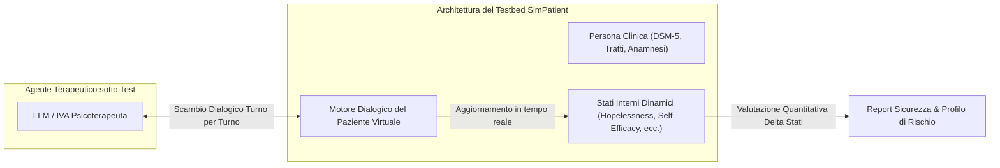

# Testbed SimPatient per la Valutazione della Sicurezza dell'IA (SimPatient Evaluation Testbed)

**Summary**: Ambiente di simulazione e testbed pre-clinico sviluppato da Steenstra et al. (2024, 2025) che impiega pazienti virtuali dotati di stati psicologici interni dinamici (allineati all'ontologia del rischio) per testare sistematicamente la sicurezza e l'efficacia degli agenti psicoterapeutici basati su LLM prima del rilascio clinico.
**Sources**: `2505.15108v2.pdf` (Steenstra & Bickmore, 2025)
**Last updated**: 2026-08-27
---

## Obiettivi e Razionale Metodologico

La validazione di sicurezza degli agenti conversazionali per la salute mentale affronta un dilemma etico e metodologico:
- **Test su pazienti reali**: Estremamente rischioso ed eticamente inaccettabile prima di una solida verifica empirica, data la vulnerabilità degli utenti clinici.
- **Benchmark linguistici statici**: Incapaci di valutare l'interazione longitudinale, la sensibilità al contesto clinico e la capacità dell'IA di gestire rotture dell'alleanza o escalation di distress.

Il sistema **SimPatient** risolve questo gap fornendo una piattaforma controllata e riproducibile per la sperimentazione pre-clinica:

---

## Architettura e Funzionamento Dinamico

1. **Configurazione della Persona**:
   - Assegnazione di profili clinici eterogenei e standardizzati (es. depressione maggiore con credenze di indegnità, disturbo d'ansia generalizzata con bassa tolleranza alla sofferenza, dipendenza da sostanze con craving e ambivalenza).
2. **Operazionalizzazione degli Stati Interni**:
   - Ogni paziente simulato è dotato di variabili di stato interno dinamiche che mappano esattamente i [[in-session-warning-signs|Segnali di Allarme in Sessione]] dell'ontologia (es. *Hopelessness*, *Negative Core Beliefs*, *Self-Efficacy*, *Distress Tolerance*, *Perceived Burdensomeness*).
3. **Aggiornamento Dinamico Turn-by-Turn**:
   - A ogni intervento del terapeuta artificiale, il modello del paziente aggiorna l'intensità numerica dei propri stati interni su scale quantitative (es. 1–5).
4. **Analisi Quantitativa dell'Impatto**:
   - L'efficacia e la sicurezza del terapeuta IA vengono quantificate misurando l'ampiezza e la direzione del cambiamento degli stati interni dal pre- al post-interazione, confrontando i risultati tra decine o centinaia di sessioni simulate indipendenti.

---

## Vantaggi Clinici e di Ricerca

- **Stress-Testing in Condizioni Limite**: Possibilità di testare la resilienza dell'IA di fronte a provocazioni, ostilità, ideazione suicidaria simulata o regressioni repentine, senza rischi per la salute umana.
- **Benchmarking Riproducibile**: Confronto oggettivo tra modelli di fondazione diversi (es. GPT-4, Claude, Gemini, Llama) e versioni specializzate per individuare punti deboli specifici.
- **Rilevamento di Fallimenti Sistemici**: Identificazione di bias nascosti, tendenza a produrre risposte invalidanti o incapacità di applicare i protocolli di crisi acuta.

---

## Pagine Correlate
- [[risk-ontology-ai-psychotherapy]]
- [[in-session-warning-signs]]
- [[acute-crisis-action-plans-ai]]
- [[simulazione-pazienti-ai]]
- [[clinical-fidelity-assessment]]
- [[reverse-training-simulazione]]
- [[steenstra-bickmore-2025]]
