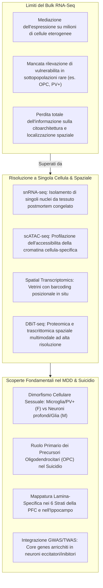

# Single-Cell and Spatial Transcriptomics in Mental Health (Trascrittomica a Singola Cellula e Spaziale nella Salute Mentale)

## Definizione Operativa
La combinazione di **Single-Nucleus RNA-Sequencing (snRNA-seq)**, **Single-Cell ATAC-Sequencing (scATAC-seq)** e **Trascrittomica/Proteomica Spaziale (Spatial Transcriptomics - ST, DBiT-seq)** costituisce una suite di tecnologie ad altissima risoluzione capaci di dissezionare l'eterogeneità cellulare e la micro-anatomia funzionale del tessuto cerebrale. Nel contesto della neurobiologia del Disturbo Depressivo Maggiore (MDD) e del suicidio, tali approcci consentono di mappare le alterazioni trascrizionali ed epigenetiche in specifiche sottopopolazioni cellulari (neuroni eccitatori/inibitori, glia, precursori) e di preservarne le coordinate tridimensionali negli strati corticali e nelle strutture subcorticali (Wang & Dwivedi, 2025).

---

## Superamento dei Limiti del Bulk RNA-Seq

Il sequenziamento su omogenato tissutale (*bulk RNA-seq*) calcola una media ponderata dell'espressione genica dell'intero blocco di tessuto, mascherando segnali specifici di sottopopolazioni cellulari rare o effetti opposti che avvengono simultaneamente in tipi cellulari diversi (es. up-regulation in microglia e down-regulation in neuroni).

---

## Scoperte Salienti a Livello Cellulare e Spaziale

### 1. Dimorfismo Cellulare Sessuale nel MDD
L'applicazione di snRNA-seq nella corteccia prefrontale di pazienti maschi e femmine con depressione ha dimostrato che, sebbene i sintomi clinici possano presentare sovrapposizioni, i pattern molecolari cellula-specifici sono radicalmente differenti (Maitra et al., 2023):
- **Pazienti di Sesso Femminile**: I geni differenzialmente espressi (DEGs) si concentrano selettivamente nella **microglia** (asse neuroimmunitario) e negli **interneuroni a parvalbumina (PV+)** (disfunzione del controllo inibitorio GABAergico).
- **Pazienti di Sesso Maschile**: I DEGs sono arricchiti nei **neuroni piramidali eccitatori degli strati profondi**, negli **astrociti** e negli **oligodendrociti maturi**.

### 2. Precursori degli Oligodendrociti (OPC) nel Comportamento Suicidario
L'integrazione di scRNA-seq, bulk mRNA-seq e profili di metilazione del DNA in cervello postmortem di individui morti per suicidio ha evidenziato che le **Oligodendrocyte Precursor Cells (OPC)** rappresentano la frazione cellulare con il maggior contributo relativo alle alterazioni dell'espressione genica e ai siti differenzialmente metilati, indicando un difetto primario nella mielinizzazione e nel supporto trofico assonale (Zhou et al., 2023).

### 3. Integrazione TWAS e Mendelian Randomization
Studi di associazione sull'intero trascrittoma a singolo nucleo (*single-nucleus TWAS*) integrati con dati GWAS su pazienti depressi anziani hanno identificato 68 geni nucleari di rischio concentrati sia in neuroni eccitatori che inibitori, validando specifici sottotipi neuronali associati a geni come `KCNN2` e `SCA1` per la sintomatologia depressiva a esordio tardivo (Zeng et al., 2024).

### 4. Mappatura Lamina-Specifica con la Trascrittomica Spaziale
- **Corteccia Prefrontale Dorsolaterale (dlPFC)**: L'impiego di Spatial RNA-seq ha permesso di mappare i gradienti di espressione genica attraverso i **6 strati corticali umani**, identificando marcatori laminari la cui alterazione è implicata nella disconnessione dei circuiti cortico-limbici (Maynard et al., 2021).
- **Atlante Spaziale dell'Ippocampo**: La trascrittomica spaziale ha rivelato la compartimentazione molecolare dei sottocampi ippocampali (CA1, CA2, CA3, Dentate Gyrus, Subiculum) associata alla plasticità e alla memoria emozionale (Thompson et al., 2025).
- **Proteomica Spaziale DBiT-seq**: Il barcoding deterministico tissutale consente di quantificare simultaneamente centinaia di proteine e fosforilazioni preservando la topografia cellulare, aprendo la strada alla mappatura proteomica in situ delle regioni cerebrali coinvolte nella depressione (Liu et al., 2020).

---

## Confronto Metodologico

| Metodologia | Risoluzione | Materiale di Partenza | Vantaggi Principali | Limiti |
| :--- | :--- | :--- | :--- | :--- |
| **snRNA-seq** | Singolo nucleo | Tessuto postmortem congelato | Isola nuclei intatti; decompone popolazioni cellulari rare | Minore copertura di mRNA citoplasmatico |
| **scATAC-seq** | Singola cellula/nucleo | Tessuto fresco o congelato | Mappa lo stato di apertura della cromatina e i promotori attivi | Dati estremamente sparsi (*sparse data*) |
| **Spatial Transcriptomics** | ~1-10 cellule (spot-based) o subcellulare | Sezioni criogeniche intatte | Preserva la citoarchitettura anatomica e le relazioni di vicinato | Costi elevati; de-convoluzione degli spot richiesta |
| **DBiT-seq Proteomics** | Spaziale microfluidica | Sezioni istologiche | Analisi proteomica e trascrittomica combinata senza anticorpi | Setup sperimentale complesso |

---

## Implicazioni Traslazionali

1. **Targeting Cellula-Specifico**: Consente di progettare farmaci che agiscano miratamente su specifici tipi cellulari (es. ripristino della funzione degli interneuroni PV o degli OPC) senza alterare indiscriminatamente l'intero tessuto cerebrale.
2. **Deconvoluzione del Sangue e del Bulk Tissue**: Le firme geniche derivate dal single-cell permettono di sviluppare algoritmi computazionali di deconvoluzione per stimare le proporzioni cellulari a partire da campioni di sangue o di omogenato cerebrale.

---

## Relazioni nel Knowledge Base
- [[wang-dwivedi-2025]]: Sintesi sistematica della review di riferimento.
- [[multi-omics-depression-suicide]]: Integrazione di dati a singola cellula con GWAS ed epigenomica.
- [[non-coding-rna-biomarkers-psychiatry]]: Localizzazione sinaptica e cellulare degli RNA non codificanti.
- [[ai-multi-omics-psychiatric-biomarkers]]: Algoritmi di apprendimento e clustering per dati a singola cellula.
- [[peripheral-blood-biomarkers-and-exosomes-in-mdd]]: Validazione periferica di alterazioni cellulari centrali.
