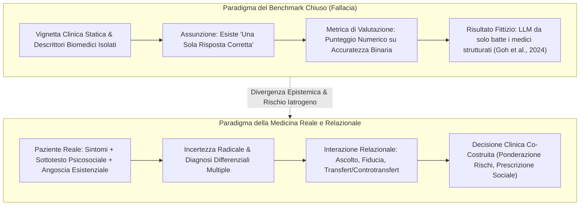
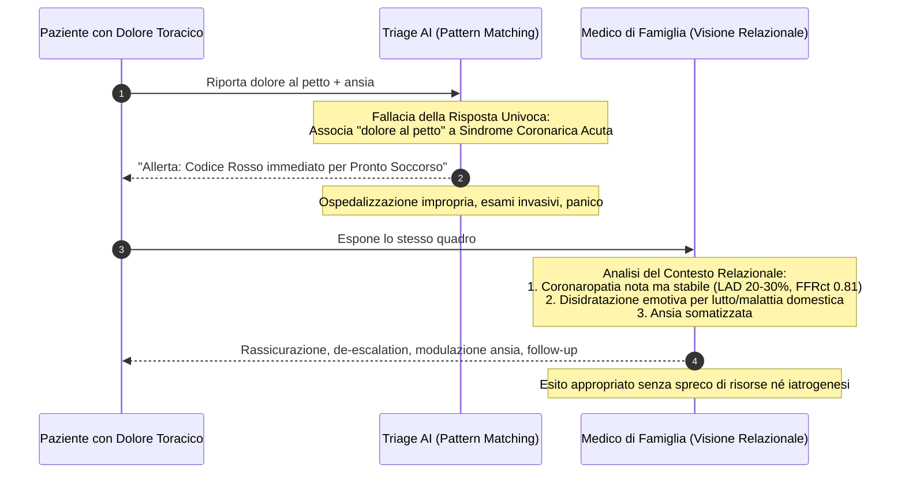

# Single-Correct-Answer Fallacy in Clinical AI (Fallacia della Risposta Univoca nell'IA Clinica)

## Definizione Operativa
- La **Single-Correct-Answer Fallacy in Clinical AI** (fallacia della risposta univoca o corretta a priori nell'IA medica) identifica l'errore metodologico ed epistemologico consistente nel concepire il processo decisionale clinico come un task chiuso di classificazione, risolvibile mediante il mero abbinamento statistico di pattern (*pattern recognition*) verso una diagnosi formalmente "esatta".
- **Identificazione e Formalizzazione:** Evidenziata da Bhasin et al. (2025) nell'analisi critica del trial randomizzato di Goh et al. (*JAMA Network Open*, 2024), dimostra l'inadeguatezza dei tradizionali benchmark di valutazione dell'IA in medicina: testare i modelli su vignette cliniche sintetiche con un'unica etichetta diagnostica corretta sovrastima le capacità dell'algoritmo e nasconde la sua inefficacia nel supportare il clinico nella pratica reale.
- **Rilevanza Clinica:** La medicina reale opera in una condizione di **incertezza intrinseca, complessità contestuale e co-costruzione relazionale**. Le decisioni cliniche non preesistono come formule astratte, ma emergono all'interno dell'alleanza tra medico e paziente, integrando il sottotesto emotivo, la storia psicosociale, le preferenze soggettive e le dinamiche di transfert/controtransfert.

---

## De-costruzione Empirica e Limiti Metodologici

### 1. Il Paradosso di Goh et al. (2024)
- Nel trial randomizzato di Goh et al. (2024), l'LLM da solo ha superato i medici nei test diagnostici sintetici, ma **l'affiancamento del modello ai medici non ha prodotto alcun miglioramento rispetto all'uso di risorse convenzionali** (*UpToDate*).
- **Spiegazione del Paradosso:**
  - I test sintetici premiano l'estrazione lessicale diretta e la correlazione sintomatica rigida (dove l'LLM eccelle);
  - Il sistema di valutazione assegna un punteggio alla risposta corretta presunta (*putative correct diagnosis*), ignorando interamente la qualità, la cautela, la ponderazione differenziale e la coerenza del percorso di ragionamento del clinico;
  - Nella complessità clinica quotidiana, il medico non necessita di un aggregatore di etichette rigide, ma di un co-ragionatore capace di calibrare il dubbio e discernere le priorità del paziente.

---

## Dimensioni Cliniche Ignorate dalla Fallacia

### 1. Riduzionismo Biomedico vs Sottotesto Psicosociale
- I sistemi di triage o trascrizione automatizzati (come *Abridge©* o i chatbot per app sanitarie) scotomizzano gli aspetti non strettamente biomedici, privilegiando solo i parametri necessari alla fatturazione (*billing*).
- Come illustrato nel caso clinico di Bhasin et al. (2025), un paziente che lamenta dolore toracico mentre esprime terrore per il proprio animale domestico malato necessita di un intervento centrato sull'angoscia e sulla relazione, non di un algoritmo rigido che impone una coronarografia invasiva per timore medico-legale.

### 2. Sofferenza e Demoralizzazione vs Misura del Dolore
- Citando Cassel (1982) e Clarke & Kissane (2002), il modello riduzionista scambia il valore quantitativo del dolore (*pain score*) con la **sofferenza complessiva della persona**.
- La cura richiede spesso interventi di *social prescribing* e supporto esistenziale (Meza, 2023), dimensioni che non ammettono una soluzione algoritmica unidimensionale.

### 3. Dinamiche di Transfert e Alleanza Terapeutica
- La decisione clinica è intrinsecamente relazionale e si sviluppa attraverso risonanza emotiva, intuizione ed empatia autentica (Frank & Frank, 1993; Hatch et al., 2025). Le macchine possono al più simulare il comportamento conversazionale, ma non possono esperire emozioni né stabilire un patto terapeutico fiduciario.

---

## Implicazioni per la Valutazione e l'Uso dell'IA

1. **Riforma dei Benchmark di Valutazione:** Sostituire le metriche binarie (accuratezza top-1 su casi chiusi) con framework di valutazione multi-assiale che misurino la qualità del ragionamento differenziale, la gestione dell'incertezza e l'aderenza al contesto psicosociale.
2. **Prevenzione della Sovradiagnosi e della Medicina Difensiva:** L'uso di algoritmi di triage rigidi rischia di esacerbare la medicina difensiva (es. ricoveri cautelativi per qualsiasi sintomo algoritmizzato), moltiplicando i costi sanitari e i rischi iatrogeni.
3. **Preservazione dell'Autorità Clinica:** L'IA deve rimanere uno strumento consultivo per l'esplorazione di ipotesi rare o pattern occulti ([[modello-centauro-clinico]]), mentre il giudizio sintetico integrato deve restare saldamente ancorato alla relazione medico-paziente.

---

## Riferimenti Bibliografici
- **Bhasin, R., El-Sayed, W., Salami, K., Abdul-Nabi, M., Elashmawy, A., & Jaruzel II, M. E. (2025).** Clinical decision-making and artificial intelligence: The role of large language models in medicine. *Clinical Research in Practice*, 11(1), eP3601. https://doi.org/10.22237/crp/1743681960
- **Cassel, E. J. (1982).** The nature of suffering and the goals of medicine. *New England Journal of Medicine*, 306(11), 639–645.
- **Clarke, D. M., & Kissane, D. W. (2002).** Demoralization: its phenomenology and importance. *Aust N Z J Psychiatry*, 36(6), 733–742.
- **Frank, J. D., & Frank, J. B. (1993).** *Persuasion and Healing: A Comparative Study of Psychotherapy* (3rd ed.). Johns Hopkins University Press.
- **Goh, E., Gallo, R., Hom, J., et al. (2024).** Large Language Model Influence on Diagnostic Reasoning: A Randomized Clinical Trial. *JAMA Network Open*, 7(10), e2440969.
- **Hatch, S. G., Goodman, Z. T., Vowels, L., et al. (2025).** When ELIZA meets therapists: A Turing test for the heart and mind. *PLOS Mental Health*, 2(2), e0000145.
- **Meza, J. P. (2023).** From the editor: Flexner Report 3.0—Structurally Competent Healthcare. *Clinical Research in Practice*, 9(1), eP3549.

---

## Related Pages
- [[clinical-decision-making-and-artificial-intelligence]]
- [[information-without-explanation-in-clinical-ai]]
- [[human-in-the-reasoning]]
- [[modello-centauro-clinico]]
- [[algorithmic-paternalism-in-ai-mental-health]]
- [[simulated-empathy-vs-authentic-presence]]
- [[ai-clinical-decision-support]]
- [[automation-bias-clinical-reasoning]]
- [[bottom-up-clinical-documentation]]
- [[traffic-light-quality-appraisal-clinical-ai]]
