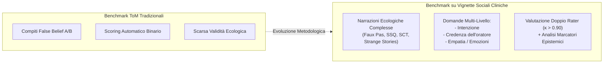

# Benchmarking di Cognizione Sociale con Vignette Cliniche

**Summary**: Metodologia di valutazione neuropsicologica applicata ai modelli di intelligenza artificiale per misurare la comprensione sociale avanzata (Theory of Mind di ordine superiore) tramite narrazioni complesse, scoring multi-dimensionale e protocolli a doppio rater indipendente.
**Sources**: `2601.06032v1.pdf`
**Last updated**: 2026-08-27
---

## Razionale e Differenze rispetto ai Benchmark Tradizionali

La maggior parte dei benchmark ToM per Large Language Models ([[large-language-models]]) si basa su compiti sintetici a risposta binaria o a scelta multipla (es. *Unexpected Transfer*, scenari A/B di Sally-Anne). Sebbene facili da automatizzare su vasta scala, tali compiti:
- Non catturano la fluidità, l'ambiguità e la natura stratificata delle interazioni sociali quotidiane.
- Rischiano elevati tassi di memorizzazione e *data contamination*.
- Non consentono di analizzare le spiegazioni narrative prodotte dal modello.

Il **benchmarking basato su vignette sociali complesse** adotta strumenti standardizzati della neuropsicologia clinica (sviluppati originariamente per lo studio dell'autismo e delle lesioni cerebrali anteriori), richiedendo risposte in linguaggio naturale valutate secondo manuali diagnostici codificati.

---

## Principali Test Neuropsicologici a Vignette

### 1. Faux Pas Recognition Test (Stone et al., 1998; Baron-Cohen et al., 1999)
- **Composizione**: 20 storie (10 con gaffe involontarie / *faux pas*, 10 storie di controllo senza gaffe).
- **Competenze Testate**: Capacità di distinguere tra una violazione sociale involontaria (dovuta a mancanza di informazioni o vuoto di memoria) e un insulto deliberato.
- **Batteria di Domande**:
  1. *Faux Pas Detection*: Qualcuno ha detto qualcosa di inappropriato o imbarazzante?
  2. *Identification*: Chi ha commesso la gaffe?
  3. *Inappropriateness*: Perché l'affermazione era inappropriata?
  4. *Intention*: Perché l'oratore ha detto quella frase?
  5. *Belief / False-Belief*: L'oratore ricordava/sapeva il fatto chiave?
  6. *Empathy*: Come si è sentita la persona che ha subito la gaffe?
  7. *Control Questions*: Domande fattuali di verifica della memoria del testo.

### 2. Social Stories Questionnaire (SSQ) (Lawson et al., 2004)
- **Composizione**: 10 vignette divise in 3 sotto-sezioni ciascuna (totale 30 item: 10 commenti sgradevoli sottili, 10 eclatanti, 10 neutri).
- **Obiettivo**: Identificare la singola riga o battuta di un dialogo che risulta offensiva o mortificante per l'interlocutore.
- **Discriminazione**: Consente di valutare la sensibilità del modello alle gradazioni di severità (blatant vs subtle faux pas).

### 3. Story Comprehension Test (SCT) (Channon & Crawford, 2000; Vetter et al., 2013)
- **Composizione**: Vignette che esplorano forme di comunicazione non letterale e strategica: *pretense* (finzione), *white lies* (bugie a fin di bene), *irony* (ironia), *elaborated irony*, *threats* (minacce velate), *dares* (sfide) ed *excuses* (scuse).
- **Punteggio**: Scala graduata (0 = errato, 1 = comprensione parziale, 2 = spiegazione completa dello stato mentale).

---

## Linee Guida per la Valutazione Rigorosa degli LLM

1. **Protocollo Multi-Rater e Accordo Inter-Valutatore**: Le risposte generate in linguaggio naturale devono essere analizzate da almeno due valutatori indipendenti, calcolando l'indice di attendibilità (Cohen's kappa $\kappa > 0.85$).
2. **Testing Cross-Linguistico**: La traduzione e validazione dei test in lingue secondarie (es. tedesco, italiano, spagnolo) permette di controllare la contaminazione da memorizzazione dei testi inglesi e ne verifica la robustezza interlinguistica.
3. **Analisi Qualitativa e Epistemica**: Oltre al calcolo della correttezza concettuale, è essenziale monitorare la presenza di modalità epistemiche (hedging) e la tendenza alla prolissità.

---

## Related pages
- [[holl-etten-et-al-2026]]
- [[applied-theory-of-mind-llm]]
- [[epistemic-markers-in-ai]]
- [[ai-assistive-autism-communication]]
- [[clinical-fidelity-assessment]]
- [[simulazione-pazienti-ai]]
