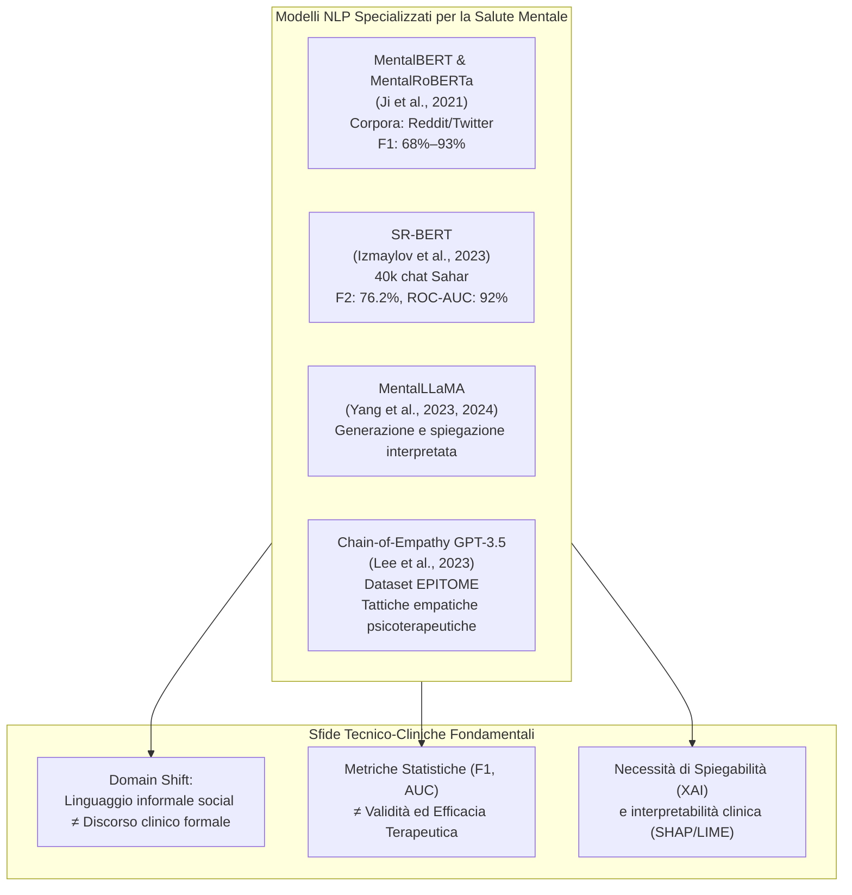

# Specialized NLP Models in Mental Health (Modelli NLP e LLM per la Salute Mentale)

## Definizione e Inquadramento Tecnico
Sviluppo e applicazione di modelli di Natural Language Processing (NLP) e architetture Transformer specializzate (preaddestrate o fine-tunate su lessico psicologico e psichiatrico) per l'analisi affettiva, l'estrazione di biomarcatori linguistici, la stima del rischio clinico e la generazione di risposte empatiche (Rezaei et al., 2026).

---

## Principali Modelli e Architetture della Letteratura

### 1. MentalBERT e MentalRoBERTa (Ji et al., 2021)
- **Caratteristiche:** Transformer preaddestrati su milioni di post estratti da community online dedicate alla salute mentale (es. r/depression, r/SuicideWatch, r/Anxiety, Twitter).
- **Performance:** Raggiungono **F1-score compresi tra il 68% e il 93%** nei task di classificazione binaria e multiclasse dei disturbi psicologici.

### 2. SR-BERT (Izmaylov et al., 2023)
- **Caratteristiche:** Modello gerarchico (estensione di DialogBERT) integrato con costrutti e teorie psicologiche per la predizione del rischio di suicidio.
- **Dataset e Risultati:** Addestrato su oltre **40.000 sessioni di chat anonimizzate** del servizio di crisi israeliano Sahar, ha conseguito un **F2-score del 76,2%** e un **ROC-AUC del 92%**, superando ampiamente i modelli tradizionali non gerarchici.

### 3. MentalLLaMA (Yang et al., 2023, 2024)
- **Caratteristiche:** Modello di linguaggio open-source (basato su LLaMA) orientato all'analisi clinica interpretabile, capace di generare non solo etichette diagnostiche ma anche motivazioni testuali comprensibili e coerenti con la letteratura psicologica.

### 4. Prompting con Chain-of-Empathy (CoE) (Lee et al., 2023)
- **Caratteristiche:** Metodo di concatenazione di prompt con GPT-3.5 che guida il modello attraverso le fasi classiche dell'empatia clinica (riconoscimento dell'emozione, comprensione del contesto, validazione affettiva e proposta di supporto).

### 5. Reti con Risoluzione delle Anafore (Wongkoblap et al., 2021)
- **Caratteristiche:** Risoluzione esplicita dei riferimenti pronominali e contestuali tra frasi successive nei post social, permettendo di intercettare sottili espressioni autoreferenziali tipiche della depressione e schemi di ruminazione.

---

## Il Problema Cruciale del Domain Shift

Una delle conclusioni più rilevanti della rassegna di Rezaei et al. (2026) riguarda il divario tra accuratezza statistica sui social media e applicabilità clinica reale:
1. **Linguaggio Social vs Discorso Clinico:** I dati di Reddit e Twitter sono caratterizzati da gergo informale, meme, iperboli, sarcasmo e metafore tipiche del web. Quando questi modelli vengono traslati nel contesto medico o psicoterapeutico formale (trascrizioni di sedute, colloqui clinici strutturati), la loro affidabilità decade sensibilmente (*domain shift*).
2. **Illusione delle Metriche Tecniche:** Metriche come F1-score e ROC-AUC descrivono la capacità di discriminare pattern lessicali espliciti (es. "depresso", "farla finita"), ma non garantiscono che il modello comprenda costrutti clinici profondi come i meccanismi di difesa, la dissonanza cognitiva o le strategie di evitamento.
3. **Ruolo Operativo:** I modelli NLP devono essere considerati strumenti di **supporto decisionale (*clinical decision support*) e screening a monte**, operanti sempre sotto la diretta supervisione del clinico (*Human-in-the-Loop*).

---

## Infrastruttura di Deploy: MCP Bridge (Ahmadi et al., 2025)
- Per connettere questi modelli eterogenei alle cartelle cliniche e ai flussi applicativi, è stata introdotta l'architettura **MCP Bridge** (*Model Context Protocol Bridge*), un proxy RESTful leggero e agnostico rispetto al fornitore di LLM che garantisce modularità, velocità di elaborazione e standardizzazione della comunicazione dati.

---

## Riferimenti Bibliografici
- Rezaei, Z., Khorraminia, A., Shi, D., & Banad, Y. M. (2026). Network-based artificial intelligence in mental healthcare: A systematic review of chatbots, artificial intelligence/machine learning models and ethical considerations in global healthcare networks. *DIGITAL HEALTH*, 12, 1–30. https://doi.org/10.1177/20552076261421688
- Ji, S., Li, Y., Xu, J., et al. (2021). MentalBERT: publicly available pretrained language models for mental healthcare. *arXiv:2110.15621*.
- Izmaylov, D., Agarwal, R., Cai, J., et al. (2023). Combining psychological theory with language models for suicide risk detection. *EACL 2023*.
- Yang, K., Zhang, T., Kuang, Z., et al. (2024). MentalLLaMA: interpretable mental health analysis on social media with large language models. *ACM Web Conf 2024*.

---

## Pagine Correlate
- [[rezaei-et-al-2026]]
- [[network-based-ai-mental-healthcare]]
- [[mental-health-chatbot-taxonomy]]
- [[rischio-suicidario-ai-limits]]
- [[ai-clinical-decision-support]]
- [[human-in-the-reasoning]]
