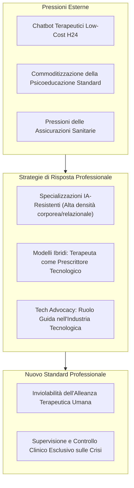

# Specializzazioni IA-Resistenti e Modelli Ibridi in Psicoterapia

**Summary**: Riorientamento strategico della professione psicoterapeutica verso aree cliniche ad altissima complessità somatica, relazionale e sistemica non surrogabili dagli algoritmi (terapia familiare, di coppia conflittuale, psicoterapia infantile embodied), integrato con modelli clinici ibridi in cui il terapeuta funge da "prescrittore tecnologico" e consulente etico nell'industria tecnologica.
**Sources**: Caldwell (2026); GPA (2026); EFPA (2026); `AI in Psicoterapia 2023-2026.docx`.
**Last updated**: 2026-08-27
---

## Il Rischio di Commoditizzazione della Terapia Verbale Individuale

Con la rapida diffusione di [[large-language-models]] generalisti e chatbot terapeutici commerciali a basso costo, i segmenti di psicoterapia verbale puramente cognitiva, psicoeducativa o di supporto aspecifico rischiano una progressiva pressione economica e sostitutiva da parte di assicurazioni e provider sanitari.

Per contrastare questo scenario, la comunità clinica teorizza un duplice adattamento:
1. **Focalizzazione su Specializzazioni IA-Resistenti**;
2. **Evoluzione verso Modelli Clinici Ibridi (*Therapist-as-Prescriber*)**.

---

## 1. Mappatura delle Specializzazioni "IA-Resistenti"

Le aree cliniche strutturalmente protette dalla disintermediazione algoritmica presentano caratteristiche epistemologiche e fenomenologiche non simulabili:

| Specializzazione / Setting | Caratteristiche Non Algoritmiche | Perché l'IA Fallisce |
| :--- | :--- | :--- |
| **Terapia con Sistemi Familiari** | Dinamiche trigenerazionali, alleanze implicite, doppi legami | Impossibilità di mappare la complessità sistemica in tempo reale |
| **Terapia di Coppia ad Alta Conflittualità** | Micro-segnali di disprezzo, rotture relazionali, aggressività repressa | Mancanza di calibratura emotiva immediata e neutralità attiva |
| **Psicoterapia Infantile Mediata dal Gioco** | Comunicazione simbolica non verbale, prosodia, movimento corporeo | Assenza di *embodiment*, incapacità di giocare nello spazio fisico |
| **Trauma Complesso e Dissociazione Corporea** | Regolazione neurovegetativa somatica, contatto oculare, grounding | Mancanza di sintonia biologica (*limbic resonance*) |

---

## 2. Modelli Ibridi e il Clinico come "Prescrittore Tecnologico"

Nel modello ibrido (*blended care* evoluto):
- Il terapeuta non abdica alla relazione ma assume il ruolo di **curatore e prescrittore di specifici strumenti di micro-intervento** (es. app validate per il tracciamento neutro dei sintomi o per il role-playing di assertività).
- **Titolarità Esclusiva della Crisi**: L'IA non gestisce l'emergenza clinica o l'ideazione suicidaria; l'accesso diretto e prioritario resta saldamente in capo al professionista umano.
- **Sostituzione dell'Uso Autonomo Selvagio**: Invece di subire la [[sycophancy-trap-clinica|Sycophancy Trap]] dei chatbot commerciali, il paziente riceve percorsi strutturati guidati dal clinico.

---

## 3. Tech Advocacy e Consulenza Etica

Come auspicato dai principi della Global Psychology Alliance (GPA, 2026) e dell'EFPA:
- Gli psicologi e psicoterapeuti devono posizionarsi come figure chiave all'interno delle aziende tecnologiche (*Tech Companies*).
- Partecipano alla fase di *fine-tuning*, redazione dei dataset clinici, definizione dei vincoli di sicurezza (guardrails) e audit deontologico per evitare la proliferazione di agenti iatrogeni.

---

## Pagine Correlate
- [[ai-in-psicoterapia-2023-2026]]
- [[sadar-framework]]
- [[artificial-intelligence-replacement-dysfunction]]
- [[sycophancy-trap-clinica]]
- [[consenso-dinamico-e-governance-dati-ia]]
- [[blended-care-ai-framework]]
