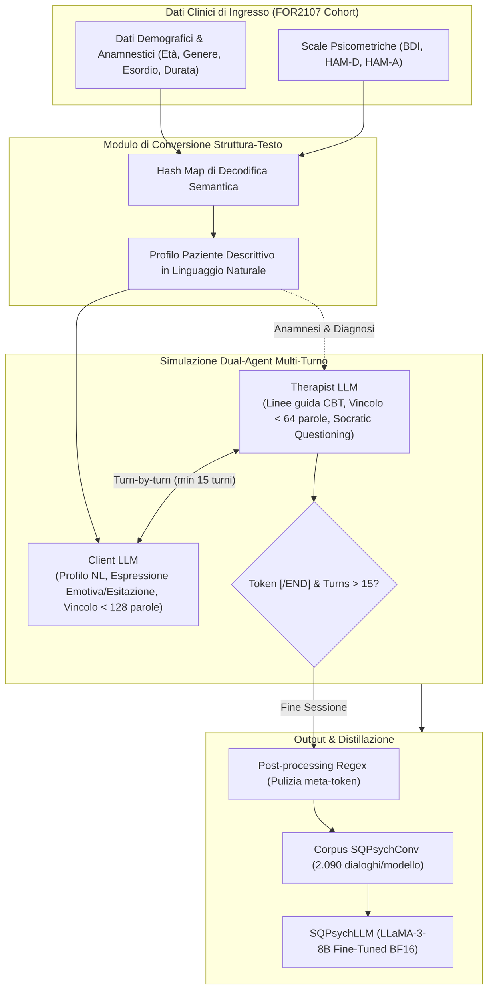

# SQPsych Framework & SQPsychConv

**Summary**: Framework multi-agente per la generazione automatizzata di dialoghi psicoterapeutici sintetici basati sulla Terapia Cognitivo-Comportamentale (CBT). SQPsych converte metadati clinici e scale psicometriche standardizzate (BDI, HAM-D, HAM-A) in linguaggio naturale e simula sedute cliniche multi-turno tramite due LLM indipendenti (Therapist LLM e Client LLM) eseguiti localmente. Il dataset risultante (**SQPsychConv**) abilita la distillazione di modelli compatti ed eticamente conformi per il counseling clinico.
**Sources**: `2510.25384v1.pdf` (Vu et al., 2025: *Roleplaying with Structure: Synthetic Therapist-Client Conversation Generation from Questionnaires*)
**Last updated**: 2026-08-27
---

## Architettura del Framework SQPsych

I sistemi tradizionali di generazione di dialoghi sintetici per la salute mentale (es. CACTUS, SMILE) impiegano un approccio a modello singolo, in cui un unico LLM commerciale (es. GPT-4o) genera alternativamente le risposte di entrambe le parti. Questo paradigma introduce bias di omogeneità stilistica e impedisce la reale separazione epistemica tra le conoscenze del paziente e quelle del terapeuta.

**SQPsych** (*Structured Questionnaire-based Psychotherapy*) supera tali limiti introducendo un'architettura **Dual-Role Multi-Agent** ancorata a dati clinici empirici:

---

## Specifiche dei Ruoli e Prompt Engineering

### 1. Therapist LLM (Terapeuta CBT)
L'agente terapeuta è istruito a simulare uno psicoterapeuta abilitato con oltre 3.000 ore di esperienza clinica supervisionata:
- **Workflow di Seduta**:
  1. *Mood Check*: Accoglienza empatica e verifica dello stato emotivo odierno.
  2. *Agenda Setting*: Definizione condivisa degli argomenti focali della sessione.
  3. *Inquadramento Clinico*: Lettura e operazionalizzazione della diagnosi dal profilo.
  4. *Rinforzo del Modello Cognitivo*: Esplorazione del nesso Pensiero $\rightarrow$ Emozione $\rightarrow$ Comportamento.
  5. *Action Planning*: Ristrutturazione cognitiva, compiti a casa ed esame delle evidenze.
  6. *Feedback*: Raccolta delle impressioni di chiusura e fissazione del prossimo appuntamento.
- **Linee Guida di Risposta**:
  - Evitare rassicurazioni vuote o affermazioni positive artificiose.
  - Applicare tecniche CBT mirate: validazione empatica, scoperta guidata, domande socratiche, reframing auto-compassionevole.
  - Concisione: enunciati inferiori a 64 parole.
  - Divieto di menzionare esplicitamente le sigle dei questionari (es. non dire mai *"Nel tuo BDI hai segnato..."*).

### 2. Client LLM (Paziente Virtuale)
L'agente paziente riceve la traduzione in linguaggio naturale dei punteggi psicometrici e dei dati contestuali:
- **Comportamento Verbale ed Emotivo**:
  - Espressione autentica di sofferenza, pessimismo o confusione in linea con il profilo (MDD vs. Controllo).
  - Utilizzo di intercalari ed esitazioni naturali (*"uh"*, *"well"*, *"like"*), senza eccessi artificiosi.
  - Possibilità di esprimere incertezza (*"Non lo so..."*) mantenendo la coerenza affettiva.
  - Concisione: enunciati inferiori a 128 parole.

---

## Il Corpus SQPsychConv e Statistiche di Dialogo

Il framework è stato eseguito su **7 modelli open-weight** di dimensione compresa tra 27B e 123B parametri, generando per ciascuno un corpus di **2.090 sessioni complete**:

| Dataset | Modello Base | Parametri | Utterance Totali | Turni Medi | Token / Turno Terapeuta | Token / Turno Paziente |
| :--- | :--- | :--- | :--- | :--- | :--- | :--- |
| **SQPsychConv-mistral** | `Mistral-Large-2407` | 123B | 98.342 | 23.12 | 32.03 | 30.17 |
| **SQPsychConv-command** | `c4ai-command-a-03-2025` | 111B | 64.760 | 17.45 | 45.43 | 56.60 |
| **SQPsychConv-qwen2.5** | `Qwen2.5-72B-Instruct` | 72B | 64.488 | 15.53 | 38.34 | 30.64 |
| **SQPsychConv-llama3.3** | `Llama-3.3-70B-Instruct` | 70B | 101.694 | 24.60 | 47.82 | 17.44 |
| **SQPsychConv-nemotron** | `Llama-3.3-Nemotron-49B` | 49B | 64.238 | 15.91 | 50.84 | 52.02 |
| **SQPsychConv-qwq** | `QwQ-32B` | 32B | 77.134 | 18.60 | 28.99 | 23.59 |
| **SQPsychConv-gemma** | `gemma-3-27b-it` | 27B | 71.000 | 17.00 | 64.59 | 38.99 |

A differenza di baseline come CACTUS (che conta 995k turni brevi e generici), SQPsychConv produce dialoghi con maggiore densità clinica, turni più ricchi (in media 30–50 token/utterance) e un'aderenza rigorosa ai protocolli CBT evidence-based.

---

## Pagine Correlate
- [[vu-et-al-2025]]: Sintesi completa del paper su SQPsych.
- [[conversione-questionari-dialoghi-clinici]]: Metodologia di traduzione semantica da item tabulari a testo.
- [[open-weight-privacy-compliant-synthesis]]: Architettura di hosting locale e conformità alla privacy.
- [[counseling-benchmarks-evaluation]]: Metodi di valutazione comparativa di competenze cliniche per LLM.
- [[synthetic-clinical-dialogues]]: Tassonomia e metodologie dei dialoghi clinici sintetici.
- [[cbt-dialogue-systems-and-tools]]: Applicazioni e sistemi dialogici basati su CBT.
- [[simulazione-pazienti-ai]]: Linee guida generali per la simulazione di pazienti virtuali.
