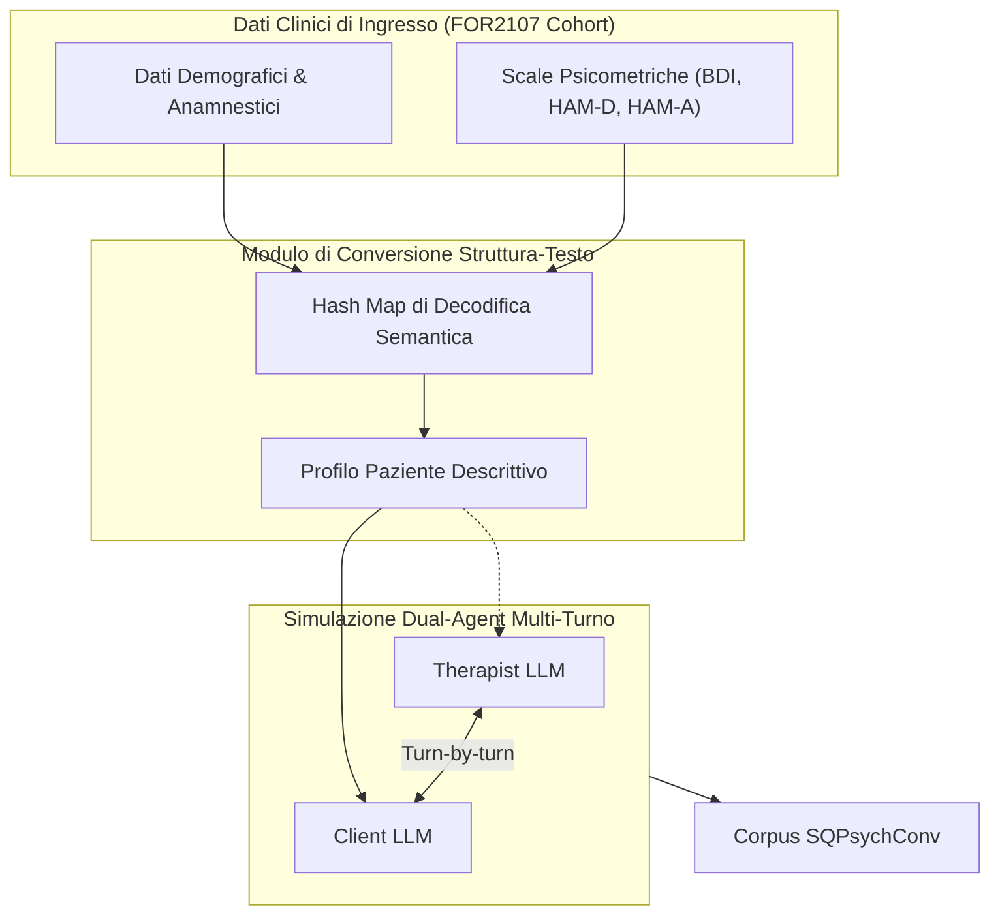

# SQPsych Framework

## Definizione Operativa

Il framework **SQPsych** (*Structured Questionnaire-based Psychotherapy*) è un sistema multi-agente progettato per la generazione automatizzata di dialoghi psicoterapeutici sintetici basati sulla Terapia Cognitivo-Comportamentale (CBT).

A differenza dei sistemi tradizionali che utilizzano un modello singolo (con potenziali bias di omogeneità), SQPsych implementa un'architettura **Dual-Role Multi-Agent** che separa le funzioni del Terapeuta e del Paziente, ancorandole a dati clinici empirici e scale psicometriche standardizzate (BDI, HAM-D, HAM-A). Il framework converte metadati clinici in profili di linguaggio naturale, permettendo la simulazione di sedute cliniche multi-turno tra due LLM indipendenti, risultando nella creazione del corpus **SQPsychConv** utile per la distillazione di modelli compatti ed eticamente conformi.

## Evidenze dalla Letteratura

Le evidenze relative al framework sono descritte in Vu et al. (2025), *Roleplaying with Structure: Synthetic Therapist-Client Conversation Generation from Questionnaires*. Il framework supera i limiti dei precedenti approcci (es. CACTUS, SMILE), che spesso soffrono di una limitata profondità clinica. SQPsychConv si distingue per:

*   **Maggiore densità clinica:** Turni più ricchi (30–50 token/utterance).
*   **Aderenza ai protocolli:** Rigorosa applicazione di tecniche CBT evidence-based (validazione empatica, scoperta guidata, domande socratiche).
*   **Separazione epistemica:** Distinzione chiara tra il profilo del paziente e le competenze del terapeuta, minimizzando il rischio di fuga di informazioni dal contesto dei questionari (es. il terapeuta non cita esplicitamente i punteggi numerici dei test).

**Riferimenti Bibliografici:**

*   Vu, T., et al. (2025). *Roleplaying with Structure: Synthetic Therapist-Client Conversation Generation from Questionnaires*. (Rif: `2510.25384v1.pdf`)

## Relazioni

*   [[vu-et-al-2025]]: Sintesi completa del paper su SQPsych.
*   [[conversione-questionari-dialoghi-clinici]]: Metodologia di traduzione semantica da item tabulari a testo.
*   [[open-weight-privacy-compliant-synthesis]]: Architettura di hosting locale e conformità alla privacy.
*   [[counseling-benchmarks-evaluation]]: Metodi di valutazione comparativa di competenze cliniche per LLM.
*   [[synthetic-clinical-dialogues]]: Tassonomia e metodologie dei dialoghi clinici sintetici.
*   [[cbt-dialogue-systems-and-tools]]: Applicazioni e sistemi dialogici basati su CBT.
*   [[simulazione-pazienti-ai]]: Linee guida generali per la simulazione di pazienti virtuali.
