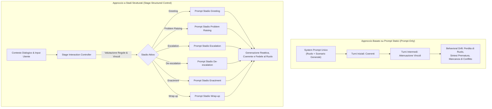

# Controllo del Dialogo Strutturato a Stadi (Stage-Structured Dialogue Control)

## Definizione Operativa
- Metodologia di controllo dell'interazione conversazionale per agenti basati su Large Language Models (LLM) che impiega una macchina a stati esplicita (*state-based interaction controller*) per governare l'evoluzione temporale del dialogo, in contrasto con la generazione non strutturata guidata esclusivamente da prompt statici (*prompt-only generation*).
- **Problema della Deriva Comportamentale (*Behavioral Drift*):**
  - Nei dialoghi multi-turno prolungati, i vincoli e le istruzioni specificate in un unico prompt di sistema iniziale tendono a decadere a causa dei limiti della finestra di contesto, dell'attenzione del modello e dell'effetto di trascinamento degli scambi recenti.
  - Gli agenti tendono a "risolvere" prematuramente i conflitti, a diventare eccessivamente accondiscendenti (*sycophancy*) o a perdere la coerenza della personalità e del ruolo clinico.
- **Funzionamento del Controllo a Stadi:**
  - L'interazione viene segmentata in fasi operative discrete e clinicamente motivate (ad es. *Greeting*, *Problem Raising*, *Escalation*, *De-escalation*, *Enactment*, *Wrap-up*).
  - Un modulo controllore valuta costantemente il contesto e lo storico degli stadi, determinando le transizioni secondo regole logiche e vincoli euristici.
  - A ogni transizione vengono iniettati prompt specifici e modulari per lo stadio corrente, garantendo che gli agenti mantengano la reattività corretta rispetto al punto esatto in cui si trova la seduta.

## Evidenze dalla Letteratura
- **Superiorità Statistica Rispetto alla Baseline:** Nello studio comparativo di Wang, Chen et al. (2026), il controllo a stadi ha garantito una fedeltà di ruolo (*Role Fidelity*) del 70.7% rispetto al 4.9% della baseline prompt-only ($\chi^2 = 352.39, p < 0.001$) e una fedeltà di stadio (*Stage Fidelity*) dell'83.8% rispetto al 63.8% ($\chi^2 = 43.75, p < 0.001$).
- **Frequenza e Dinamismo delle Transizioni:** La presenza dello stage controller ha promosso un flusso di sessione significativamente più dinamico, con un numero significativamente maggiore di transizioni di stato ($t = 6.36, p < 0.001$), impedendo alla conversazione di ristagnare in scambi superficiali o inconcludenti (Wang, Chen et al., 2026).
- **Percezione di Realismo Clinico:** La progressione a stadi guidata da vincoli euristici (es. divieto di escalation prima del turno 5, de-escalation forzata dopo 2 tentativi del terapeuta) ha permesso ai terapeuti valutatori di percepire l'interazione come autentica, elastica e strutturata secondo i reali ritmi della psicoterapia di coppia ($z = 24.72, p < 0.001$) (Wang, Chen et al., 2026; Choubey et al., 2025).

**Riferimenti Bibliografici:**
- Wang, C., Chen, A., Bao, C., Jin, S., Swartz, H., Wu, T., Kraut, R. E., & Zhu, H. (2026). Simulating Couple Conflict: Designing A Multi-Agent System for Therapy Training and Practice. *arXiv preprint arXiv:2601.10970v2*. https://arxiv.org/abs/2601.10970
- Choubey, P. K., Peng, X., Bhagavath, S., Xiong, C., Pentyala, S. K., & Wu, C.-S. (2025). Turning Conversations into Workflows: A Framework to Extract and Evaluate Dialog Workflows for Service AI Agents. *Proceedings of ACL 2025*, 3933–3954.
- Almasi, M., & Kristensen-McLachlan, R. D. (2025). Alignment Drift in CEFR-prompted LLMs for Interactive Spanish Tutoring. *Proceedings of BEA 2025 (ACL)*, 70–88.

## Relazioni
- Vedi anche: [[wang-chen-et-al-2026]], [[sense-plan-act-therapy-simulation]], [[multi-party-interaction-simulation]], [[demand-withdraw-multi-agent-dynamics]], [[therapeutic-enactment-simulation]], [[clinical-fidelity-assessment]]
