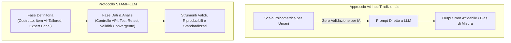
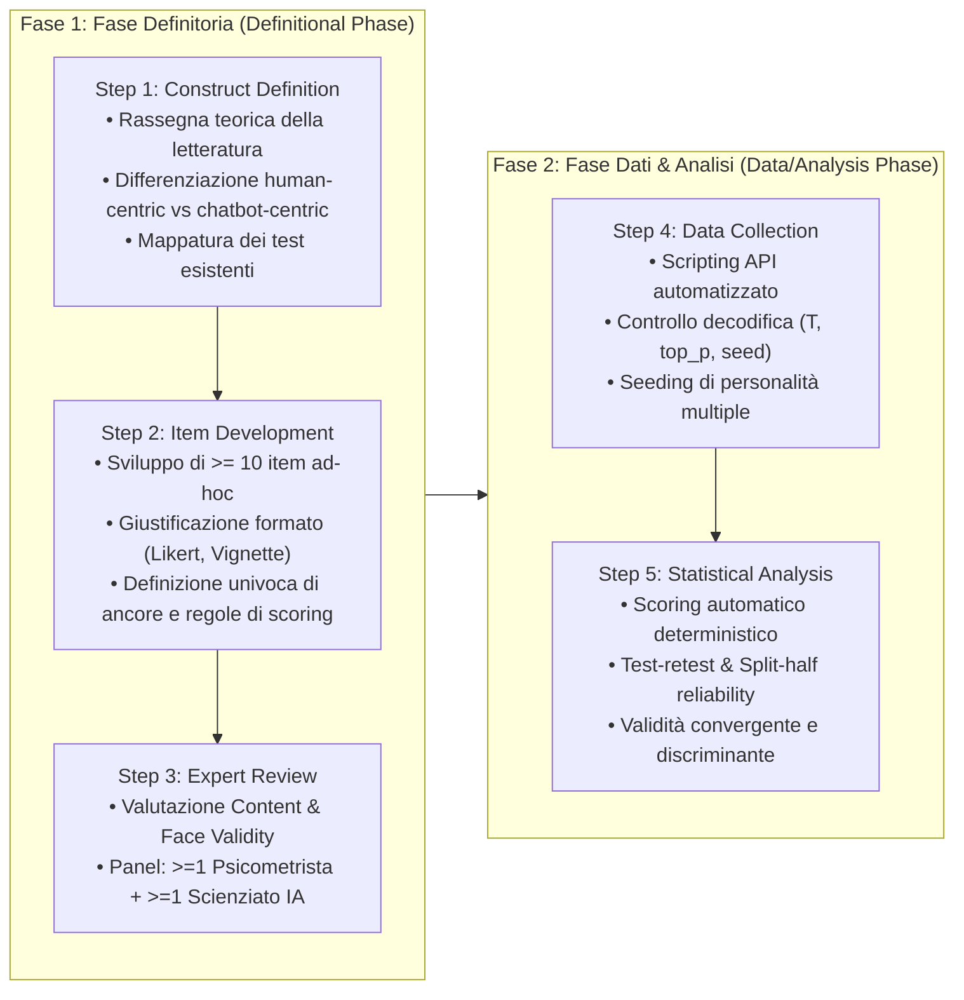

# Framework STAMP-LLM (Standardized Test & Assessment Measurement Protocol for LLMs)

**Summary**: Framework metodologico strutturato in due macro-fasi (Fase Definitoria e Fase Dati/Analisi) e 5 passaggi sequenziali, ideato per progettare, calibrare e validare psicometricamente strumenti di valutazione e misurazione dei bias e delle proprietà cognitive specificamente concepiti per i Large Language Models, superando i limiti del trasferimento diretto di test per umani.
**Sources**: `2509.13324v3.pdf` (Benosman, 2025)
**Last updated**: 2026-08-27
---

## Premessa Epistemologica: Il Limite del Trasferimento Diretto

La ricerca nella cosiddetta *Machine Psychology* ([[machine-psychology]]) ha frequentemente tentato di quantificare bias cognitivi, etici e sociali negli LLM ([[large-language-models]]) somministrando acriticamente strumenti psicometrici creati per soggetti umani (es. *Implicit Association Test*, *Cognitive Reflection Test*, *Modern Racism Scale*). 

Questo approccio incorre in una grave vulnerabilità metodologica:
1. **Assunzione di Invarianza di Misura**: Si assume implicitamente che un test standardizzato per la cognizione biologica umana misuri lo stesso costrutto latente quando somministrato a un'architettura probabilistica di predizione token.
2. **Ignoranza dei Vincoli di Piattaforma**: I test per umani sono vincolati da brevità per evitare l'affaticamento cognitivo, mentre gli LLM necessitano di batterie ampie, controllo rigoroso dei parametri di decodifica (*temperature*, *seed*) e isolamento dai pattern superficiali di prompting.

Per rispondere a tale criticità, **M. Benosman (2025)** ha formalizzato il protocollo **STAMP-LLM** (*Standardized Test & Assessment Measurement Protocol for LLMs*).

---

## Architettura del Protocollo STAMP-LLM

Il protocollo si articola in **due macro-fasi** e **cinque passaggi operativi**:

### Dettaglio delle Macro-Fasi Operative

| Fase | Step | Obiettivo | Azioni Chiave |
| :--- | :--- | :--- | :--- |
| **1. Definitoria** | **Step 1: Construct Definition** | Definire il costrutto di bias target | Condurre ricerche accademiche; identificare se il costrutto presenta caratteristiche peculiari nell'IA; censire strumenti preesistenti. |
| | **Step 2: Item Development** | Sviluppare gli stimoli di test | Progettare $\ge 10$ item; rimuovere vincoli di brevità umana; definire ancore (es. Likert $[-2, +2]$ + opzione $X$ per rifiuto); formalizzare le regole di calcolo punteggi. |
| | **Step 3: Expert Review** | Revisione della validità di contenuto | Sottoporre gli item a un panel interdisciplinare composto da almeno un esperto in psicometria e un ricercatore di LLM/IA per verificare *content* e *face validity*. |
| **2. Dati & Analisi** | **Step 4: Data Collection** | Raccogliere dati controllati | Costruire script API automatizzati; gestire seeding di tratti e contesti; registrare rigorosamente i metadati di inferenza (*sampling parameters*). |
| | **Step 5: Statistical Analysis** | Validare statisticamente la misura | Eseguire scoring automatico; calcolare statistiche descrittive e test di normalità; stimare affidabilità (*test-retest*, *split-half*) e validità di costrutto (*convergente/discriminante*). |

---

## Standard di Reporting e Riproducibilità

STAMP-LLM stabilisce standard precisi per la pubblicazione e condivisione di studi psicometrici su modelli linguistici:
1. **Batteria Completa di Item**: Pubblicazione integrale del testo di domande, vignette e istruzioni.
2. **Template di Prompting Esatti**: Dichiarazione dei prompt di sistema, vincoli di ruolo e formattazione richiesta.
3. **Impostazioni di Decodifica**: Esplicitazione di *temperature*, *top_p*, frequenza di penalizzazione e versioni esatte dei modelli testati.
4. **Pipeline di Analisi Open Source**: Condivisione degli script di somministrazione via API, parsing delle risposte e calcolo degli indici statistici.

---

## Riferimenti Bibliografici
- Benosman, M. (2025). Designing Psychometric Measures for LLMs: Framework and Application to Racial Bias. *arXiv preprint arXiv:2509.13324v3 [cs.HC]*.
- Wang, X., Jiang, L., Hernandez-Orallo, J., Stillwell, D., Sun, L., Luo, F., & Xie, X. (2023). Evaluating general-purpose AI with psychometrics. *arXiv preprint arXiv:2310.16379*.
- Kaplan, R. M., & Saccuzzo, D. P. (2009). *Psychological Testing: Principles, Applications, and Issues* (7th ed.). Wadsworth Cengage Learning.

---

## Related pages
- [[benosman-2025]]: Sintesi del paper fondativo di STAMP-LLM applicato al bias razziale.
- [[validita-psicometrica-llm]]: Il paradosso tra affidabilità test-retest e validità convergente negli LLM.
- [[misurazione-bias-razziale-llm]]: Metodologie esplicite e implicite per la quantificazione dei pregiudizi razziali nell'IA.
- [[audit-bias-llm-clinici]]: Metodologie di auditing e benchmark per bias etici e clinici.
- [[machine-psychology]]: La disciplina emergente dell'indagine psicologica sui modelli linguistici.
- [[pmv-framework]]: Framework di validità di misurazione psicometrica per l'IA.
- [[measurement-phantoms]]: Costrutti fantasma derivanti da vizi di misurazione negli LLM.
- [[pseudoreplication]]: Errori di campionamento e pseudo-replicazione nelle valutazioni dell'IA.
