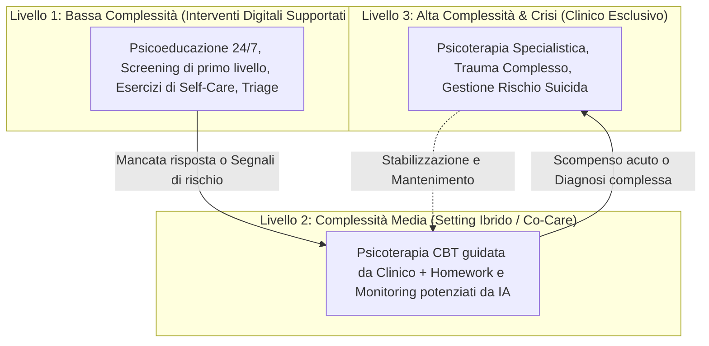

# Stepped-Care AI Integration

**Summary**: Modello organizzativo e clinico che inserisce gli strumenti basati su intelligenza artificiale nei sistemi di cura a gradini (*stepped-care*), allocando compiti a bassa intensità all'IA e riservando diagnosi differenziale, terapia relazionale e gestione delle crisi alla supervisione umana diretta.
**Sources**: Erdemir & Sumbas (2026) - `10.1177_00469580261438322.pdf`
**Last updated**: 2026-08-27
---

## Definizione e Razionale

Il modello di **Stepped-Care AI Integration** affronta la crisi di accessibilità dei servizi di salute mentale integrando l'intelligenza artificiale non come surrogato dell'intero percorso terapeutico, ma come componente graduata all'interno di una piramide di complessità assistenziale.

L'approccio stepped-care prevede che i pazienti ricevano inizialmente l'intervento meno invasivo e più economico capace di produrre benefici clinici, scalando verso livelli di maggiore intensità e supervisione professionale qualora il quadro clinico lo richieda.

---

## Articolazione Operativa dei Livelli

### 1. Livello 1: Bassa Intensità (AI-Assisted Self-Care & Psychoeducation)
- **Funzioni**: Erogazione di contenuti psicoeducativi interattivi, chiarimenti su concetti CBT di base, monitoraggio quotidiano dell'umore e abitudini di vita.
- **Strumenti**: Chatbot dedicati, app di benessere mentale, diari guidati.
- **Autonomia tecnologica**: Elevata, con vincoli stringenti di sicurezza e anonimato dei dati.

### 2. Livello 2: Intensità Intermedia (Clinician on the Loop / Setting Ibrido)
- **Funzioni**: Psicoterapia evidence-based condotta dal clinico, supportata dall'IA per la compilazione di schede ABC, diari dei pensieri automatici tra le sedute, e riassunti preliminari per il terapeuta.
- **Supervisione**: Il clinico monitora regolarmente l'avanzamento su dashboard dedicate, validando e discutendo i dati in seduta.

### 3. Livello 3: Alta Intensità (Human-Led Care / Direct Supervision)
- **Funzioni**: Valutazione psicodiagnostica differenziale, formulazione del caso, intervento su quadri di comorbilità severa, disturbi di personalità, dissociazione e gestione del rischio di suicidio o autolesionismo.
- **Ruolo dell'IA**: Rigorosamente circoscritto a supporto documentale o retrospettivo (decision support non vincolante), senza interazione diretta e non mediata con il paziente.

---

## Protocolli di Escalation Automatica (*Fail-Safe Referral*)
Un requisito fondamentale dello Stepped-Care ibrido è la presenza di algoritmi di sicurezza attivi:
- Se l'elaborazione NLP rileva marcatori di ideazione suicidaria, intenzione autolesiva o scompenso psicotico, la sessione automatica viene immediatamente interrotta.
- Il sistema fornisce istruzioni di emergenza e attiva la notifica automatica al clinico referente o ai servizi sanitari di pronto intervento.

---

## Vantaggi Sistemici
- **Ottimizzazione delle Risorse Sanitarie**: Riduce le liste d'attesa e riserva le ore cliniche umane ai pazienti con bisogni più gravi e complessi.
- **Continuità di Cura**: Fornisce un ponte di supporto continuo tra una seduta e la successiva, migliorando l'aderenza ai compiti a casa.

---

## Related pages
- [[erdemir-sumbas-2026]]
- [[three-layer-governance-framework]]
- [[clinical-fidelity-assessment]]
- [[ai-assisted-psychotherapy]]
- [[augmented-psychotherapy]]
- [[simulated-empathy-vs-authentic-presence]]
