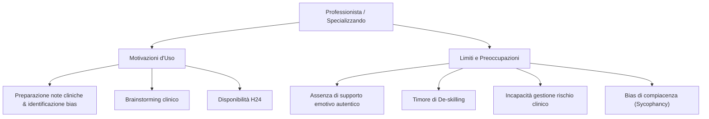

# Supervisione Clinica e Intelligenza Artificiale

## Definizione Operativa
L'integrazione di sistemi di Intelligenza Artificiale (IA), in particolare Large Language Models (LLM) e chatbot, all'interno dei processi di supervisione e intervisione psicoterapeutica. Tale pratica si configura non come sostituzione della supervisione umana, ma come strumento di supporto tecnico (brainstorming, stesura note cliniche, analisi di bias) esperito in un contesto di "modello centauro".

## Evidenze dalla Letteratura
L'indagine empirica (Cosentino et al., 2026) su 93 professionisti (specializzandi ed esperti) evidenzia:

- **Motivazioni**: Preparazione di note cliniche, identificazione di bias personali, brainstorming su tecniche e disponibilità costante (H24).
- **Variabili Psicologiche**: 
  - Il *Timore della Colpa* (FGS) correla con una maggiore cautela etica.
  - L'*Ansia Sociale* (LSAS) correla con l'uso dell'IA come strategia di coping contro il timore del giudizio umano.
- **Rischi Percepiti**:
  - **De-skilling**: Timore che la delega decisionale indebolisca il giudizio clinico autonomo, particolarmente sentito dagli allievi in formazione.
  - **Sycophancy**: Tendenza dell'IA alla compiacenza (conferma acritica delle ipotesi dell'utente).
  - **Limiti Strutturali**: Incapacità di offrire sintonizzazione affettiva autentica e gestione di situazioni ad alto rischio (suicidario, psicosi).

**Riferimenti Bibliografici:**
- Cosentino, T., et al. (2026). *Studio su atteggiamenti e motivazioni nell'adozione dell'IA a supporto della supervisione clinica*. (Dati tratti dalla Lezione: "RAG, LLM in Psicoterapia e Governance Etica").

## Relazioni
- [[modello-centauro-clinico]]
- [[feedback-informed-practice-ai]]
- [[rischio-suicidario-ai-limits]]
- [[ai-literacy-in-academia]]
- [[human-in-the-reasoning]]

