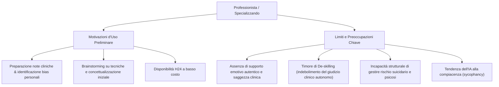

# Supervisione Clinica e Intelligenza Artificiale

**Summary**: Esplorazione empirica e clinica dell'uso dei Large Language Models e chatbot come strumenti di supporto alla supervisione e all'intervisione in psicoterapia, con particolare attenzione alle variabili psicologiche individuali (ansia sociale, timore della colpa), ai benefici preliminari e ai rischi di de-skilling.
**Sources**: `06-10 Lezione_ RAG, LLM in Psicoterapia e Governance Etica.txt`
**Last updated**: 2026-08-27
---

## Stato dell'Arte e Ricerca Empirica (Studio Cosentino et al., 2026)
L'indagine empirica condotta dalla Dott.ssa Teresa Cosentino su 93 professionisti della salute mentale (48 allievi specializzandi e 45 psicoterapeuti esperti) ha esplorato atteggiamenti, motivazioni psicologiche e timori nell'adozione dell'IA a supporto della supervisione clinica.

## Variabili Psicologiche e Determinanti Individuali
1. **Timore della Colpa (Fear of Guilt Scale - FGS)**:
   - I professionisti con elevata responsabilità morale e timore di arrecare danno mostrano una marcata cautela nell'uso dell'IA, temendo che delegare processi decisionali alla macchina possa compromettere la qualità della cura del paziente.
2. **Ansia Sociale e Timore del Giudizio (Liebowitz Social Anxiety Scale - LSAS)**:
   - L'evitamento sociale correla positivamente con l'utilizzo dell'IA come strategia per attenuare l'ansia da prestazione e il timore del giudizio del supervisore umano.
   - L'ansia sociale spiega il 10,3% della varianza nel timore di indebolire il proprio giudizio clinico autonomo.
3. **Confronto tra Allievi Specializzandi e Psicoterapeuti Esperti**:
   - Entrambi i gruppi rifiutano in modo compatto l'idea che l'IA possa sostituire la supervisione umana.
   - Il timore che l'uso continuativo dell'IA possa **indebolire il pensiero clinico autonomo (de-skilling)** è significativamente più marcato tra gli allievi in formazione, che avvertono maggiormente la propria vulnerabilità professionale.

## Limiti Strutturali dell'IA nella Supervisione
- **Assenza di Saggezza ed Empatia Incarnata**: l'empatia generata dai modelli linguistici è un costrutto simulato a livello lessicale, incapace di offrire una reale sintonizzazione affettiva e contenimento emotivo.
- **Bias di Compiacenza (Sycophancy)**: gli LLM tendono a confermare le ipotesi iniziali dell'utente piuttosto che stimolare una riflessione critica o sfidare le letture cliniche preconcette.
- **Rischio Deontologico e Privacy**: necessità imprescindibile di anonimizzazione preventiva e divieto di inserimento di dati identificativi in piattaforme prive di certificazioni di conformità sanitaria.

---

## Pagine Correlate
- [[modello-centauro-clinico]]
- [[feedback-informed-practice-ai]]
- [[rischio-suicidario-ai-limits]]
- [[ai-literacy-in-academia]]
- [[human-in-the-reasoning]]
