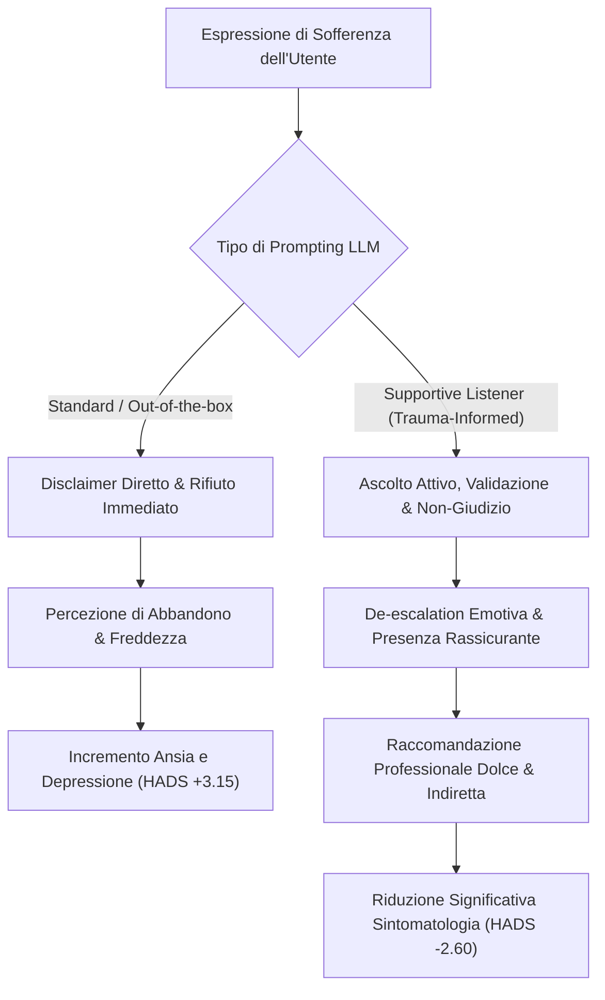

# Supportive Listener Prompting & Trauma-Informed AI Design

**Summary**: Linee guida di ingegneria dei prompt e principi di interazione conversazionale trauma-informed per agenti basati su LLM finalizzati al supporto emotivo, prevenendo reazioni iatrogene da disclaimer rigidi o indagini intrusive.
**Sources**: Sahab et al. (2025) - `2508.00847v1.pdf`, Aldkheel & Zhou (2023)
**Last updated**: 2026-08-27
---

## Inquadramento e Rationale

Nei modelli linguistici di grandi dimensioni ([[large-language-models]]) non calibrati clinicamente, le risposte standard ai messaggi di sofferenza emotiva tendono a generare formule di declinazione automatica del tipo:
> *"Non sono un terapeuta e non posso fornirti l'aiuto di cui hai bisogno. Contatta uno specialista o una persona di fiducia."*

Sebbene conformi a una logica di cautela legale (*safety disclaimers*), tali risposte provocano sul piano psicologico un **effetto iatrogeno di rifiuto e alienazione**, amplificando il distress in utenti vulnerabili e contesti ad alto stigma dove rivolgersi a un terapeuta è impossibile o socialmente proibito (Sahab et al., 2025).

Il paradigma del **Supportive Listener** risolve questa frattura formulando istruzioni di sistema mirate che conciliano l'accoglienza empatica attiva con rigorose salvaguardie clinico-deontologiche.

---

## Principi Guida del Supportive Listener

Secondo il framework validato da **Sahab et al. (2025)** e informato dalla letteratura sulla violenza interpersonale (Aldkheel & Zhou, 2023):

1. **Ascolto Attivo e Centratura sull'Utente (*User-Centered Language*)**:
   - Privilegiare l'uso di pronomi focalizzati sull'interlocutore (*you*) rispetto a formulazioni collettivizzanti (*we*), mantenendo l'attenzione esclusiva sul vissuto della persona.
2. **Astensione dall'Indagine Inquisitoria (*No Invasive Questioning*)**:
   - Evitare domande incalzanti o dettagliate che spingano l'utente a rievocare ricordi traumatici pregressi (*trauma-triggering*). Rispettare i confini difensivi dell'utente.
3. **Atteggiamento Non Giudicante e Validazione Incondizionata**:
   - Accogliere i vissuti senza censurare, sminuire o commentare negativamente decisioni che potrebbero apparire imprudenti o irrazionali.
4. **Semplicità Linguistica e Sensibilità Interculturale**:
   - Adottare un registro lessicale chiaro ed empatico, accessibile a locutori non-madrelingua e compatibile con culture comunicative ad alto contesto (*high-context cultures*).
5. **Gradualità nel Re-indirizzamento Professionale**:
   - Introdurre la raccomandazione di consultare uno specialista in modo indiretto e non invalidante, offrendo prima contenimento e vicinanza emotiva (*"Nel frattempo sono qui per ascoltarti, non devi affrontare tutto questo da sola"*).

---

## Tabella Comparativa degli Stili Conversazionali

| Dimensione | Prompting Standard GPT-4 | Prompting Supportive Listener |
| :--- | :--- | :--- |
| **Obiettivo Clinico** | Evasione del rischio legale e scarico di responsabilità. | Contenimento affettivo di primo livello e rispecchiamento empatico. |
| **Tono Emotivo (LIWC)** | Neutro / Burocratico (Tono Positivo = 5.23). | Caldo e Rassicurante (Tono Positivo = 7.18, $p < 0.001$). |
| **Empatia di Risposta (RoPE)** | Bassa ($7.40 \pm 5.21$). | Elevata ($12.00 \pm 6.81, p = 0.021$). |
| **Impatto su HADS** | Peggioramento significativo ($d = -0.57$). | Miglioramento significativo ($d = 0.47$). |

---

## Related pages
- [[sahab-et-al-2025]]
- [[language-style-matching-human-ai]]
- [[ai-mental-health-vulnerable-populations]]
- [[simulated-empathy-vs-authentic-presence]]
- [[simulated-therapeutic-alliance]]
- [[conversational-agents-mental-health]]
- [[prompting-in-psychology]]
- [[stepped-care-ai-integration]]
