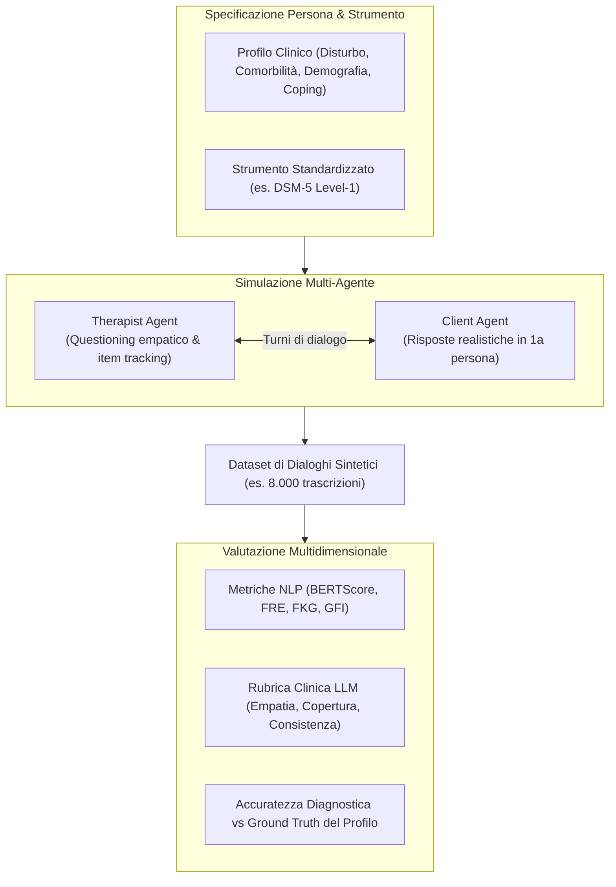

# Synthetic Clinical Dialogues (Dialoghi Clinici Sintetici)

**Summary**: Metodologia di generazione computazionale di conversazioni e interviste cliniche simulate tra agenti intelligenti guidati da profili psicopatologici ed epidemiologici controllati, finalizzata al superamento della scarsità dei dati sensibili, alla ricerca sull'Explainable AI e al benchmarking rigoroso di modelli per la salute mentale.
**Sources**: `2508.11398v2.pdf` (Ozgun et al., CIKM 2025: *Trustworthy AI Psychotherapy: Multi-Agent LLM Workflow for Counseling and Explainable Mental Disorder Diagnosis*), `1-s2.0-S1386505625004216-main.pdf` (Huynh et al., 2026)
**Last updated**: 2026-08-27
---

## Necessità e Obiettivi dei Dialoghi Clinici Sintetici

Nell'ambito del Natural Language Processing (NLP) applicato alla salute mentale, la ricerca e lo sviluppo di modelli predittivi e decisionali si scontrano costantemente con la **scarsità e riservatezza dei dati reali**:
- **Privacy e Conformità Etico-Legale (GDPR/HIPAA)**: Le trascrizioni di sedute di psicoterapia e consultazioni psichiatriche contengono informazioni ad altissima sensibilità, la cui condivisione e diffusione per scopi di addestramento algoritmico solleva complessi ostacoli etici e legali.
- **Sbilanciamento e Scarsità di Casi Rari**: I dati clinici disponibili soffrono spesso di forte sbilanciamento di classe, con sotto-rappresentazione di profili complessi, disturbi con comorbilità o casi limite (*edge cases*).
- **Trasparenza e Riproducibilità**: La generazione controllata di dialoghi sintetici consente di creare dataset standardizzati aperti alla comunità scientifica per il benchmarking trasparente di architetture di IA senza violare la confidenzialità di pazienti reali.

---

## Metodologia di Generazione Controllata (DSM5AgentFlow)

Ozgun e colleghi (2025) delineano un protocollo rigoroso per la produzione di dialoghi clinici sintetici di alta fedeltà:

1. **Configurazione Strutturata del Profilo Paziente**:
   - *Disturbo primario*: Definito in base a criteri nosografici formali (es. PTSD, Disturbo Bipolare, Ansia Sociale).
   - *Modificatori di comorbilità*: Sintomi secondari realistici per evitare profili didascalici stereotipati.
   - *Variabili contestuali*: Età, genere, eventi stressanti recenti e stile di fronteggiamento (*coping style*).
2. **Vincoli di Ruolo per il Paziente Virtuale**:
   - Risposta rigorosa in prima persona senza meta-commentari.
   - Divieto assoluto di nominare esplicitamente la propria diagnosi o ammettere di essere un modello generativo.
   - Espressione di risonanza emotiva autentica e comportamento di richiesta d'aiuto.
3. **Ancoraggio a Scale Standardizzate**:
   - L'interazione non è libera e caotica, ma guidata dalla somministrazione sequenziale dei domini del *DSM-5 Level-1 Cross-Cutting Symptom Measure* tramite un agente intervistatore empatico.
4. **Scalabilità e Parallelizzazione**:
   - Esecuzione tramite architettura parallela multi-thread (4 worker) con logiche di retry e backoff esponenziale, capace di generare migliaia di dialoghi multi-turno in poche ore.

---

## Metriche di Valutazione dei Dialoghi Sintetici

La validazione della qualità dei dialoghi sintetici richiede un approccio integrato:
- **Metriche NLP di Coerenza e Leggibilità**:
  - *BERTScore*: Misura la coerenza semantica tra turni successivi.
  - *Flesch Reading Ease (FRE)*, *Flesch-Kincaid Grade (FKG)*, *Gunning Fog Index (GFI)*: Quantificano la complessità sintattica e il registro linguistico della conversazione.
- **Rubriche Qualitative Multidimensionale (scala 1–5)**:
  - *Completezza della copertura DSM-5*: Esplorazione esaustiva di tutti i domini sintomatologici.
  - *Rilevanza clinica delle domande*: Aderenza ai criteri del manuale diagnostico.
  - *Consistenza e flusso logico*: Naturalezza della progressione del colloquio.
  - *Esplicabilità e giustificazione diagnostica*: Chiarezza del legame tra risposte e conclusioni.
  - *Empatia e tono professionale*: Capacità dell'agente intervistatore di stabilire un clima accogliente.
- **Validità Diagnostica Interna**:
  - Confronto tra la diagnosi derivata dal dialogo sintetico e il profilo clinico di partenza (*ground-truth profile*) mediante Precision, Recall, F1-Score e matrici di confusione.

---

## Limiti Ecologici e Considerazioni Etiche

- **Assenza di Validità Ecologica Completa**: I dialoghi sintetici, per quanto realistici, non possono sostituire interamente la ricchezza, la prosodia, i segnali non verbali e la complessità relazionale dei colloqui con pazienti in carne ed ossa.
- **Uso Esclusivo per la Ricerca**: I dataset generati non devono essere impiegati per scopi diagnostici reali né considerati dispositivi medici autonomi.
- **Prevenzione di Bias e Allucinazioni**: I prompt di generazione devono essere continuamente controllati per impedire la riproduzione di stereotipi socioculturali o deviazioni cliniche grossolane.

---

## Pagine Correlate
- [[dsm5agentflow]]: Il framework multi-agente per la generazione e valutazione di dialoghi DSM-5.
- [[ozgun-et-al-2025]]: Sintesi del paper di riferimento (CIKM 2025).
- [[simulazione-pazienti-ai]]: Principi generali di simulazione di pazienti virtuali e prompt engineering.
- [[explainable-mental-disorder-diagnosis]]: Trasparenza ed esplicabilità diagnostica basata su dialoghi clinici.
- [[trade-off-conversazione-ragionamento-llm]]: Valutazione comparativa dei modelli linguistici su compiti sintetici.
- [[three-layer-governance-framework]]: Quadro etico e di governance per l'uso dell'IA in salute mentale.
- [[ai-assisted-psychotherapy]]: Stato dell'arte dell'integrazione tra IA e psicoterapia.
