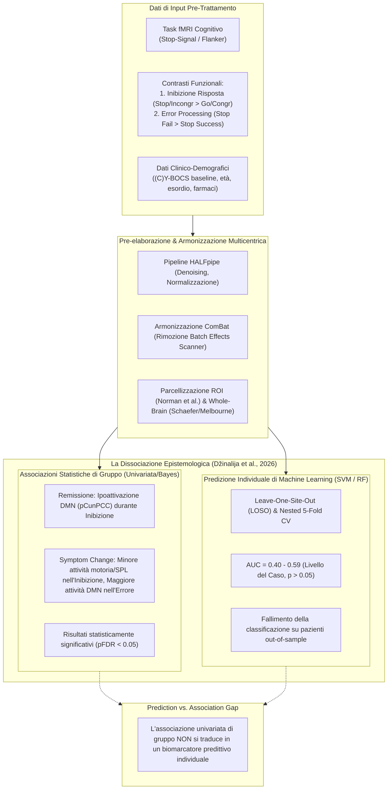

# Predizione della Risposta alla CBT tramite fMRI Task-Based (Task-Based fMRI Prediction of CBT Outcome)

## Definizione Operativa
- Paradigma di neuroimaging computazionale e psichiatria di precisione che impiega modelli di Machine Learning (es. Support Vector Machines, Random Forest) applicati a dati di risonanza magnetica funzionale durante compiti cognitivi o affettivi (fMRI *task-based*, es. compiti di inibizione della risposta o elaborazione degli errori) per prevedere la risposta terapeutica individuale, la remissione clinica o la riduzione quantitativa dei sintomi a seguito di un percorso di Psicoterapia Cognitivo-Comportamentale (CBT).
- **Utilità CBT / Applicativa:** Nei disturbi d'ansia e nel Disturbo Ossessivo-Compulsivo (OCD), l'efficacia del trattamento cardine—l'Esposizione con Prevenzione della Risposta (ERP)—dipende dall'integrità dei circuiti fronto-striatali deputati al controllo inibitorio e alla modulazione della salienza dell'errore. Identificare biomarcatori neurali oggettivi pre-trattamento risponde alla necessità di superare il metodo empirico del *trial-and-error*, consentendo l'ottimizzazione delle risorse sanitarie, la riduzione delle liste d'attesa e l'assegnazione tempestiva di protocolli intensificati o combinati (es. CBT associata a farmacoterapia o stimolazione magnetica transcranica) ai pazienti con profilo prognostico sfavorevole.

## Evidenze dalla Letteratura

### 1. Correlati Neurobiologici di Gruppo nella CBT per l'OCD
- Nello studio di mega-analisi su dati individuali ($N=130$) del consorzio ENIGMA-OCD (Džinalija et al., 2026), l'analisi univariata e bayesiana ha individuato pattern specifici associati agli esiti della CBT:
  - **Inibizione della Risposta e DMN:** I pazienti che raggiungono la remissione clinica mostrano una ridotta attivazione pre-trattamento nei nodi chiave del *Default Mode Network* (DMN), specificamente nel precuneo e nella corteccia cingolata posteriore (pCunPCC bilaterale: sinistro $T=-3.784$, destro $T=-3.826, p_{FDR}=0.028$). Ciò suggerisce che la capacità di silenziare adeguatamente l'attività autoreferenziale interna a favore dei network di controllo esecutivo faciliti l'apprendimento inibitorio durante l'ERP.
  - **Corteccia Motoria e Riduzione Continua dei Sintomi:** Una maggiore riduzione del punteggio (C)Y-BOCS correla con una minore attivazione pre-trattamento nell'area motoria supplementare (SMA), nella corteccia motoria primaria (PMC) e nel lobulo parietale superiore (SPL), oltre che in diffuse regioni frontoparietali e attentive dorsali ($p_{FDR} < 0.05$).
  - **Elaborazione dell'Errore (*Error Processing*):** Contrariamente all'inibizione, una maggiore risposta neurale all'errore nel precuneo/PCC è positivamente associata a una maggiore riduzione dei sintomi post-trattamento ($p_{FDR} = 0.04$).

### 2. Il "Prediction vs. Association Gap" nei Modelli Predittivi
- Il contributo concettuale cardine emerso dai recenti consorzi multicentrici (Džinalija et al., 2026; van de Mortel et al., 2025) riguarda la **profonda frattura metodologica tra associazione statistica esplicativa e predizione clinica**:
  - **L'illusione dei campioni singoli:** Precedenti studi pilota monocentrici su campioni ridotti e omogenei ($N \approx 20-40$) avevano riportato un'accuratezza elevata (spesso $>80\%$) nel predire la risposta alla CBT tramite connettività resting-state o compiti fMRI (Reggente et al., 2018; Pagliaccio et al., 2019).
  - **Il crollo al livello del caso nei consorzi:** Quando la classificazione viene testata su dataset multicentrici indipendenti tramite schemi rigorosi di cross-validazione (*Leave-One-Site-Out* e nested CV), sia i modelli basati su fMRI task-based (ROI o whole-brain) sia quelli basati su feature cliniche falliscono, registrando AUC non superiori al caso (range $0.40 - 0.59$, $p > 0.05$) (Džinalija et al., 2026).
  - **Spiegazione epistemologica:** Come formalizzato da Bzdok et al. (2021) e Poldrack et al. (2020), i modelli statistici esplicativi quantificano l'effetto medio su un'intera popolazione preservando la varianza di gruppo, mentre il machine learning richiede pattern stabili e ad elevata densità informativa capaci di generalizzare su soggetti mai visti (*out-of-sample prediction*). L'esistenza di una correlazione univariata statisticamente solida non implica la separabilità multivariata delle classi cliniche.

### 3. Fattori di Eterogeneità e Limiti Metodologici
- **Discrepanza tra Paradigmi di Task:** L'aggregazione di compiti con carichi cognitivi differenti—come lo Stop-Signal Task (inibizione reattiva e cancellazione motoria) e il Flanker Task (controllo dell'interferenza cognitiva)—può introdurre una varianza non controllabile nei regressori di primo livello, riducendo il rapporto segnale/rumore per gli algoritmi di apprendimento supervisionato (van Velzen et al., 2014; Džinalija et al., 2026).
- **Variabilità dei Protocolli Clinici CBT:** Nei consorzi internazionali retrospettivi, la durata (da 1 a 27 settimane, media 9.7) e il formato terapeutico (individuale vs di gruppo, intensivo vs settimanale) variano sensibilmente tra i centri partecipanti, costituendo fonti di varianza clinica predominanti rispetto al segnale biologico.
- **Task Cognitivi vs Task Emotivi:** Meta-analisi su disturbi d'ansia suggeriscono che i compiti che stimolano l'elaborazione affettiva (es. provocazione dei sintomi, condizionamento alla paura) mostrano una direzione di attivazione e una sensibilità predittiva potenzialmente superiore o opposta rispetto ai compiti puramente esecutivi di controllo inibitorio (Picó-Pérez et al., 2023).

## Riferimenti Bibliografici
- Bzdok, D., Varoquaux, G., & Steyerberg, E. W. (2021). Prediction, not association, paves the road to precision medicine. *JAMA Psychiatry*, 78(2), 127-128. https://doi.org/10.1001/jamapsychiatry.2020.3421
- Džinalija, N., van den Heuvel, O. A., Simpson, H. B., Ivanov, I., Alonso, P., Bertolin, S., Bruin, W., Fortea, L., Fullana, M. A., Hagen, K., Hansen, B., Huijser, C., Kvale, G., Martinez-Zalacain, I., Menchon, J. M., Ousdal, O. T., Soriano-Mas, C., van der Straten, A. L., Thomopoulos, S. I., ... van de Mortel, L. A. (2026). Predicting cognitive-behavioral therapy outcomes in obsessive-compulsive disorder from inhibitory control neural activity: A mega-analysis and machine learning study from the ENIGMA-OCD consortium. *medRxiv*, 2026.03.13.26348316. https://doi.org/10.64898/2026.03.13.26348316
- Norman, L. J., Taylor, S. F., Liu, Y., Radua, J., Chye, Y., De Wit, S. J., ... & Fitzgerald, K. D. (2019). Error processing and inhibitory control in obsessive-compulsive disorder: A meta-analysis using statistical parametric maps. *Biological Psychiatry*, 85(9), 713-725. https://doi.org/10.1016/j.biopsych.2018.11.010
- Norman, L. J., Mannella, K. A., Yang, H., Angstadt, M., Abelson, J. L., Himle, J. A., ... & Fitzgerald, K. D. (2021). Treatment-specific associations between brain activation and symptom reduction in OCD following CBT: A randomized fMRI trial. *American Journal of Psychiatry*, 178(1), 39-47. https://doi.org/10.1176/appi.ajp.2020.19080886
- Picó-Pérez, M., Fullana, M. A., Albajes-Eizagirre, A., Vega, D., Marco-Pallarés, J., Vilar, A., ... & Soriano-Mas, C. (2023). Neural predictors of cognitive-behavior therapy outcome in anxiety-related disorders: A meta-analysis of task-based fMRI studies. *Psychological Medicine*, 53(8), 3387-3395. https://doi.org/10.1017/S0033291722000078
- Poldrack, R. A., Huckins, G., & Varoquaux, G. (2020). Establishment of best practices for evidence for prediction: A review. *JAMA Psychiatry*, 77(5), 534-540. https://doi.org/10.1001/jamapsychiatry.2019.3671
- Reggente, N., Moody, T. D., Morfini, F., Sheen, C., Rissman, J., O'Neill, J., & Feusner, J. D. (2018). Multivariate resting-state functional connectivity predicts response to cognitive behavioral therapy in obsessive-compulsive disorder. *Proceedings of the National Academy of Sciences*, 115(9), 2222-2227. https://doi.org/10.1073/pnas.1716686115
- van de Mortel, L. A., Bruin, W. B., Alonso, P., Bertolín, S., Feusner, J. D., Guo, J., ... & Vriend, C. (2025). Development and validation of a machine learning model to predict cognitive behavioral therapy outcome in obsessive-compulsive disorder using clinical and neuroimaging data. *Journal of Affective Disorders*, 389, 119729. https://doi.org/10.1016/j.jad.2025.119729
- van Velzen, L. S., Vriend, C., de Wit, S. J., & van den Heuvel, O. A. (2014). Response inhibition and interference control in obsessive-compulsive spectrum disorders. *Frontiers in Human Neuroscience*, 8, 419. https://doi.org/10.3389/fnhum.2014.00419

## Relazioni
- Vedi anche: [dzinalija-et-al-2026](../dzinalija-et-al-2026.md), [treatment-outcome-and-relapse-prediction](treatment-outcome-and-relapse-prediction.md), [clinical-prediction-model-evaluation](../clinical-prediction-model-evaluation.md), [mccv-and-statistical-validation-clinical-ml](mccv-and-statistical-validation-clinical-ml.md), [kim-et-al-2025](../kim-et-al-2025.md), [cbt](cbt.md)

