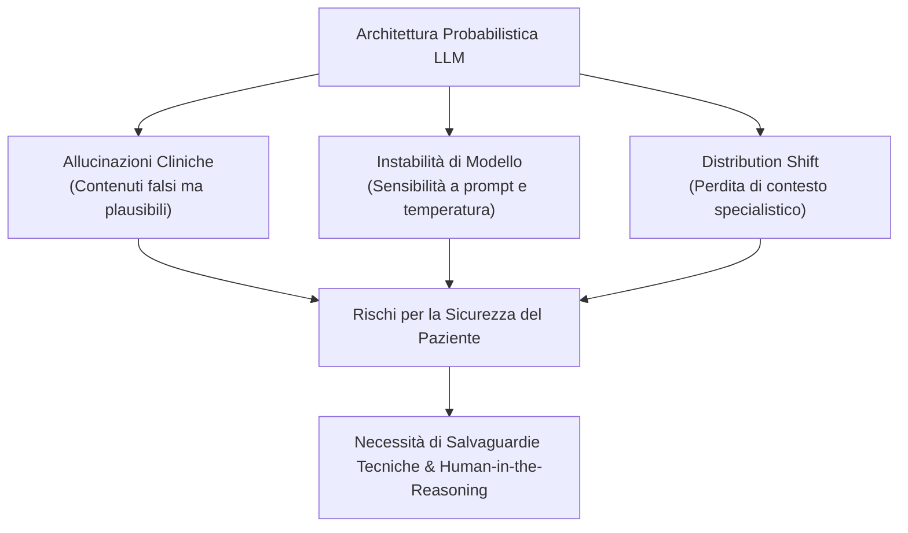

# Technical Vulnerabilities of LLMs in Counseling

**Summary**: Analisi delle fragilità architetturali e probabilistiche dei Modelli Linguistici di Grandi Dimensioni (LLM) applicati al contesto clinico-psicologico, comprendenti allucinazioni epistemiche, instabilità delle risposte e shift di distribuzione.
**Sources**: Erdemir & Sumbas (2026) - `10.1177_00469580261438322.pdf`
**Last updated**: 2026-08-27
---

## Il Paradosso Architetturale: Fluenza vs Validità Clinica

I modelli di linguaggio generativi (LLM) non operano su una conoscenza empiricamente verificata o su un modello causale del funzionamento mentale umano, bensì su predizioni statistiche volte a massimizzare la coerenza lessicale e la plausibilità sintattica.

Nei contesti ad alto rischio come il counseling psicologico e la psicoterapia, questa discrepanza architetturale si traduce in vulnerabilità strutturali specifiche:

---

## Principali Vulnerabilità Tecniche

### 1. Allucinazioni Cliniche (*Epistemic Hallucinations*)
- **Descrizione**: Generazione di informazioni inventate, protocolli inesistenti, citazioni fittizie o spiegazioni psicoeducative clinicamente scorrette presentate con un registro linguistico autorevole e convincente.
- **Rischio nel counseling**: Formulazione di consigli di coping disfunzionali, validazione involontaria di deliri/ossessioni o minimizzazione impropria di segnali di allarme suicidario.

### 2. Instabilità di Modello e Sensibilità ai Prompt (*Model Instability*)
- **Descrizione**: Sensibilità elevata a minime variazioni nel fraseggio del prompt, nell'ordine dei token di contesto o nei parametri di campionamento (temperatura, top-p).
- **Rischio nel counseling**: Il modello può fornire indicazioni cliniche contraddittorie a fronte di presentazioni sintomatologiche identiche, violando il principio di affidabilità, consistenza e standardizzazione proprio della pratica evidence-based.

### 3. Shift di Distribuzione e Mancanza di Grounding (*Distribution Shift*)
- **Descrizione**: Il modello viene addestrato su corpora testuali generici eterogenei; quando viene impiegato in un setting clinico altamente specifico, opera al di fuori della distribuzione originaria.
- **Rischio nel counseling**: Incapacità di cogliere idiomi specifici del disagio, ironia, sfumature relazionali o registri emotivi non standardizzati, producendo risposte formalmente ineccepibili ma clinicamente cieche (*linguistic fluency does not equal clinical competence*).

### 4. Assenza di "Embodied Cognition" e Consapevolezza Situazionale
- Gli LLM non hanno accesso alla dimensione corporea, ai ritmi respiratori, alla prosodia vocale o al silenzio significativo del paziente, componenti che costituiscono oltre il 70% della comunicazione clinica non verbale.

---

## Strategie di Mitigazione Tecnica e Clinica
- **Verifica tramite RAG (Retrieval-Augmented Generation)** vincolata a linee guida cliniche validate.
- **Supervisione Attiva (Human-in-the-Reasoning)**: Il terapeuta non accetta passivamente i testi generati, ma ne esamina criticamente la coerenza logica e clinica.
- **Benchmarking e Monitoraggio del Drift**: Test periodici standardizzati per misurare la stabilità delle risposte su scenari di simulazione clinica.

---

## Related pages
- [[erdemir-sumbas-2026]]
- [[three-layer-governance-framework]]
- [[human-in-the-reasoning]]
- [[simulated-empathy-vs-authentic-presence]]
- [[clinical-fidelity-assessment]]
- [[large-language-models]]
- [[prompting-in-psychology]]
