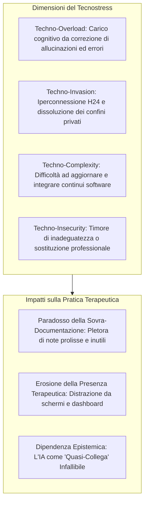

# Tecnostress Clinico e Paradosso della Sovra-Documentazione

**Summary**: Manifestazione di distress professionale e burnout nello psicoterapeuta derivante dall'inclusione di strumenti di IA generativa nella routine clinica, caratterizzata da sovraccarico da correzione di allucinazioni, pletora documentale (*over-documentation paradox*), invasione dei confini di vita privata ed erosione della presenza terapeutica incarnata.
**Sources**: Signorini & Paganin (2026, *Frontiers in Psychology*, DOI: 10.3389/fpsyg.2026.1690291); Tarafdar et al. (2019); `AI in Psicoterapia 2023-2026.docx`.
**Last updated**: 2026-08-27
---

## Le Dimensioni del Tecnostress nello Psicoterapeuta

L'introduzione dell'Intelligenza Artificiale Generativa nel setting clinico è stata spesso promossa con la promessa di "liberare tempo" e "azzerare la burocrazia". Tuttavia, l'evidenza empirica (2023-2026) rivela l'emergere di dinamiche di **Tecnostress** articolate in quattro sotto-dimensioni:

---

## 1. Il Paradosso della Sovra-Documentazione (*Over-Documentation Paradox*)

La facilità con cui gli LLM producono testi dettagliati spinge i clinici e i sistemi informatici a generare report, cartelle e note chilometriche per ogni singolo colloquio:
- **Sovraccarico Informativo**: Note cliniche gonfiate e prolisse oscurano i dati salienti del paziente, rendendo faticosa la revisione prima della seduta successiva.
- **Onere di Fact-Checking**: Il terapeuta, per tutelarsi legalmente da denunce per negligenza, è costretto a una meticolosa e faticosa lettura di ogni riga generata dall'IA per scovare micro-allucinazioni o interpretazioni erronee.

---

## 2. Erosione della Presenza Terapeutica

L'efficacia della cura psicoterapeutica poggia sulla qualità della **presenza incarnata**, sulla sintonia neurovegetativa e sul contatto visivo continuo:
- L'uso di sistemi di registrazione in tempo reale, prompter o tablet nella stanza di terapia frammenta l'attenzione del professionista.
- La mente del terapeuta si divide tra l'ascolto del paziente e il monitoraggio dell'interfaccia tecnologica, alterando la sincronia interpersonale e l'alleanza terapeutica.

---

## 3. Dipendenza Epistemica e il "Quasi-Collega" Artificiale

Un ulteriore rischio del tecnostress è lo scivolamento verso una **dipendenza epistemica**:
- Il clinico, oberato e isolato, inizia a dialogare con l'algoritmo trattandolo come un collega onnisciente, rassicurante e privo di giudizio critico.
- Questo allontana il terapeuta dal confronto autentico, vivo e necessario con la comunità professionale dei pari e con la supervisione clinica umana.

---

## Linee Guida per la Decontaminazione Tecnologica

1. **Setting Pulito (*Technology-Free In-Session*)**: Nessun dispositivo attivo nella stanza di terapia durante il colloquio (principio cardine del [[sadar-framework|SADAR]]).
2. **Standard di Sintesi Minimale**: Privilegiare note cliniche essenziali e scritte dal clinico rispetto a volumi di trascrizioni automatizzate.
3. **Presidio della Supervisione tra Pari**: Mantenere la supervisione umana come unico luogo di confronto formativo ed etico.

---

## Pagine Correlate
- [[artificial-intelligence-replacement-dysfunction]]
- [[cognitive-offloading-e-diagnostic-deskilling]]
- [[sadar-framework]]
- [[digital-analytic-third]]
- [[moral-buffering-e-deskilling-etico]]
- [[ai-in-psicoterapia-2023-2026]]
